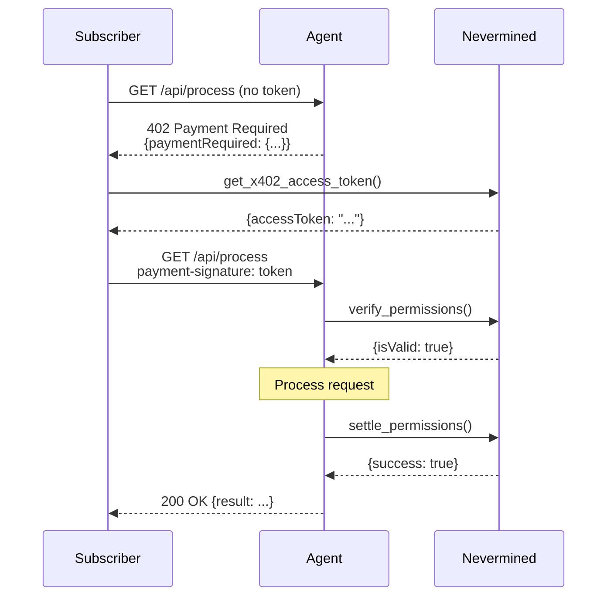

> **Looking for MPP?** The Machine Payments Protocol is a second framing
> over this same plan/credits/delegation core — see
> [15. MPP Protocol](/api-reference/python/mpp-module).

This guide covers the x402 payment protocol for verifying permissions and settling payments.

## Overview

x402 is a payment protocol that enables:

- **Permission Generation**: Subscribers create access tokens for agents
- **Permission Verification**: Agents verify tokens without burning credits
- **Permission Settlement**: Agents burn credits after completing work

The protocol is named after HTTP status code 402 (Payment Required).

## Supported Schemes

Nevermined supports two x402 payment schemes:

| Scheme | Network | Use Case | Settlement |
|--------|---------|----------|------------|
| `nvm:erc4337` | `eip155:84532` | Crypto payments | ERC-4337 UserOps + session keys |
| `nvm:card-delegation` | `stripe` \| `braintree` \| `visa` | Fiat/credit card | Provider charge + credit burn |

The scheme is determined by the plan's pricing configuration. Plans with `isCrypto: false` use `nvm:card-delegation`; all others use `nvm:erc4337`. The SDK auto-detects the scheme via `resolve_scheme()`. The `network` value within `nvm:card-delegation` is determined by which provider issued the delegation being consumed (`stripe`, `braintree`, or `visa`).

### Visa support

Visa delegations use the same `nvm:card-delegation` scheme and SDK surface as Stripe and Braintree, but two steps must happen in a **browser** before the SDK can consume them:

1. **Card enrolment** — the cardholder enrols a Visa card through VGS Collect (PCI-compliant iframe) in the Nevermined webapp. The card is bound to a Visa Agentic Token via the VGS Credential Management Platform.
2. **Delegation creation** — the cardholder approves a delegation via a WebAuthn/passkey (FIDO) device-binding ceremony embedded by Visa VTS. This produces a single-use `assuranceData` blob bound to the spending limit + duration + merchant context.

Both steps require a real DOM and a user gesture, so the SDK cannot perform them programmatically. Once a Visa delegation exists, the SDK consumes it identically to Stripe/Braintree — pass `delegation_id` to `DelegationConfig` and call `get_x402_access_token` as usual:

```python
from payments_py.x402 import X402TokenOptions, DelegationConfig

result = subscriber_payments.x402.get_x402_access_token(
    plan_id,
    token_options=X402TokenOptions(
        scheme="nvm:card-delegation",
        network="visa",
        delegation_config=DelegationConfig(
            delegation_id="11111111-1111-1111-1111-111111111111",
        ),
    ),
)
```

`delegation_id` reuse is the **only** supported pattern for Visa — `create_delegation(provider="visa", ...)` is rejected by the backend without the browser-only `consumer_prompt` + `assurance_data` blobs the SDK has no way to produce. When a Visa creation call fails this way, `PaymentsError.code` carries the backend `BCK.VISA.0014` so consumers can branch programmatically.

## Generate Payment Permissions

### From Nevermined App

The easiest way to generate permissions is through the [Nevermined App Permissions page](https://nevermined.app/permissions/agent-permissions):

1. Navigate to the permissions page
2. Select your plan and agent
3. Configure limits (optional)
4. Generate the access token

### From SDK

```python
from payments_py import Payments, PaymentOptions

payments = Payments.get_instance(
    PaymentOptions(nvm_api_key="nvm:subscriber-key", environment="sandbox")
)

# Basic token generation
result = payments.x402.get_x402_access_token(
    plan_id="your-plan-id",
    agent_id="agent-id"
)
access_token = result['accessToken']

# With delegation config (crypto — erc4337)
from payments_py.x402 import X402TokenOptions, DelegationConfig, CreateDelegationPayload

# Create the delegation once (currency is required), then reuse it across plans.
delegation = payments.delegation.create_delegation(
    CreateDelegationPayload(
        provider="erc4337",
        spending_limit_cents=10000,  # $100
        duration_secs=604800,         # 1 week
        currency="usdc",
    )
)
result = payments.x402.get_x402_access_token(
    plan_id="your-plan-id",
    agent_id="agent-id",
    token_options=X402TokenOptions(
        delegation_config=DelegationConfig(delegation_id=delegation.delegation_id)
    )
)
```

> **Deprecated:** passing `spending_limit_cents` / `duration_secs` directly to
> `get_x402_access_token` (inline create-on-the-fly, a `DelegationConfig` with no
> `delegation_id`) emits a `DeprecationWarning` and will be removed in a future
> release. Create the delegation first as shown above, then pass only
> `delegation_id`.

### Card-Delegation Token Generation

For fiat plans using `nvm:card-delegation`, create the card delegation once
(`currency` is required), then request the token by `delegation_id`:

```python
from payments_py.x402 import X402TokenOptions, DelegationConfig, CreateDelegationPayload

# Step 1 — create a USD card delegation (currency is required).
usd_delegation = payments.delegation.create_delegation(
    CreateDelegationPayload(
        provider="stripe",
        provider_payment_method_id="pm_1AbCdEfGhIjKlM",
        spending_limit_cents=10000,  # $100.00
        duration_secs=2592000,       # 30 days
        currency="usd",
        max_transactions=100,
    )
)

# Step 2 — request the token referencing the delegation id.
result = payments.x402.get_x402_access_token(
    plan_id="your-plan-id",
    agent_id="agent-id",
    token_options=X402TokenOptions(
        scheme="nvm:card-delegation",
        delegation_config=DelegationConfig(
            delegation_id=usd_delegation.delegation_id
        ),
    )
)
access_token = result['accessToken']

# EUR card delegation — same flow, currency="eur".
eur_delegation = payments.delegation.create_delegation(
    CreateDelegationPayload(
        provider="stripe",
        provider_payment_method_id="pm_1AbCdEfGhIjKlM",
        spending_limit_cents=10000,  # €100.00 (in euro cents)
        duration_secs=2592000,       # 30 days
        currency="eur",
        max_transactions=100,
    )
)
eur_result = payments.x402.get_x402_access_token(
    plan_id="your-plan-id",
    agent_id="agent-id",
    token_options=X402TokenOptions(
        scheme="nvm:card-delegation",
        delegation_config=DelegationConfig(
            delegation_id=eur_delegation.delegation_id
        ),
    )
)
```

### Auto Scheme Resolution

Use `resolve_scheme()` to auto-detect the correct scheme from plan metadata:

```python
from payments_py.x402.resolve_scheme import resolve_scheme

# Auto-detect scheme from plan metadata (cached for 5 minutes)
scheme = resolve_scheme(payments, plan_id="your-plan-id")
# Returns "nvm:erc4337" for crypto plans, "nvm:card-delegation" for fiat plans

# Explicit override
scheme = resolve_scheme(payments, plan_id="your-plan-id", explicit_scheme="nvm:card-delegation")
```

### DelegationAPI

Create delegations and list enrolled payment methods:

```python
from payments_py.x402 import CreateDelegationPayload

# Create a crypto delegation (currency is required)
delegation = payments.delegation.create_delegation(
    CreateDelegationPayload(
        provider="erc4337",
        spending_limit_cents=10000,
        duration_secs=604800,
        currency="usdc",
    )
)
print(f"Delegation ID: {delegation.delegation_id}")

# List enrolled payment methods (every provider)
methods = payments.delegation.list_payment_methods()
for method in methods:
    print(f"{method.brand} ****{method.last4} (expires {method.exp_month}/{method.exp_year})")
    # e.g., "visa ****4242 (expires 12/2027)"

# Restrict the result to a single provider with the optional `provider` kwarg
stripe_methods = payments.delegation.list_payment_methods(provider="stripe")
```

`list_payment_methods()` accepts an optional `provider` keyword argument
(`'stripe' | 'braintree' | 'visa' | 'erc4337'`). When set, it is forwarded as a
`?provider=` query string and only methods backed by that provider are returned.
Omit it (the default) to return methods from every provider.

`PaymentMethodSummary` fields:

| Field | Type | Description |
|-------|------|-------------|
| `id` | `str` | Payment method ID (e.g., `pm_...`) |
| `brand` | `str` | Card brand (e.g., `visa`, `mastercard`) |
| `last4` | `str` | Last 4 digits of the card number |
| `exp_month` | `int` | Card expiration month |
| `exp_year` | `int` | Card expiration year |

### Token Structure

The x402 token is a base64-encoded JSON document:

```json
{
  "payload": {
    "authorization": {
      "from": "0xSubscriberAddress",
      "planId": "plan-123",
      "agentId": "agent-456"
    },
    "sessionKey": {
      "address": "0xSessionKeyAddress",
      "permissions": ["order", "burn"],
      "limits": {
        "redemptionLimit": 100,
        "orderLimit": "1000000000000000000"
      }
    }
  },
  "signature": "0x..."
}
```

### Access Token Versions (v2 and v3)

A **v2** token — what the backend mints by default today — is a *bearer*
credential. Its EIP-712 signature covers only
`[from, sessionKeysProvider, sessionKeys, planId]`: `agentId`, `resource.url`
and `httpVerb` sit outside the signature and there is no nonce. Consequences:
any seller holding a token minted for plan `P` can present it to another seller
on the same plan, and the same token can be settled more than once.

A **v3** token additionally signs `agentId`, `resourceUrl`, `httpVerb` and a
one-time `nonce`. That binds it to one seller and one endpoint, and makes it
**single-use**: the first `POST /x402/settle` consumes it. `verify()` never
consumes, so the standard verify-then-settle flow is unchanged and verify stays
repeatable.

v3 is **opt-in**. Request it with `token_version=3`, and give the token the
`resource` and `http_verb` it should be bound to:

```python
from payments_py.x402 import DelegationConfig, X402TokenOptions

result = payments.x402.get_x402_access_token(
    plan_id,
    agent_id,
    token_options=X402TokenOptions(
        delegation_config=DelegationConfig(delegation_id=delegation_id),
        resource="https://seller.example/api/v1/tasks",
        http_verb="POST",
        token_version=3,
    ),
)

access_token = result["accessToken"]
if result.get("tokenVersion") == 3:
    ...  # single-use: mint a fresh token for the next paid request
```

`resource` accepts a URL string or an `X402Resource` (which also carries
`description` / `mime_type`).

<Warning title="`resource` and `http_verb` are v3-only">
They are **not** inert on a v2 token, so the SDK refuses them without
`token_version=3` rather than forwarding or dropping them. On v2 they land
on the unsigned envelope and bind nothing, but the presence of the token's
`resource.url` is exactly what switches the backend's endpoint allowlist
**on** — the `resource.url not provided in token … skipping endpoint
validation` log is the marker of a check being skipped, not noise to tidy
away. Adding `resource` to a working v2 flow therefore buys no binding and
can turn it into `BCK.PROTOCOL.0031`.
</Warning>

<Warning title="v3 does not work yet for agents registered with `endpoints`">
Because v3 requires `resource`, and `resource` arms that allowlist, a v3
token fails `BCK.PROTOCOL.0031` for any agent this SDK registered with an
`endpoints` list. `AgentAPIAttributes` serializes each entry as
`{"verb": …, "url": …}` while the backend reads `{ <VERB>: <url> }`, so no
entry can ever match. Until [payments-py#274](https://github.com/nevermined-io/payments-py/issues/274)
lands, v3 is usable only for agents registered with **no** `endpoints`
(absent ⇒ allow-all) — so treat v3 as opt-in for that configuration rather
than as the default path for every agent.
</Warning>

<Warning title="Breaking: `X402TokenOptions` is no longer an `MppTokenOptions`">
The two are siblings now, so passing an `X402TokenOptions` to
`payments.mpp.get_mpp_access_token` fails type checking. It still runs and
still raises at the mint if it carries any of the v3 binding — the change
is that the annotation rejects it at the call site rather than leaving the
runtime guard as the only defence. Construct an `MppTokenOptions` there.
</Warning>

<Warning title="Breaking: `X402TokenOptions` now rejects unknown keyword arguments">
Both options models are `extra="forbid"`. That strictness is what makes
`MppTokenOptions(token_version=3)` an error rather than a silently dropped
field, but `X402TokenOptions` inherits it: a call that previously passed a
superset dict (`X402TokenOptions(**config)`) now raises `ValidationError`
instead of ignoring the extra keys. Filter the dict to the declared fields,
or pass them explicitly.
</Warning>

### Which URL do I bind?

The one **the seller advertises** in its 402 `resource.url`. The backend
compares the two by `origin + path` and falls back to exact string equality
when either side does not parse as an absolute URL — so a relative `/ask` on
one side and `https://seller.example/ask` on the other can never match, and the
settle fails. Sellers built on this SDK's middleware advertise whatever
`endpoint` they pass to `build_payment_required`, which is commonly the
request's relative path. Check what your seller sends before binding.

> **Never infer the version from what you asked for.** The backend's
> `ValidationPipe` runs with `whitelist: true` and *without*
> `forbidNonWhitelisted`, so `tokenVersion: 3` sent to a deployment that
> predates v3 support is dropped **without an error** and you get a v2 token
> back. Read the version off the token you received — that is exactly what the
> `tokenVersion` key of the response reports:

```python
from payments_py.x402 import detect_access_token_version, is_single_use_access_token

is_single_use_access_token(access_token)        # True / False
detect_access_token_version(access_token)  # 2 or 3
```

A field absent at mint is signed as the empty string, and the unsigned envelope
copy must then also be absent. Any post-mint edit of the envelope that
disagrees with the signed value is rejected as forgery (`BCK.X402.0005`), so
relay the token **byte-for-byte** — never re-encode, trim or normalise it.

#### Single-use means: mint per paid request

Do not cache a v3 token across paid requests. A second settle of the same token
fails with **`BCK.X402.0059`**, surfaced by the SDK as its own error type:

```python
from payments_py.x402 import AccessTokenAlreadyUsedError, is_access_token_already_used

try:
    settlement = payments.facilitator.settle_permissions(
        payment_required=payment_required,
        x402_access_token=access_token,
    )
except AccessTokenAlreadyUsedError:
    # Mint a NEW token — retrying the same one can only fail again.
    ...
```

`AccessTokenAlreadyUsedError` subclasses `PaymentsError`, so existing
`except PaymentsError` handlers keep working; `is_access_token_already_used(err)`
checks the wire code (`BCK.X402.0059`) rather than the class, which also works
across a process boundary.

The A2A client follows the same rule automatically: `PaymentsClient` caches a v2
token for its lifetime but mints a v3 token per paid request. Pass
`token_version=3` to `payments.a2a["get_client"]` to opt in.

**MPP carries no token version at all.** The two protocols stopped sharing a
version ladder (nvm-monorepo#3266) because their single-use unit differs: for
x402 it is the *token* (the v3 nonce), for MPP it is the *challenge*, whose id
doubles as the burn idempotency key. One MPP access token is presented across
many challenges by design, so a per-token nonce would kill every buyer's second
challenge.

`payments.mpp.get_mpp_access_token` therefore takes an `MppTokenOptions` — the
same fields minus `token_version` — and refuses any version before the request;
the backend answers `BCK.MPP.0007` for **any** value, `2` included, since that
ordinal belongs to x402's ladder. Its response carries no `tokenVersion` key
either: there is no version to report. `payments.mpp.fetch` is unaffected — it
never asked for one.

## Verify Payment Permissions

Verification checks if a subscriber has valid permissions without burning credits:

```python
from payments_py import Payments, PaymentOptions
from payments_py.x402.helpers import build_payment_required

payments = Payments.get_instance(
    PaymentOptions(nvm_api_key="nvm:agent-key", environment="sandbox")
)

# Build the 402 Payment Required specification
payment_required = build_payment_required(
    plan_id="your-plan-id",
    endpoint="https://your-api.com/endpoint",
    agent_id="your-agent-id",
    http_verb="POST"
)

# Verify the token
verification = payments.facilitator.verify_permissions(
    payment_required=payment_required,
    x402_access_token=access_token,
    max_amount="1"  # Optional: max credits to verify
)

if verification.is_valid:
    print(f"Valid! Payer: {verification.payer}")
else:
    print(f"Invalid: {verification.invalid_reason}")
```

### Verification Response

| Field | Type | Description |
|-------|------|-------------|
| `is_valid` | `bool` | Whether verification passed |
| `invalid_reason` | `str` | Reason for invalidity (if `is_valid` is false) |
| `payer` | `str` | Payer's wallet address |
| `agent_request_id` | `str` | Agent request ID for observability tracking |

## Settle Payment Permissions

Settlement burns credits after successfully processing a request:

```python
# After processing the request successfully
settlement = payments.facilitator.settle_permissions(
    payment_required=payment_required,
    x402_access_token=access_token,
    max_amount="1",  # Credits to burn
    agent_request_id="request-123"  # Optional: for tracking
)

if settlement.success:
    print(f"Settled! Credits burned: {settlement.credits_redeemed}")
    print(f"Transaction: {settlement.transaction}")
    print(f"Remaining: {settlement.remaining_balance}")
else:
    print(f"Settlement failed: {settlement.error_reason}")
```

### Settlement Response

| Field | Type | Description |
|-------|------|-------------|
| `success` | `bool` | Whether settlement succeeded |
| `error_reason` | `str` | Reason for failure (if `success` is false) |
| `payer` | `str` | Payer's wallet address |
| `transaction` | `str` | Blockchain transaction hash |
| `credits_redeemed` | `str` | Credits that were burned |
| `remaining_balance` | `str` | Credits remaining |

## Payment Required Object

The `X402PaymentRequired` object specifies what payment is required. The `scheme` and `network` fields vary by payment type:

```python
from payments_py.x402.types import X402PaymentRequired, X402Resource, X402Scheme, X402SchemeExtra

# Crypto plan (nvm:erc4337)
payment_required = X402PaymentRequired(
    x402_version=2,
    resource=X402Resource(
        url="https://your-api.com/endpoint",
        description="Protected endpoint"  # Optional
    ),
    accepts=[
        X402Scheme(
            scheme="nvm:erc4337",
            network="eip155:84532",  # Base Sepolia
            plan_id="your-plan-id",
            extra=X402SchemeExtra(
                http_verb="POST",  # HTTP method goes in extra, not resource
                agent_id="agent-123"  # Optional
            )
        )
    ],
    extensions={}
)

# Fiat plan (nvm:card-delegation)
payment_required_fiat = X402PaymentRequired(
    x402_version=2,
    resource=X402Resource(
        url="https://your-api.com/endpoint",
        description="Protected endpoint"
    ),
    accepts=[
        X402Scheme(
            scheme="nvm:card-delegation",
            network="stripe",
            plan_id="your-plan-id",
            extra=X402SchemeExtra(
                http_verb="POST",
                agent_id="agent-123"
            )
        )
    ],
    extensions={}
)
```

### Using the Helpers

```python
from payments_py.x402.helpers import build_payment_required, build_payment_required_for_plans

# Single plan (scheme auto-detected from plan metadata when omitted)
payment_required = build_payment_required(
    plan_id="your-plan-id",
    endpoint="https://api.example.com/tasks",
    agent_id="agent-123",
    http_verb="POST"
)

# Explicit scheme override
payment_required = build_payment_required(
    plan_id="your-plan-id",
    endpoint="https://api.example.com/tasks",
    agent_id="agent-123",
    http_verb="POST",
    scheme="nvm:card-delegation"  # Force fiat/Stripe scheme
)

# Multiple plans — creates one entry per plan in accepts[]
payment_required = build_payment_required_for_plans(
    plan_ids=["plan-basic", "plan-premium"],
    endpoint="https://api.example.com/tasks",
    agent_id="agent-123",
    http_verb="POST"
)
```

For a single plan, `build_payment_required_for_plans` delegates to `build_payment_required` internally. When `scheme` is omitted, the network defaults to `eip155:84532` (Base Sepolia). When `scheme="nvm:card-delegation"`, the network is automatically set to `stripe`.

## Complete Workflow Example

```python
from payments_py import Payments, PaymentOptions
from payments_py.x402.helpers import build_payment_required
from flask import Flask, request, jsonify

app = Flask(__name__)

# Agent's payments instance
agent_payments = Payments.get_instance(
    PaymentOptions(nvm_api_key="nvm:agent-key", environment="sandbox")
)

PLAN_ID = "your-plan-id"
AGENT_ID = "your-agent-id"

@app.route('/api/process', methods=['POST'])
def process_request():
    # 1. Extract x402 token from payment-signature header
    token = request.headers.get('payment-signature', '')
    if not token:
        return jsonify({'error': 'Missing payment-signature header'}), 402

    # 2. Build payment requirement
    payment_required = build_payment_required(
        plan_id=PLAN_ID,
        endpoint=request.url,
        agent_id=AGENT_ID,
        http_verb=request.method
    )

    # 3. Verify (doesn't burn credits)
    verification = agent_payments.facilitator.verify_permissions(
        payment_required=payment_required,
        x402_access_token=token,
        max_amount="1"
    )

    if not verification.is_valid:
        return jsonify({
            'error': 'Payment required',
            'details': verification.invalid_reason,
            'paymentRequired': payment_required.model_dump()
        }), 402

    # 4. Process the request
    try:
        result = do_expensive_work(request.json)
    except Exception as e:
        # Don't settle on failure
        return jsonify({'error': str(e)}), 500

    # 5. Settle (burn credits) on success
    settlement = agent_payments.facilitator.settle_permissions(
        payment_required=payment_required,
        x402_access_token=token,
        max_amount="1"
    )

    return jsonify({
        'result': result,
        'creditsUsed': settlement.credits_redeemed,
        'remainingBalance': settlement.remaining_balance
    })

def do_expensive_work(data):
    # Your processing logic
    return {'processed': True}

if __name__ == '__main__':
    app.run(port=8080)
```

## HTTP Flow



## Best Practices

1. **Always verify before processing**: Don't do expensive work without verification

2. **Only settle on success**: Don't burn credits if processing fails

3. **Use agent_request_id**: Include request IDs for tracking and debugging

4. **Handle 402 responses**: Return proper payment required responses with scheme info

5. **Cache verifications carefully**: a v2 token can be used multiple times until limits are reached; a **v3 token is single-use** and must be re-minted per paid request (see [Access Token Versions](#access-token-versions-v2-and-v3))

## Error Codes

| Error | Description | Resolution |
|-------|-------------|------------|
| `invalid_token` | Token is malformed | Generate a new token |
| `expired_token` | Token has expired | Generate a new token |
| `insufficient_balance` | Not enough credits | Order more credits |
| `invalid_plan` | Plan ID mismatch | Use correct plan ID |
| `invalid_agent` | Agent ID mismatch | Use correct agent ID |
| `BCK.X402.0005` | Envelope disagrees with the signed value | Relay the token byte-for-byte; do not edit it |
| `BCK.X402.0059` | v3 access token already used (spent by its first settle) | Mint a new token — raised as `AccessTokenAlreadyUsedError` |
| `BCK.MPP.0007` | A `tokenVersion` was sent to the MPP mint | MPP has no version ladder — omit the field (the SDK refuses it client-side) |
| `BCK.X402.0013` | The token's `resource.url` does not match the seller's `paymentRequired.resource.url` | Bind the exact string the seller advertises — see [Which URL do I bind?](#which-url-do-i-bind) |
| `BCK.PROTOCOL.0031` | The bound endpoint is not in the agent's `endpoints` allowlist | Register the agent without `endpoints`, or wait for payments-py#274 |

## Next Steps

<CardGroup cols={2}>
  <Card title="Request Validation" icon="arrow-right" href="/api-reference/python/validation-module">
    More validation patterns
  </Card>
  <Card title="MCP Integration" icon="arrow-right" href="/api-reference/python/mcp-module">
    x402 with MCP servers
  </Card>
  <Card title="OAuth 401 vs. payment-required" icon="arrow-right" href="/api-reference/python/mcp-module#oauth-401-vs-payment-required">
    In-band x402 v2 MCP signaling
  </Card>
</CardGroup>
