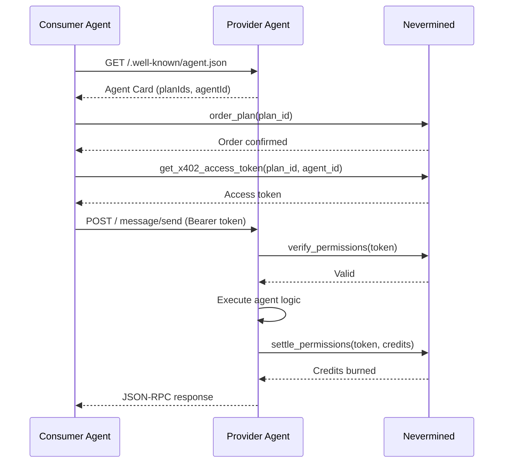

This guide explains how to integrate the Nevermined Payments Python SDK with A2A (Agent-to-Agent) protocol servers.

## Overview

A2A (Agent-to-Agent) is a protocol that enables AI agents to communicate with each other using JSON-RPC. The Nevermined SDK provides A2A integration to:

- Build A2A servers with payment validation
- Automatically verify x402 tokens on incoming requests
- Handle credit redemption for agent tasks

## Payment Flow



## Building Agent Cards

### With a Single Plan

```python
from payments_py.a2a import build_payment_agent_card

agent_card = build_payment_agent_card(
    base_card={
        "name": "Code Review Agent",
        "description": "Automated code review powered by AI",
        "url": "https://localhost:8080",
        "version": "1.0.0",
        "capabilities": {
            "streaming": False,
            "pushNotifications": False,
        },
    },
    payment_metadata={
        "paymentType": "fixed",
        "credits": 1,
        "agentId": "your-agent-id",
        "planId": "your-plan-id",
        "costDescription": "1 credit per review",
    },
)
```

### With Multiple Plans

When your agent supports multiple plans (e.g. a basic and a premium tier), use `planIds` instead of `planId`:

```python
agent_card = build_payment_agent_card(
    base_card={
        "name": "Code Review Agent",
        "url": "https://localhost:8080",
        "version": "1.0.0",
        "capabilities": {},
    },
    payment_metadata={
        "paymentType": "dynamic",
        "credits": 5,
        "agentId": "your-agent-id",
        "planIds": ["plan-basic", "plan-premium"],
        "costDescription": "1-5 credits depending on review depth",
    },
)
```

<Note>Provide either `planId` or `planIds`, not both. `planIds` must be a non-empty list.</Note>

### Agent Card Structure

The agent card includes a payment extension:

```json
{
  "name": "Code Review Agent",
  "url": "https://localhost:8080",
  "version": "1.0.0",
  "capabilities": {
    "extensions": [
      {
        "uri": "urn:nevermined:payment",
        "params": {
          "paymentType": "dynamic",
          "credits": 5,
          "agentId": "your-agent-id",
          "planIds": ["plan-basic", "plan-premium"],
          "costDescription": "1-5 credits depending on review depth"
        }
      }
    ]
  }
}
```

## Using the `@a2a_requires_payment` Decorator

The simplest way to create a payment-protected A2A agent:

```python
from payments_py import Payments
from payments_py.common.types import PaymentOptions
from payments_py.a2a import AgentResponse, a2a_requires_payment, build_payment_agent_card

payments = Payments.get_instance(
    PaymentOptions(nvm_api_key="nvm:your-key", environment="sandbox")
)

agent_card = build_payment_agent_card(
    base_card={
        "name": "My Agent",
        "url": "http://localhost:8080",
        "version": "1.0.0",
        "capabilities": {},
    },
    payment_metadata={
        "paymentType": "dynamic",
        "credits": 3,
        "agentId": "your-agent-id",
        "planIds": ["plan-1", "plan-2"],
    },
)

@a2a_requires_payment(
    payments=payments,
    agent_card=agent_card,
    default_credits=1,
)
async def my_agent(context) -> AgentResponse:
    text = context.get_user_input()
    return AgentResponse(text=f"Echo: {text}", credits_used=1)

# Start serving (blocking)
my_agent.serve(port=8080)
```

The decorator handles:

- Payment middleware (verify/settle) automatically
- Publishing task status events with `creditsUsed` metadata
- Credit burning on task completion

### `AgentResponse`

| Field | Type | Description |
|-------|------|-------------|
| `text` | `str` | The agent's text response |
| `credits_used` | `int \| None` | Credits consumed (falls back to `default_credits`) |
| `metadata` | `dict \| None` | Extra metadata for the final event |

## Starting an A2A Server (Advanced)

For more control, use `PaymentsA2AServer.start()` directly:

```python
from payments_py.a2a.server import PaymentsA2AServer
from a2a.server.agent_execution import AgentExecutor
from a2a.server.events.event_queue import EventQueue

class MyExecutor(AgentExecutor):
    async def execute(self, context, event_queue: EventQueue):
        # Your agent logic — publish events to event_queue
        ...

    async def cancel(self, context, event_queue: EventQueue):
        ...

result = PaymentsA2AServer.start(
    agent_card=agent_card,
    executor=MyExecutor(),
    payments_service=payments,
    port=8080,
    base_path="/",
    expose_agent_card=True,
    async_execution=False,
)

# Run the server
import asyncio
asyncio.run(result.server.serve())
```

## Server Configuration Options

| Option | Type | Required | Description |
|--------|------|----------|-------------|
| `agent_card` | `AgentCard` | Yes | A2A agent card with payment extension |
| `executor` | `AgentExecutor` | Yes | Your agent implementation |
| `payments_service` | `Payments` | Yes | Payments instance |
| `port` | `int` | No | Server port (default: 8080) |
| `task_store` | `TaskStore` | No | Task storage implementation |
| `base_path` | `str` | No | Base URL path (default: "/") |
| `expose_agent_card` | `bool` | No | Expose /.well-known/agent.json |
| `hooks` | `dict` | No | Request lifecycle hooks |
| `async_execution` | `bool` | No | Enable async task execution |

## Request Validation

The A2A server automatically validates payments on every POST request:

1. Extracts the access token from the `payment-signature` header
2. Reads `planId` or `planIds` from the agent card's payment extension
3. Verifies permissions via `build_payment_required_for_plans()`
4. Rejects requests with 402 if validation fails, including a base64-encoded `payment-required` header

When multiple plans are configured, the 402 response includes all plans in `accepts[]`, allowing the client to choose which plan to purchase.

```
HTTP/1.1 402 Payment Required
payment-required: eyJ4NDAy... (base64-encoded X402PaymentRequired)

{"error": {"code": -32001, "message": "Missing bearer token."}}
```

## Client Usage

### Discovering Plans from the Agent Card

Consumers can fetch the agent card to discover available plans:

```python
import httpx

async with httpx.AsyncClient() as client:
    resp = await client.get("http://agent-url/.well-known/agent.json")
    card = resp.json()

extensions = card["capabilities"]["extensions"]
payment_ext = next(e for e in extensions if e["uri"] == "urn:nevermined:payment")
plan_ids = payment_ext["params"].get("planIds") or [payment_ext["params"]["planId"]]
agent_id = payment_ext["params"]["agentId"]
```

### Ordering a Plan and Sending Messages

```python
from payments_py import Payments
from payments_py.common.types import PaymentOptions

payments = Payments.get_instance(
    PaymentOptions(nvm_api_key="nvm:subscriber-key", environment="sandbox")
)

# Order (purchase) the plan
payments.plans.order_plan(plan_ids[0])

# Get x402 access token
token_resp = payments.x402.get_x402_access_token(
    plan_id=plan_ids[0],
    agent_id=agent_id,
)
access_token = token_resp["accessToken"]

# Send A2A JSON-RPC message
async with httpx.AsyncClient() as client:
    resp = await client.post(
        "http://agent-url/",
        json={
            "jsonrpc": "2.0",
            "id": 1,
            "method": "message/send",
            "params": {
                "message": {
                    "messageId": "msg-1",
                    "role": "user",
                    "parts": [{"kind": "text", "text": "Review this code"}],
                }
            },
        },
        headers={"payment-signature": access_token},
    )
    result = resp.json()
```

## Hooks

Add custom logic at request lifecycle points:

```python
async def before_request(method, params, request):
    print(f"Incoming request: {method}")

async def after_request(method, response, request):
    print(f"Request completed: {method}")

async def on_error(method, error, request):
    print(f"Request failed: {method} - {error}")

result = PaymentsA2AServer.start(
    agent_card=agent_card,
    executor=executor,
    payments_service=payments,
    hooks={
        "beforeRequest": before_request,
        "afterRequest": after_request,
        "onError": on_error,
    },
)
```

## Error Handling

| Error Code | HTTP Status | Description |
|------------|-------------|-------------|
| -32001 | 402 | Missing Bearer token |
| -32001 | 402 | Payment validation failed |
| -32001 | 402 | Agent ID missing from card |
| -32001 | 402 | Plan ID missing from card |

## Next Steps

<CardGroup cols={2}>
  <Card title="x402 Protocol" icon="arrow-right" href="/docs/api-reference/python/x402-module">
    Deep dive into x402 payment protocol
  </Card>
  <Card title="Request Validation" icon="arrow-right" href="/docs/api-reference/python/validation-module">
    Manual validation patterns
  </Card>
</CardGroup>
