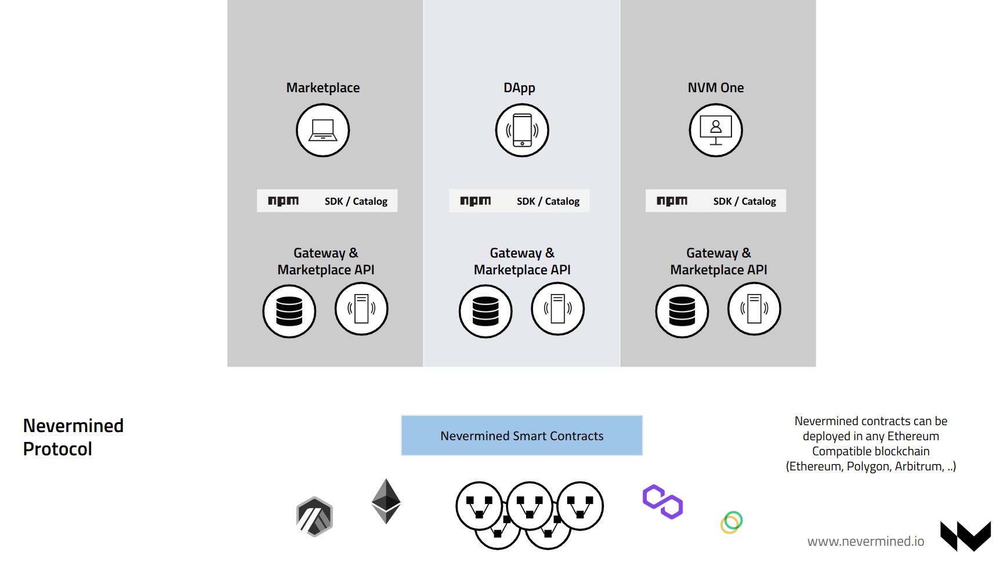

# Building decentralized applications with Nevermined

Nevermined provides a list of features that allow to build rich use cases around the digital assets registed by content creators. And all of this in a decentralized manner, facilitating the interaction between these content creators and their target users in a trustless environment.

Nevermined ships different [technical components](building-blocks.md) to make that happen, but in most of the cases the builders of applications are interested in delivering nice use cases without knowing all the low level details of the architecture.

To facilitate the utilization of Nevermined and the orchestration of all the different components, we provide the following components:

* The [Nevermined SDK](../nevermined-sdk/)
* The [Nevermined Catalog](../catalog/intro)

:::info Which one to use

If you are building a **React application** our recommendation is to use the [Nevermined Catalog](../catalog/intro), but if not to use the [Nevermined SDK](../nevermined-sdk/).

:::

From a developer point of view, the integration of Nevermined is quite straight forward. The usage of the Catalog or the SDK with the usage of any of the existing [Nevermined public environments](../environments/) facilitate the easy development of Decentralized Applications leveraging the Nevermined features.

## Features

Nevermined provides the following core features that can be used to build different scenarios or use cases:

* Access Control - It is a core and cross capability of Nevermined that can be found across all the existing features. It allows to asset creators/providers to define authorization rules that are enforced and validated in a blockchain.
* Data Sharing - In Nevermined a digital asset can be registered and provide an **access** service. That service allows the download of all the files attached to the asset, when the consumer fulfills all the conditions defined by the asset creator/provider.
* Remote Computation - It allows to define scenarios where an asset owner enable the execution of an algorithm on top of existing data in a privacy preserving manner.
* Tokenization - Allows digital assets tokenization via ERC-721 or ERC-1155 NFTs. It includes the modules to facilitate secondary markets and royalties enforcement.
* Search & Discovery - Exposes the flexibility of querying for digital asset metadata attributes and the events associated with their life-cycle.
* Provenance - Tracks on-chain all the relevant actions related with the digital assets.

## Integration

The existence of these features allow application developers to build use cases touching one or many of the above. The best way to do that is using any of the existing libraries provided.

### Nevermined Catalog

The [Nevermined Catalog](../catalog/intro) is also a **NPM** library of packaged Nevermined functionalities making easier to add web3 capabilities to any existing **React application**. The Catalog uses the SDK under the hood.

### Nevermined SDK

The [Nevermined SDK](../nevermined-sdk/) is a **NPM** library of packaged Nevermined functionalities allowing to use all the existing functionalities in any kind of **web or stand-alone** application.
