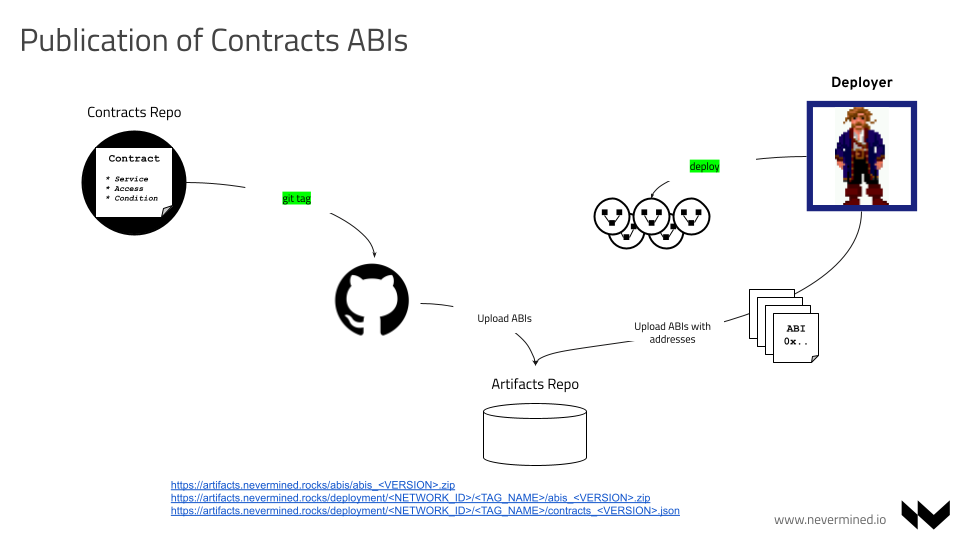
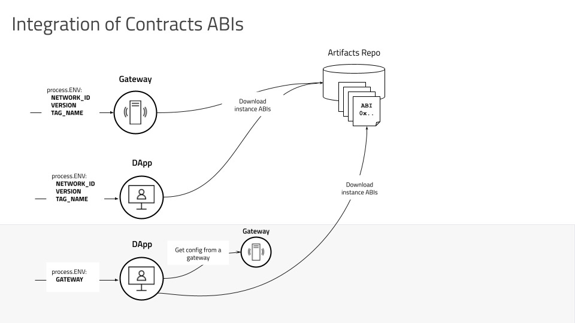

# Contracts ABIs

Nevermined as a digital ecosystems builder has some differences from a contracts deployment point of view compared
with some other protocols.

These are some main characteristics:

* We support different products built on Nevermined contracts running in different networks
* Each product will use different versions of the contracts
* Different products in the same network could require different versions of the contracts

## What defines a Nevermined deployment

So the organization of how the applications are using the which version of the contracts in which network is defined by
3 dimensions:

* **Version**, the version of the Smart Contracts `v1.3.9`, `v2.0.1`, etc
* **Network**, in which network  (`NETWORK_ID`) are the contracts deployed. Typically `mumbai`, `polygon`, `rinkeby`,
  `mainnet`, `alfajores` and `celo` but it could be others
* **Tag Name**, referring to a specific product or app using this specific release of the contracts. This is important
  because the same version of the contracts in the same network could be required because different configuration
  during the deployment of the instance. If tag name is not specified we assume is a `common` deployment.

So **Version** + **Network** + **Tag Name** defines a unique Nevermined deployment or instance.

## How we release the ABIs?

Because of this, the releasing and deployment process of the contracts take care of:

1. When a new version of the contracts is tagged, the ABIs of that version are stored indicating the version.
2. When a new version of the contracts is installed or upgraded into a non-local environment, the ABIs of that version
   (with the contract address included) corresponding to that network and tag name are stored in a hierarchy structure
   representing this unique version/network/tag




### New release of the contracts (new tag)

A new tag of Nevermined contracts will generate the ABIs that will be uploaded using the following structure:

```
https://artifacts.nevermined.network/abis/abis_<VERSION>.zip | tar.gz
https://artifacts.nevermined.network/abis/<VERSION>/ContractNameA.json
https://artifacts.nevermined.network/abis/<VERSION>/ContractNameB.json
```

### Deployment of the contracts in a network

A new deployment (fresh install or upgrade) of the contracts will generate 2 different files:

* The contracts file keeping the name of the contract and the address where the contract is deployed. This file will be
  in JSON format and have the following format:
```json
{
	"ContractName1": "0x123",
	"ContractName2": "0x123"
}
```
* The ABIs package file including all the ABI files. The package file could be in zip and tar.gz formats.

Taking all the above into account, after a deployment 2 new files are generated with the contracts addresses and abis
using the following structure:
```
https://artifacts.nevermined.network/deployment/<NETWORK_ID>/<TAG_NAME>/abis_<VERSION>.zip | .tar.gz
https://artifacts.nevermined.network/deployment/<NETWORK_ID>/<TAG_NAME>/contracts_<VERSION>.json
```

For example, for a new deployment of contracts `v2.1.0` on `mumbai` that will be used for `common` environments, it will
be generated the following 2 files:

```
https://artifacts.nevermined.network/deployment/mumbai/common/abis_v2.1.0.zip
https://artifacts.nevermined.network/deployment/mumbai/common/contracts_v2.1.0.json
```

## Integration

Knowing the version, environment and the tag name, a client can get all the artifacts and addresses of the contracts
that needs to use downloading the artifacts from the public repository.

In addition to this, the NPM package `@nevermined-io/contracts` of the contracts will include the ABIs. In combination
with the contracts.json, the client should be able to configure the correct address where connect just replacing the
contract addresses in the ABIs.


