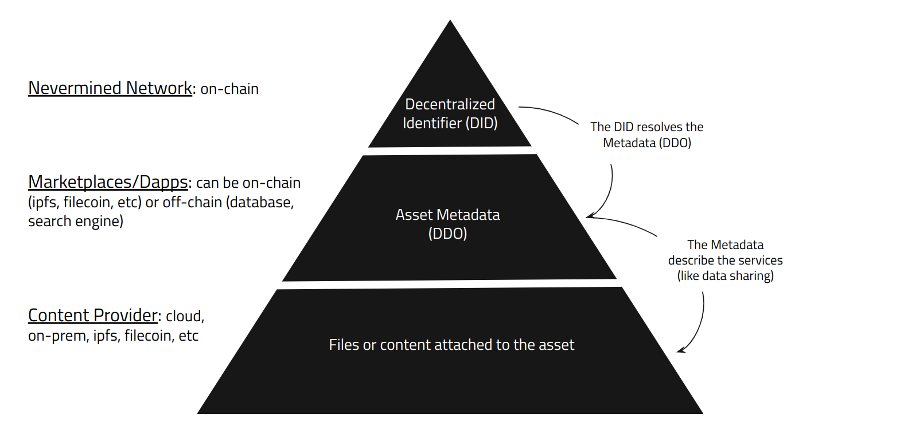

# Intro to Nevermined Architecture

Nevermined is a digital ecosystems builder solution that provides the capabilities of
creating bespoke networks where different entities can interact around digital assets.
This interaction between parties allow to them data sharing, tokenization and 
monetization of their digital assets in an efficient and secure way between 
untrusted parties.

Nevermined is the product powered by [Nevermined AG](https://nevermined.io).

## Capabilities

* **Assets Tokenization via NFTs** — content creators can tokenize their digital 
  assets and make them available to their community of users allowing selling them,
  exclusive access to NFT holders, secondary market and royalties enforcement
* **Data Sharing** — enabling the sharing and access of digital assets between 
  untrusted parties in the data ecosystem
* **Data In-Situ Computation**  — allowing the execution of models and algorithms 
  without moving the data
* **Marketplace** — the user interfaces gluing all together and facilitating user
   interactions with the rest of the digital ecosystem
* **Data Monetization and Incentives** — facilitating the monetization of existing 
  organization assets and the different mechanisms to incentivize the users of a 
  digital ecosystem
* **Data Governance** — making possible to build the agreements that allow to 
  handle an ecosystem with multiple and independent participants


## Digital Ecosystem

A digital ecosystem is an environment where different users can interact around 
digital assets. So Nevermined is built around these digital assets and how they can 
be used between different parties.

### Everything is about assets

An asset in Nevermined is the representation of a phisical or digital thing. It is 
registered by the origital creator or a provider. As an abstract concept, an asset
can represent a piece of digital art, a dataset, an algorithm or piece of software,
a manufactured good or any other kind of physical or digital entity.

An asset in Nevermined is composed by 3 things:

* The unique registry of the asset (on-chain) including the Decentralized Identifier
  of the asset (aka **DID**) and the reference to the asset metadata (aka **DDO**).
* The metadata describing the asset. This includes things like a description of the
  asset, author, creation date, etc. The metadata of the asset can be stored anywhere
  (off-chain in a database or on-chain in IPFS, Filecoin, etc).
* All the files attached to the asset. They can be of any type, format, size, encrypted
  or not, etc. The files can be stored in the cloud, on-premise, public network, etc.



:::info

Nevermined don't store the files attached to an asset. So if you register an asset you 
can keep all of them wherever you want (in a private or public storage). 
In Nevermined we just keep the **DID** and some **metadata** to facilitate the discovery
of the asset.

:::


The main reason of an asset in Nevermined is to **offer certain services** from the 
publishers of that asset to the rest of the world. These services are flexible and 
typically can be understood as something like the following example:

```
As a owner of this asset, I want to allow others to download the contents associated
to it if they pay 1 ETH.
```

The above example is a simple service offered by an asset owner published on Nevermined
where it allows data sharing to anyone paying `1 ETH`. Nevermined allows the registration
of assets with attached services like that one, and orchestrates all the trading to 
mediate in the delivery of that service in a decentralized and secure way. 

Nevermined implements this and some other services around digital assets, allowing to 
build use cases where content creators and/or publishers can create robust interactions
without having a central entity keeping the assets of the users.

:::info

This last part is important. Nevermined don't store your private files, your credentials
or own any of the assets you register in any of the networks.

:::


