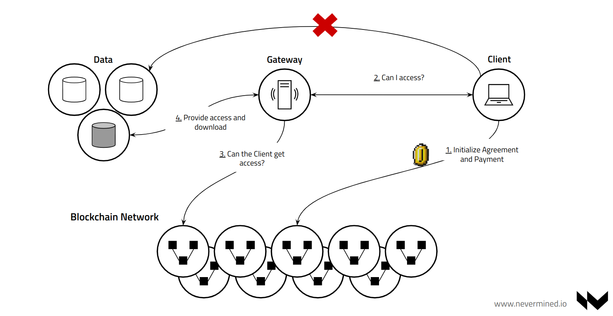
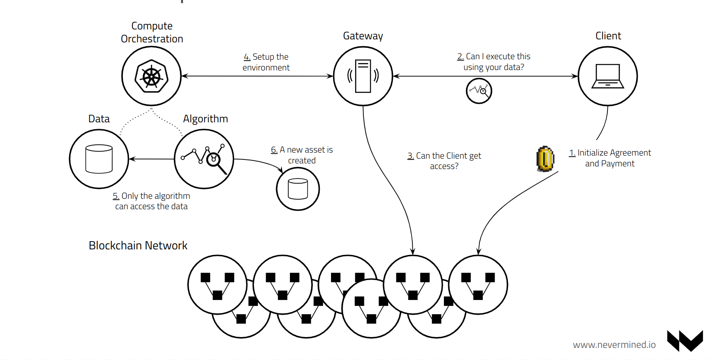
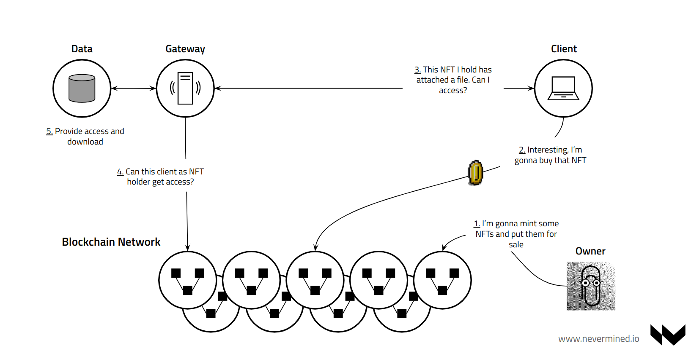

# What can I do with my assets?

Nevermined is a network built around digital assets and how they can be 
used to provide digital services. In the overview section we introduced
the concept of a service, as something that an asset owner/publisher 
provide to the rest of the world to get something in return (or for free!).

Nevermined enforces the delivery of these services in a secure way for 
asset owners/providers and the final users/consumers via the Nevermined
Smart Contracts. 

Nevermined is an omnichain interoperability protocol for the creation, minting and bridging of digital assets and non-fungible tokens (NFTs). The SDK, Catalogue and other tools it comproses seamlessly beam tokens across blockchains with complete data integrity, including persistent smart contract addresses and token IDs. Omnichain bridging unlocks new and exciting use cases by achieving true asset interactivity. 

:::info

Each asset registered in Nevermined can have associated more than one service.
Data Sharing and Compute. NFT Sales and NFT Access to exclusive contents, etc.

:::

## Available services

The services available on Nevermined for digital assets are:

### Data Sharing (aka "access")

This service allows data owners or providers to give access to the files 
attached to an asset if the users/consumers fulfill the conditions they
define (in most of the cases payment of some amount).

As a owner of data I want to keep this in place where is stored (cloud, 
on-prem, public network, etc). But I want to give access to this data to
users paying for it (free access is possible too).

So what I do is register an asset in Nevermined specifying I want to provide
the `access` service. Everything I have to specify is: 

* The Metadata of the asset. That will help to discover the asset.
* The payment conditions. What's the price, what token will be used (erc20 or native), etc.
* The URLs where the asset/s are. The URLs needs to be resolvable by the gateway. URLs can be 
  regular http urls, or reference CIDs on IPFS and/or Filecoin networks.

:::info

The URLs to the files **always will be encrypted** so even if they are in a public network a 
user won't be able to access the files unless it goes through the Nevermined Service Agreements.

:::

### Remote computation (aka "compute")

For owners of assets with more restrictive privacy constraints, data sharing could
not be a valid option. The "compute" service allows to third-parties for paying to 
execute some algorithm on top of the data in a privacy preserving manner. 
All of this without moving the data from the current location.

:::info

The full name of the compute service is Data In Situ Computation (DISC).
You can find the low level details in the [Compute Specifications](specs/Spec-COMPUTE.md).

:::

In this case Nevermined facilitates the 
payment and reward for the delivery of this service and orchestates the infrastructure
to make that possible.

The compute engine of Nevermined allows the orchestration of different kind of computations,
currently we support the execution of traditional analytics frameworks (Spark, Flink, etc),
stand-alone software and Federated Learning workflows.

### Tokenization of assets via ERC-721 NFTs (aka "nft721-sales")

This service allows users to attach an asset to a ERC-721 NFT. This will allow them
to sell NFTs representing a fraction of the digital ownership of that asset to some other
users. 

This service works as follows:

1. The publisher register a new asset in Nevermined (Metadata, price, etc). The publisher specifies
   the contract address of the ERC-721 NFT.
2. A different user pays for that NFT. The ERC-721 is transferred to the buyer.
3. The rewards are transferred to the seller.

### Tokenization of assets via ERC-1155 NFTs (aka "nft-sales")

This service works like the previous one with the difference it uses a ERC-1155 NFT.
The difference between the different NFTs standards are the ERC-721 are non-fungible and 
ERC-1155 semi-fungible. In the first one each NFT minted is unique, but in the ERC-1155 there
is the possibility for minting multiple editions of the same NFT.

### Exclusive access for ERC-721 NFTs holders (aka "nft721-access")

This service allows asset owners to create access control mechanisms to contents where only the 
holders of specific ERC-721 NFTs can access. 

This service protects contents implementing a NFT access control system that is enforced by the 
Nevermined Gateway, that works as a guard of the asset contents checking on-chain if the user
has a specific NFT.

:::info

This service works perfectlly in combination with the **nft721-sales** service. The Sales service allows
to sell NFTs associated to an asset, and for all the buyers you allow to get access to exclusive contents
with the **nft721-access** service.

:::

### Exclusive access for ERC-1155 NFTs holders (aka "nft-access")

This service works like the previous one with the difference it uses a ERC-1155 NFT.
The difference between the different NFTs standards are the ERC-721 are non-fungible and 
ERC-1155 semi-fungible. In the first one each NFT minted is unique, but in the ERC-1155 there
is the possibility for minting multiple editions of the same NFT.

Because of that, this service allows to define access depending on the number of editions that 
a user holds. For example:

* If a user holds 1 edition of my NFT, that user can get access to a exclusive picture
* If a user holds 3 editions of my NFT, that user can get access to a exclusive picture in high quality
* If a user holds 5 editions of my NFT, that user can get access to a exclusive picture in high quality and a video

### Loans using NFTs as collateral (aka "aave-credit")

This service is provided with the integration of Nevermined with **Aave protocol**.

This service makes it possible for NFT collectors to create loan agreements using their NFTs as collateral, 
without having to leave their trusted marketplace. The benefit for depositors is that they can receive two 
streams of return: from the collector and from an Aave vault.

Yo can find more information about it in the [NFT Baked Loans blog post](https://medium.com/nevermined-io/new-nevermined-component-allows-marketplaces-to-offer-nft-backed-loans-5e05c77e6709).
