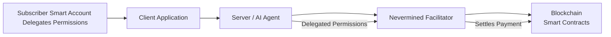
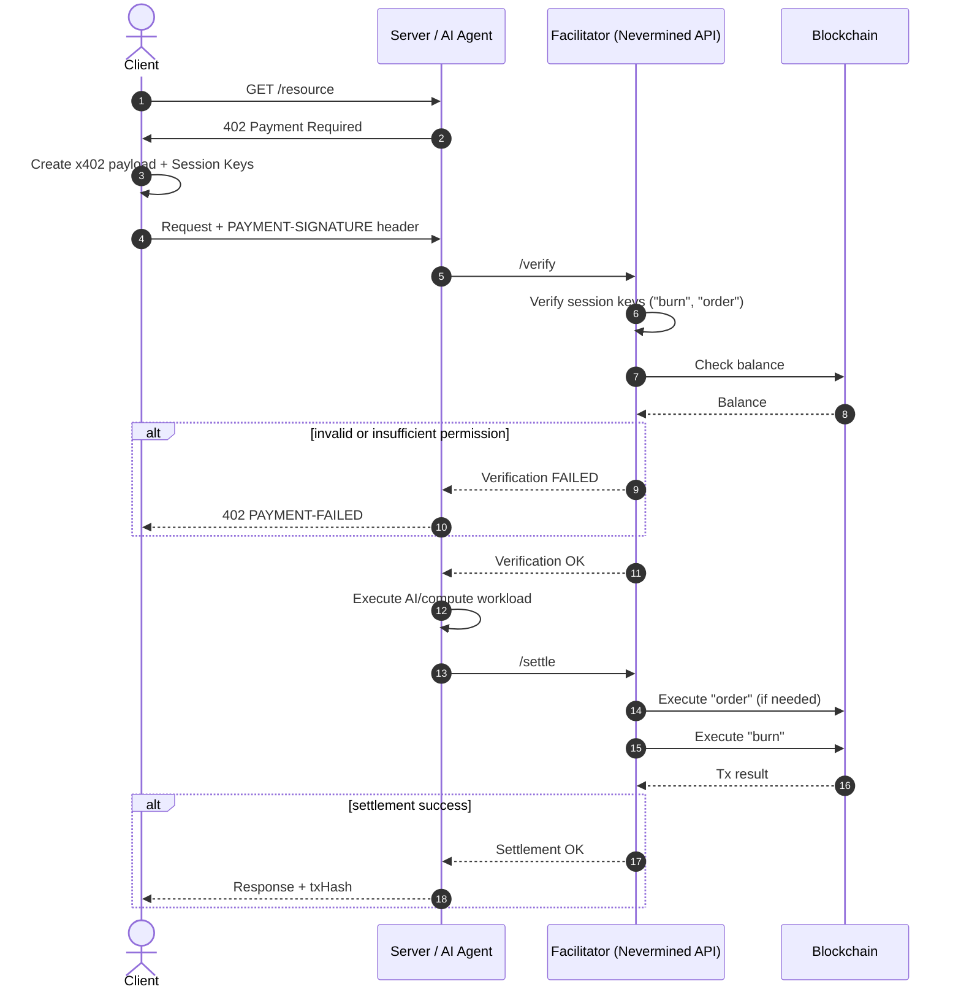

# Nevermined x402

Nevermined provides first-class support for the x402 payment protocol, enabling AI agents, APIs, and services to charge per-request using secure, locally-signed payment authorizations.

## Overview

This section explains:

- How Nevermined extends x402 with Smart Account–based settlement
- How subscribers generate and sign x402 Access Tokens
- How permissions, session keys, and delegated execution work
- How the facilitator verifies and settles requests
- How to use the Python and TypeScript x402 client libraries
- Advanced integration with Google A2A/AP2

Nevermined's x402 implementation is compatible with the standard protocol while adding programmable settlement layers (credits, subscriptions, time-based plans, etc.) powered by Nevermined smart contracts.

## Background: What x402 Solves

The x402 protocol defines a payment-enforced HTTP 402 mechanism:

1. A client calls an API.
2. The server responds with HTTP 402 Payment Required and instructions.
3. The client signs a payment authorization locally (no private key leaves the device).
4. The signed authorization is included in the next request.
5. The server forwards it to a facilitator, which:
   - Verifies the signature
   - Checks balance/permissions
   - Settles payment on-chain (EIP-3009 or equivalent)

Nevermined extends this with ERC-4337 Smart Accounts, session keys, and programmable billing models, allowing much more complex behavior than standard EIP-3009-based transfers.

## Why Nevermined Extends x402

x402 itself focuses on single ERC-20, pay-per-request flows.

Nevermined introduces:

| Area                  | x402            | Nevermined                                                          |
| --------------------- | --------------- | ------------------------------------------------------------------- |
| Payment authorization | EIP-3009        | ERC-4337 UserOps + session keys                                     |
| Wallet model          | EOA signatures  | Smart Accounts with granular permissions                            |
| Billing models        | Pay-per-request | Subscriptions, credits, time windows, credit-burning                |
| Delegated execution   | Basic           | Fully programmable “burn”, “order”, “redeem”, plan-specific actions |
| Settlement layer      | ERC-20          | Nevermined smart-contract settlement                                |


This means a subscriber can grant a server the ability to redeem credits or burn usage units while maintaining strict control over what the server can do.

## High-Level Architecture



Roles:

- Subscriber: owns a Smart Account; delegates permissions through smart account policies
- Server/Agent: exposes an API secured by x402
- Facilitator: Nevermined component that verifies and settles payments
- Blockchain: executes credit burns, orders, or other plan-specific actions


## The Nevermined x402 Smart-Account Extension

Nevermined introduces a new x402 extension:
```
extensions.smart-account
```

Instead of embedding an EIP-3009 transfer, the payload includes:

- An EIP-712 signature
- One or more session keys
- Encoded UserOperations representing actions like:
  - order (purchase credits if balance is low)
  - burn (burn credits for usage)
  - redeem (convert plan entitlements into usage)

### Example Payment Payload

```json
{
  "x402Version": 2,
  "scheme": "exact",
  "network": "base-sepolia",
  "extensions": {
    "smart-account": {
      "signature": "EIP-712 signature",
      "authorization": {
        "provider": "zerodev",
        "sessionKeys": [
          { "id": "order", "data": "base64-session-key" },
          { "id": "redeem", "hash": "keccak-session-key-hash" }
        ]
      }
    }
  },
  "payload": {}
}
```

### What the subscriber delegates

| Permission      | Meaning                                                    |
| --------------- | ---------------------------------------------------------- |
| **order**       | Allows facilitator to top-up credits (e.g., auto-purchase) |
| **redeem**      | Allows facilitator to deduct credits per request           |
| **\<custom\>**  | Additional session-key-scoped behaviors you define         |


## Complete Payment & Execution Flow

Below is the Nevermined x402 Smart Account flow (verification + settlement).



## Facilitator Responsibilities

### Verification

The facilitator validates:

- x402 envelope structure
- EIP-712 signature
- Session key authenticity (data or hash)
- UserOperation validity (simulation)
- Permission requirements (e.g., burn MUST be delegated)
- Subscriber balance and plan state
- If verification fails, server returns 402 PAYMENT-FAILED.

### Settlement

Settlement runs after the server performs the work:

- Execute order (if needed) to top up credits
- Execute burn to deduct usage
- Submit UserOps on-chain
- Return tx hashes to the server

## Developer Guide: Subscriber Flow

### Step 1 — Discover payment requirements

When the server returns 402 Payment Required, it includes a JSON object with:

- Supported schemes (smart-account)
- Required permissions
- Accepted plans / plan IDs

### Step 2 — Build a payment payload

Using Nevermined Payments libraries (Python or TS), you generate:

- Session keys
- Delegated permissions (burn, order, redeem)
- A fully-formed x402 payload with EIP-712 signing

<Tabs>
  <Tab title="TypeScript">
    ```typescript
    import { Payments } from '@nevermined-io/payments'
    
    const payments = Payments.getInstance({
      nvmApiKey: 'nvm:subscriber-key',
      environment: 'sandbox',
    })
    
    // Fetch protected resource to get the Nevermined extension
    const requiredRes = await fetch('https://api.example.com/protected')
    const paymentRequired = await requiredRes.json()
    const { plan_id, agent_id, max_amount, network } = paymentRequired.extensions.nevermined.info
    
    // Generate the x402 session token
    const { accessToken } = await payments.x402.getX402AccessToken(plan_id, agent_id)
    
    // Build the payload with the copied extension
    const paymentPayload = {
      x402Version: 2,
      scheme: 'contract',
      network,
      payload: { session_key: accessToken },
      extensions: paymentRequired.extensions,
    }
    ```
  </Tab>
  <Tab title="Python">
    ```python
    import json, requests
    from payments_py import Payments, PaymentOptions
    from payments_py.x402.extensions.nevermined import extract_nevermined_info
    
    payments = Payments.get_instance(
        PaymentOptions(nvm_api_key="nvm:subscriber-key", environment="sandbox")
    )
    
    # Fetch protected resource to get the Nevermined extension
    required_res = requests.get("https://api.example.com/protected")
    payment_required = required_res.json()
    nvm_info = extract_nevermined_info(payment_required, None)
    
    # Generate the x402 session token
    token_res = payments.x402.get_x402_access_token(
        nvm_info["plan_id"],
        nvm_info["agent_id"],
    )
    access_token = token_res["accessToken"]
    
    # Build the payload with the copied extension
    payment_payload = {
        "x402Version": 2,
        "scheme": "contract",
        "network": nvm_info["network"],
        "payload": {"session_key": access_token},
        "extensions": payment_required["extensions"],
    }
    ```
  </Tab>
</Tabs>

### Step 3 — Submit with HTTP header

Clients include:

```
PAYMENT-SIGNATURE: <base64 x402 payload>
```

## Developer Guide: Agent Flow

### Step 1 — Receive and parse

- Read the x402 payload from the request header (e.g., `PAYMENT-SIGNATURE`).
- Extract the Nevermined extension (`plan_id`, `agent_id`, `max_amount`, `network`, `scheme`) and the `session_key`.

### Step 2 — Verify with the facilitator

<Tabs>
  <Tab title="TypeScript">
    ```typescript
    import { Payments } from '@nevermined-io/payments'
    
    const payments = Payments.getInstance({
      nvmApiKey: 'nvm:agent-key',
      environment: 'sandbox',
    })
    
    // xPaymentHeader contains the JSON string from the incoming request
    const paymentPayload = JSON.parse(xPaymentHeader)
    const { plan_id, max_amount } = paymentPayload.extensions.nevermined.info
    
    const verification = await payments.facilitator.verifyPermissions({
      planId: plan_id,
      maxAmount: BigInt(max_amount),
      x402AccessToken: paymentPayload.payload.session_key,
      subscriberAddress: subscriberAddressFromRequest,
    })
    
    if (!verification.success) {
      throw new Error('Payment Required')
    }
    ```
  </Tab>
  <Tab title="Python">
    ```python
    from payments_py.x402 import NeverminedFacilitator, PaymentRequirements
    from payments_py.x402.extensions.nevermined import extract_nevermined_info
    
    facilitator = NeverminedFacilitator(
        nvm_api_key="nvm:agent-key",
        environment="sandbox",
    )
    
    nvm_info = extract_nevermined_info(payment_payload, None)
    requirements = PaymentRequirements(
        plan_id=nvm_info["plan_id"],
        agent_id=nvm_info["agent_id"],
        max_amount=nvm_info["max_amount"],
        extra={"subscriber_address": subscriber_address},
    )
    
    verify_result = await facilitator.verify(payment_payload, requirements)
    if not verify_result.is_valid:
        raise Exception("Payment Required")
    ```
  </Tab>
</Tabs>

### Step 3 — Execute your workload

- Perform the paid operation only after verification succeeds.

### Step 4 — Settle

<Tabs>
  <Tab title="TypeScript">
    ```typescript
    await payments.facilitator.settlePermissions({
      planId: plan_id,
      maxAmount: BigInt(max_amount),
      x402AccessToken: paymentPayload.payload.session_key,
      subscriberAddress: subscriberAddressFromRequest,
    })
    ```
  </Tab>
  <Tab title="Python">
    ```python
    await facilitator.settle(payment_payload, requirements)
    ```
  </Tab>
</Tabs>

- Return your response to the client, optionally including the settlement transaction hash.

## Summary

This section provides a comprehensive guide for developers integrating Nevermined with x402:

- **x402** gives a universal payment-required protocol
- **Nevermined** enriches it with Smart Accounts, UserOps, and advanced billing models
- **Subscribers** delegate controlled permissions using session keys
- **Servers** simply forward PAYMENT-SIGNATURE headers
- **Facilitators** verify and settle on-chain
- **Python & TS libraries** provide turnkey developer tooling
- **Google A2A/AP2** flows are supported for enterprise-grade integrations