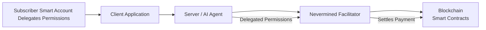
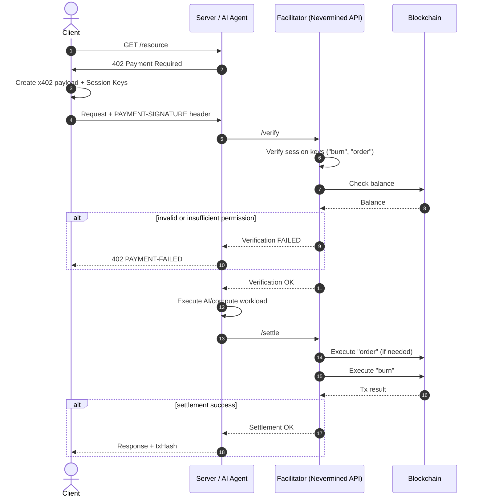

# Nevermined x402

Nevermined provides first-class support for the x402 payment protocol, enabling AI agents, APIs, and services to charge per-request using secure, locally-signed payment authorizations.

<Note>
For the complete technical specification, see the [x402 Smart Accounts Extension Spec](/docs/specs/x402-smart-accounts).
</Note>

## Overview

This section explains:

- The x402 HTTP 402 handshake and `PAYMENT-SIGNATURE` retry pattern
- How Nevermined extends x402 with Smart Accountbased settlement
- How subscribers generate and sign x402 payment proofs
- How permissions, session keys, and delegated execution work
- How the facilitator verifies and settles requests
- How to use the Python and TypeScript x402 client libraries
- Advanced integration with Google A2A/AP2

For pricing and plan configuration (credits, time-based access, dynamic pricing), see:

- [Payment Models](/docs/products/x402-facilitator/payment-models)

Nevermined's x402 implementation is compatible with the standard protocol while adding programmable settlement layers powered by Nevermined smart contracts.

## Background: What x402 Solves

The x402 protocol defines a payment-enforced HTTP 402 mechanism:

1. A client calls an API.
2. The server responds with HTTP 402 Payment Required and instructions.
3. The client signs a payment authorization locally (no private key leaves the device).
4. The signed authorization is included in the next request.
5. The server forwards it to a facilitator, which:
   - Verifies the signature
   - Checks balance/permissions
   - Settles payment on-chain (EIP-3009 or equivalent)

Nevermined extends this with ERC-4337 Smart Accounts, session keys, and programmable billing models, allowing much more complex behavior than standard EIP-3009-based transfers.

## Why Nevermined Extends x402

x402 itself focuses on single ERC-20, pay-per-request flows.

Nevermined introduces:

| Area                  | x402            | Nevermined                                                          |
| --------------------- | --------------- | ------------------------------------------------------------------- |
| Payment authorization | EIP-3009        | ERC-4337 UserOps + session keys                                     |
| Wallet model          | EOA signatures  | Smart Accounts with granular permissions                            |
| Billing models        | Pay-per-request | Subscriptions, credits, time windows, credit-burning                |
| Delegated execution   | Basic           | Fully programmable “burn”, “order”, “redeem”, plan-specific actions |
| Settlement layer      | ERC-20          | Nevermined smart-contract settlement                                |


This means a subscriber can grant a server the ability to redeem credits or burn usage units while maintaining strict control over what the server can do.

## High-Level Architecture



Roles:

- Subscriber: owns a Smart Account; delegates permissions through smart account policies
- Server/Agent: exposes an API secured by x402
- Facilitator: Nevermined component that verifies and settles payments
- Blockchain: executes credit burns, orders, or other plan-specific actions


## The Nevermined x402 Smart-Account Extension

Nevermined introduces a new x402 scheme: `nvm:erc4337`

This scheme uses ERC-4337 smart accounts instead of EOA wallets, enabling programmable settlement through session keys and UserOperations.

Instead of embedding an EIP-3009 transfer, the payload includes:

- An EIP-712 signature
- One or more session keys
- Encoded UserOperations representing actions like:
  - order (purchase credits if balance is low)
  - burn (burn credits for usage)
  - redeem (convert plan entitlements into usage)

### PaymentRequired Response (402)

When a server requires payment, it returns a `402` response with a `payment-required` header:

```json
{
  "x402Version": 2,
  "error": "Payment required to access resource",
  "resource": {
    "url": "/api/v1/agents/80918427023170428029540261117198154464497879145267720259488529685089104529015/tasks",
    "description": "AI agent task execution",
    "mimeType": "application/json"
  },
  "accepts": [{
    "scheme": "nvm:erc4337",
    "network": "eip155:84532",
    "planId": "44742763076047497640080230236781474129970992727896593861997347135613135571071",
    "extra": {
      "version": "1",
      "agentId": "80918427023170428029540261117198154464497879145267720259488529685089104529015"
    }
  }],
  "extensions": {}
}
```

### PaymentPayload (Client Response)

The client responds with a `payment-signature` header containing the payment payload:

```json
{
  "x402Version": 2,
  "resource": {
    "url": "/api/v1/agents/80918427023170428029540261117198154464497879145267720259488529685089104529015/tasks"
  },
  "accepted": {
    "scheme": "nvm:erc4337",
    "network": "eip155:84532",
    "planId": "44742763076047497640080230236781474129970992727896593861997347135613135571071",
    "extra": {
      "version": "1",
      "agentId": "80918427023170428029540261117198154464497879145267720259488529685089104529015"
    }
  },
  "payload": {
    "signature": "0x01845ADb2C711129d4f3966735eD98a9F09fC4cE...",
    "authorization": {
      "from": "0xD4f58B60330bC59cB0A07eE6A1A66ad64244eC8c",
      "sessionKeysProvider": "zerodev",
      "sessionKeys": [
        { "id": "order", "data": "0x20a13d82dd9ee289fc5e5a90f4011c8dc03f8f5d..." },
        { "id": "redeem", "data": "0x68e8e34d659149087451cafc89a7320114072e49..." }
      ]
    }
  },
  "extensions": {}
}
```

### What the subscriber delegates

| Permission      | Meaning                                                    |
| --------------- | ---------------------------------------------------------- |
| **order**       | Allows facilitator to top-up credits (e.g., auto-purchase) |
| **redeem**      | Allows facilitator to deduct credits per request           |
| **\<custom\>**  | Additional session-key-scoped behaviors you define         |


## Complete Payment & Execution Flow

Below is the Nevermined x402 Smart Account flow (verification + settlement).



## Facilitator Responsibilities

### Verification

The facilitator validates:

- x402 envelope structure
- EIP-712 signature
- Session key authenticity (data or hash)
- UserOperation validity (simulation)
- Permission requirements (e.g., burn MUST be delegated)
- Subscriber balance and plan state
- If verification fails, server returns 402 PAYMENT-FAILED.

### Settlement

Settlement runs after the server performs the work:

- Execute order (if needed) to top up credits
- Execute burn to deduct usage
- Submit UserOps on-chain
- Return tx hashes to the server

## Developer Guide: Subscriber Flow

### Step 1 — Discover payment requirements

When the server returns 402 Payment Required, it includes the `payment-required` header (base64-encoded) with:

- Supported schemes (`nvm:erc4337`)
- Plan and agent IDs
- Network information

### Step 2 — Build a payment payload

Using Nevermined Payments libraries (Python or TS), you generate an x402 access token:

<Tabs>
  <Tab title="TypeScript">
    ```typescript
    import { Payments } from '@nevermined-io/payments'
    import { X402_HEADERS } from '@nevermined-io/payments/express'

    const payments = Payments.getInstance({
      nvmApiKey: 'nvm:subscriber-key',
      environment: 'sandbox',
    })

    // Fetch protected resource to get the payment requirements
    const response = await fetch('https://api.example.com/protected')

    if (response.status === 402) {
      // Decode the payment-required header
      const paymentRequired = JSON.parse(
        Buffer.from(response.headers.get(X402_HEADERS.PAYMENT_REQUIRED)!, 'base64').toString()
      )

      // Extract planId and agentId from accepts array
      const { planId, agentId } = paymentRequired.accepts[0]

      // Generate the x402 access token
      const { accessToken } = await payments.x402.getX402AccessToken(planId, agentId)
    }
    ```
  </Tab>
  <Tab title="Python">
    ```python
    import base64
    import json
    import requests
    from payments_py import Payments, PaymentOptions

    payments = Payments.get_instance(
        PaymentOptions(nvm_api_key="nvm:subscriber-key", environment="sandbox")
    )

    # Fetch protected resource to get the payment requirements
    response = requests.get("https://api.example.com/protected")

    if response.status_code == 402:
        # Decode the payment-required header
        payment_required = json.loads(
            base64.b64decode(response.headers.get("payment-required")).decode()
        )

        # Extract planId and agentId from accepts array
        plan_id = payment_required["accepts"][0]["planId"]
        agent_id = payment_required["accepts"][0].get("extra", {}).get("agentId")

        # Generate the x402 access token
        token_res = payments.x402.get_x402_access_token(plan_id, agent_id)
        access_token = token_res["accessToken"]
    ```
  </Tab>
</Tabs>

### Step 3 — Submit with HTTP header

Clients include the x402 access token in the `payment-signature` header:

```
payment-signature: <x402-access-token>
```

## Developer Guide: Agent Flow

### Quick Integration: Express Middleware

For Express.js applications, use the `paymentMiddleware` from `@nevermined-io/payments/express` to handle x402 automatically:

```typescript
import { Payments } from '@nevermined-io/payments'
import { paymentMiddleware } from '@nevermined-io/payments/express'

const payments = Payments.getInstance({
  nvmApiKey: process.env.NVM_API_KEY!,
  environment: 'sandbox'
})

// One line to protect routes
app.use(
  paymentMiddleware(payments, {
    'POST /ask': { planId: PLAN_ID, credits: 1 }
  })
)

// Route handler - no payment logic needed
app.post('/ask', async (req, res) => {
  const result = await processRequest(req.body)
  res.json({ result })
})
```

The middleware handles verification, settlement, and all x402 headers automatically. See the [Express.js Integration Guide](/docs/integrate/add-to-your-agent/express) for full details.

### Manual Integration

For other frameworks or custom implementations, follow these steps:

### Step 1 — Receive and parse

- Read the x402 token from the `payment-signature` or `x-payment` header.
- If no token is present, return a 402 response with payment requirements.

### Step 2 — Verify with the facilitator

<Tabs>
  <Tab title="TypeScript">
    ```typescript
    import { Payments, decodeAccessToken } from '@nevermined-io/payments'

    const payments = Payments.getInstance({
      nvmApiKey: 'nvm:agent-key',
      environment: 'sandbox',
    })

    // Get token from payment-signature header
    const x402Token = req.headers['payment-signature']

    if (!x402Token) {
      // Return 402 with payment requirements
      return res.status(402).json({ error: 'Payment Required' })
    }

    // Verify permissions - facilitator extracts planId and subscriberAddress from token
    const verification = await payments.facilitator.verifyPermissions({
      x402AccessToken: x402Token,
      maxAmount: BigInt(creditsRequired),
    })

    if (!verification.success) {
      return res.status(402).json({ error: 'Payment verification failed' })
    }
    ```
  </Tab>
  <Tab title="Python">
    ```python
    from payments_py import Payments, PaymentOptions

    payments = Payments.get_instance(
        PaymentOptions(nvm_api_key="nvm:agent-key", environment="sandbox")
    )

    # Get token from payment-signature header
    x402_token = request.headers.get("payment-signature")

    if not x402_token:
        # Return 402 with payment requirements
        return {"error": "Payment Required"}, 402

    # Verify permissions - facilitator extracts planId and subscriberAddress from token
    verification = payments.facilitator.verify_permissions(
        x402_access_token=x402_token,
        max_amount=credits_required,
    )

    if not verification.success:
        return {"error": "Payment verification failed"}, 402
    ```
  </Tab>
</Tabs>

### Step 3 — Execute your workload

- Perform the paid operation only after verification succeeds.

### Step 4 — Settle

<Tabs>
  <Tab title="TypeScript">
    ```typescript
    // Settle after work is complete - burns the actual credits used
    const settlement = await payments.facilitator.settlePermissions({
      x402AccessToken: x402Token,
      maxAmount: BigInt(actualCreditsUsed),
    })

    // Return response with settlement receipt in payment-response header
    const settlementReceipt = Buffer.from(JSON.stringify({
      success: true,
      creditsRedeemed: actualCreditsUsed,
      transactionHash: settlement.txHash,
    })).toString('base64')

    res.set('payment-response', settlementReceipt)
    res.json({ result })
    ```
  </Tab>
  <Tab title="Python">
    ```python
    import base64
    import json

    # Settle after work is complete - burns the actual credits used
    settlement = payments.facilitator.settle_permissions(
        x402_access_token=x402_token,
        max_amount=actual_credits_used,
    )

    # Return response with settlement receipt in payment-response header
    settlement_receipt = base64.b64encode(json.dumps({
        "success": True,
        "creditsRedeemed": actual_credits_used,
        "transactionHash": settlement.tx_hash,
    }).encode()).decode()

    response.headers["payment-response"] = settlement_receipt
    return {"result": result}
    ```
  </Tab>
</Tabs>

## Summary

This section provides a comprehensive guide for developers integrating Nevermined with x402:

- **x402** gives a universal payment-required protocol
- **Nevermined** enriches it with Smart Accounts, UserOps, and advanced billing models using the `nvm:erc4337` scheme
- **Subscribers** delegate controlled permissions using session keys
- **Servers** use `payment-signature` headers and verify/settle via the facilitator
- **Facilitators** verify and settle on-chain
- **Python & TS libraries** provide turnkey developer tooling
- **Express middleware** handles the entire flow automatically