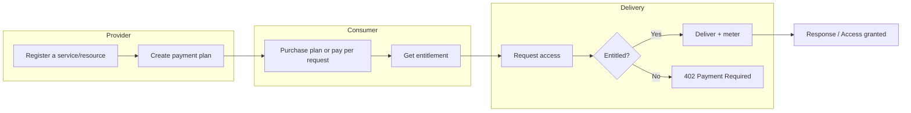

Nevermined enables paid access to **services and resources** — agent APIs, MCP tools/servers, and protected assets — with a consistent flow for pricing, access control, and settlement.

## The Payment Flow

## Three Steps to Monetization

<Steps>
  <Step title="Register what you’re charging for">
    Define the thing you want to monetize — an API endpoint, an MCP tool, or a protected asset — plus metadata for discovery.

    **Examples**: Agent endpoint, MCP tool method, gated download URL.
  </Step>

  <Step title="Create a payment plan">
    Define pricing and how customers pay:

    - **Credits** (prepaid) or **pay-as-you-go (PAYG)**
    - **Time-based** access, **credits-based** usage, or **trial**
    - Fiat (Stripe) or crypto (including stablecoins)
  </Step>

  <Step title="Validate, deliver, and settle">
    At runtime, check entitlement before delivering the service/resource.

    - If entitled: deliver and meter usage (redeem credits or settle per request)
    - If not: return **HTTP 402 Payment Required** (especially for x402 flows)
  </Step>
</Steps>

## Two Integration Paths

<CardGroup cols={2}>
  <Card title="No-Code: Nevermined App" icon="browser" href="/docs/products/nevermined-app/overview">
    Configure services/resources and plans via the dashboard.

    **Best for**: Quick setup, testing, non-technical workflows
  </Card>

  <Card title="Code: SDKs + REST API" icon="code" href="/docs/products/payment-libraries/overview">
    Integrate in TypeScript/Python or call the REST API for full control.

    **Best for**: Production systems, automation, custom request flows
  </Card>
</CardGroup>

## Payment Settlement Options

<CardGroup cols={1}>
  <Card title="x402 Protocol" icon="shield-check" href="/docs/products/x402-facilitator/overview">
    **HTTP 402 Payment Required**

    Use the x402 standard for payment-required requests. The facilitator can handle verification and settlement.
  </Card>
</CardGroup>

## What Nevermined Handles

| Concern | Nevermined Handles |
|---------|-------------------|
| Payment processing | Crypto (including stablecoins) and fiat (Stripe) |
| Access control | Entitlement validation (plans/tokens/x402) |
| Usage metering | Credits redemption or per-request settlement |
| Settlement | Payouts to providers |

## Next Steps

<CardGroup cols={3}>
  <Card title="Core Concepts" icon="book" href="/docs/getting-started/core-concepts">
    Learn the platform terminology
  </Card>

  <Card title="5-Minute Setup" icon="rocket" href="/docs/integrate/quickstart/5-minute-setup">
    Integrate quickly
  </Card>

  <Card title="Use cases" icon="lightbulb" href="/docs/solutions/agent-to-agent-monetization">
    Explore the pillar use cases
  </Card>
</CardGroup>
