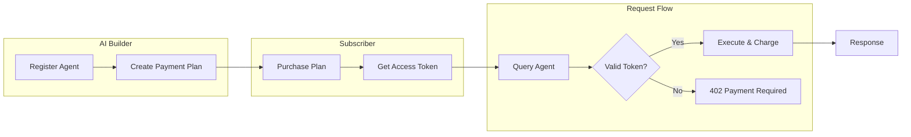

Nevermined enables AI agents and services to accept payments with minimal integration effort. Here's the complete flow from registration to payment.

## The Payment Flow



## Three Steps to Monetization

<Steps>
  <Step title="Register Your Agent">
    Define your AI agent with its endpoints and metadata. This can be done through the [Nevermined App](https://nevermined.app) or programmatically via the Payment Libraries.

    ```typescript
    const { agentId } = await payments.agents.registerAgent({
      name: 'My AI Assistant',
      endpoints: [{ POST: 'https://api.myservice.com/query' }]
    })
    ```
  </Step>

  <Step title="Create a Payment Plan">
    Attach a payment plan that defines pricing and access terms. Choose from credits-based, time-based, or dynamic pricing models.

    ```typescript
    const { planId } = await payments.plans.createPlan({
      agentId,
      name: 'Pro Plan',
      price: 10_000_000n, // 10 USDC
      credits: 100n       // 100 requests
    })
    ```
  </Step>

  <Step title="Validate & Charge">
    When requests come in, validate the access token and charge credits automatically.

    ```typescript
    const { isValid } = await payments.requests.isValidRequest(token, request)
    if (!isValid) {
      return res.status(402).json({ error: 'Payment Required' })
    }
    // Process request...
    ```
  </Step>
</Steps>

## Two Integration Paths

<CardGroup cols={2}>
  <Card title="No-Code: Nevermined App" icon="browser" href="/docs/products/nevermined-app/overview">
    Use the visual interface to register agents, create plans, and manage payments without writing code.

    **Best for**: Quick setup, non-technical users, testing
  </Card>

  <Card title="Code: Payment Libraries" icon="code" href="/docs/products/payment-libraries/overview">
    Integrate programmatically with TypeScript or Python SDKs for full control and automation.

    **Best for**: Production systems, CI/CD, custom workflows
  </Card>
</CardGroup>

## Payment Settlement Options

<CardGroup cols={2}>
  <Card title="Standard Flow" icon="credit-card">
    **Bearer Token Authentication**

    Users purchase plans, receive access tokens, and include them in requests. Your agent validates tokens and charges credits.
  </Card>

  <Card title="x402 Protocol" icon="shield-check" href="/docs/products/x402-facilitator/overview">
    **HTTP 402 Payment Required**

    Industry-standard payment protocol with smart account support. The Nevermined Facilitator handles verification and on-chain settlement.
  </Card>
</CardGroup>

## What Gets Handled For You

| Concern | Nevermined Handles |
|---------|-------------------|
| Payment processing | Crypto (ERC-20) and fiat (Stripe) |
| Access control | Token validation, credit checking |
| Usage metering | Automatic credit deduction |
| Multi-currency | USDC, USDT, native tokens, credit cards |
| Settlement | Instant payments to builders |

## Next Steps

<CardGroup cols={3}>
  <Card title="Core Concepts" icon="book" href="/docs/getting-started/core-concepts">
    Learn the terminology and key concepts
  </Card>

  <Card title="5-Minute Setup" icon="rocket" href="/docs/integrate/quickstart/5-minute-setup">
    Get your first agent accepting payments
  </Card>

  <Card title="Solutions" icon="lightbulb" href="/docs/solutions/agent-to-agent-monetization">
    See what you can build
  </Card>
</CardGroup>
