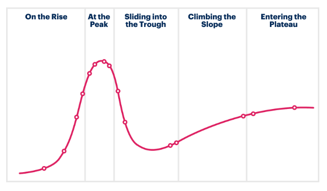
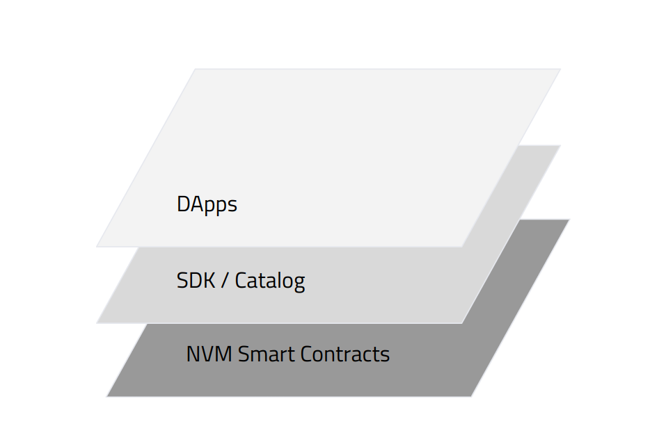
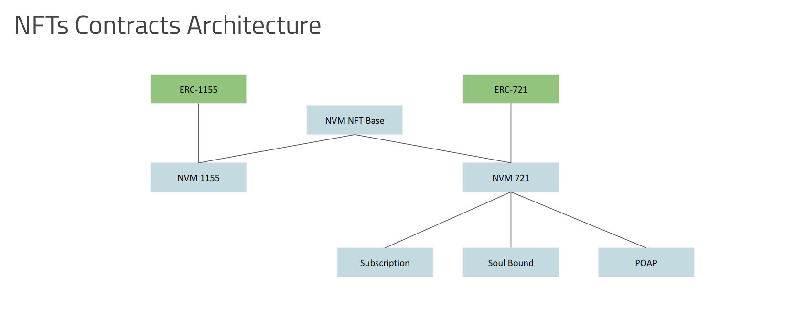

# Bringing NFTs to a new Dimension

## What's a NFT

NFTs represent ownership of digital assets in a decentralized manner. They allow that assets you own in a digital environment belong to you and not to a third-party.
In digital environments where assets don't live in a physical world, the ownership of them is more faith than a reality. Faith in infrastructure where these assets live, and faith in the owners of that infrastucture.
It's quite common to think you own that character you purchased to play a video game, that subscription to a streaming service, etc. But in reality these are just entries in a company database. These assets you "own" and probably you paid for, tomorrow can be updated or deleted (accidentaly or not) by the entity running the infrastructure where these digital assets exists, your account can be "banned", etc. In any of these situations all your digital assets just evaporate. And good luck claiming for them.

NFTs are good to remove that dependency on any third-party. They live in a blockchain not owned by anyone directly, and their code (the NFT Smart Contract code) who owns them and what can be done with them and what not. Something so "simple" has massive implications because gravitates the "real ownership" and responsibility of the asset to the final user.

### New generation of NFTs

As any new technology, in the short history of NFTs they went through the typical journey of the emerging technology hype cycle.

During 2021 and 2022 we lived the infancy of the NFTs technology. Many digital assets were put online and traded. With a bigger focus in the speculative factor of the new thing, the first age of NFTs had some characteristics:

* The concept of ownership was not enforced, the NFT content creator didn't "own" the asset but a small
* From a users point of view, most of the NFTs didn't represent any real benefit vs traditional assets. Term & conditions made that very clear.
* No attribution, no provenance, no utility, just static pictures

Beyond the fun of playing with a new technology, first age of NFTs didn't provide any real value to content creators or users. There is an obvious disenchanment because they didn't provide any real improvement.

But with the lower hype came also more clarity and thinking on the benefits NFTs technology can bring to a digital world and their users. A second age of NFTs is coming with a different direction:

* Enforcement of ownership and content attribution to creators and users
* Activation of digital assets utility
* Remix/combination/interaction of NFTs
* Attribution to content creators, provenance and royalties for secondary market sales

More information in the post: [Facilitating asset tokenization with NFTs](https://medium.com/nevermined-io/facilitating-asset-tokenization-with-nfts-3f725bfd51e2).

### Utility

In a digital world assets need to be represented somehow. We spoke above about the ownership of them. But also NFTs are useful to describe the digital asset, what are their properties and how that asset can be used. This is important because on top of the "ownership" concept we can build the "utility" concept. That means how the asset can be used and what under what conditions.

The utility allows that asset owners can define things like:

* A piece of that asset can be sold
* That ownership from a third-party of a piece of an asset can give access to something exclusive
* That asset can be rented for being used
* Or lended
* etc, etc

There is a big terrotory to explore where between content owners and developers can design and activate different kind of utilities on this new kind of digital assets.

### ERC-721 vs ERC-1155

There are many different standards in different states defining NFTs and their potential characteristics. But the 2 main standards are:

* The [ERC-721](https://ethereum.org/en/developers/docs/standards/tokens/erc-721/) for Non-Fungible NFTs. This allow to tokenize digital assets in several pieces. And each piece is unique. An anology in the physical world would be a photography. An artist could cut the original negative in 10 pieces and sell to the collectors. Each piece is unique and different to the others.
* The [ERC-1155](https://ethereum.org/en/developers/docs/standards/tokens/erc-1155/) describes the Multi-Token standard. It allows to tokenize assets where each piece is not distinguble of the others. An anology would be the money. If dollars can be represented via a NFT ERC-1155 because my dollar is not distingueable of your dollar.

Each of these standards are usful and fit better depending on the use case. 

## What extras are provided by Nevermined NFTs?

In Nevermined [we constructed](https://github.com/nevermined-io/contracts/tree/master/contracts/token) some additional features on top of both standards that can be used to deliver more powerful use cases.
Some of these extra features are the following:

### Selling and Purchasing assets

Via the Nevermined Service Execution Agreements, content creators and their users can trade around digital assets in a decentralized manner. This means content creators can define under what conditions they want to sell their NFTs, and users can purchase them. The Nevermined Smart Contracts work as an intermediary of that process and ensure this process is executed securely for all the parties.

### Access Control

Nevermined includes an access control piece that allows to content creators to provide special access to certain assets or services under some circunstances. This enable powerful use cases like exclusive access, enabling the users holding some NFTs to get access to something is exclusive and unique.

### Royalties and Secondary Markets

When content creators sell NFTs associated to their creations the lost control of who owns what. Nevermined enforces royalties in sales in secondary markets, allowing to content creators to define upfront the royalties they want to receive, and collect them if there is a secondary market sale.

### Search and Discovery

To facilitate the [discovery of digital assets](../tutorials/searching-information.md) and the NFTs attached to them when assets are registered into Nevermined the creator can define some metadata. This metadata can be stored in an immutable manner too on IPFS or Filecoin.

### Provenance

Nevermined Smart Contracts provide a provenance track record that register all the interactions around digital assets. More information in this [Provenance blog post](https://medium.com/nevermined-io/provenance-everything-has-a-story-behind-1275e3693d3f).

### Subscriptions

Nevermined allows content creators to control the access to exclusive stuff to users who are subscribed. These subscriptions can be defined in a flexible manner and specify a duration. More information in this post: [Bringing online subscriptions into Web3 with NFTs](https://medium.com/nevermined-io/bringing-online-subscriptions-into-web3-with-nfts-5fc2e9570122).

### Proof of Attendance (POAP)

Proof of Attendance are special case of ERC-721 NFTs that are useful to repesent that a user was in a specific place in a specific moment. Only the users meeting these conditions can claim that specific POAP NFT. POAPs are very interesting for use cases that want to build loyalty around live events.

You can read more about it in [this post about Alities network](https://medium.com/nevermined-io/built-on-nevermined-alities-is-an-nft-community-for-artist-and-collectors-f6b08f00f18c).

### Soul Bound or Non-Transferable NFTs 

As stands in the name, Non-Transferable Tokens (NTT) are a special kind of NFTs that can be transferred. Once they are minted and are owned by a user they can not sent to anyone else. This is useful for usecases that wan to represent personal achievements or similar characteristics that are directly tied to the identity of the owner of that NFT.

## How to build applications using Nevermined NFTs

### Getting Started

Nevermined NFTs are built on top of the OpenZeppelin standard implementation and use regular industry standards. We augmented the existing implementation with additional features that allow to create more sophisticated use cases providing the above features, having always in mind to create richer experiences where content creators and users keep control.

Nevermined provides the Open Source components to accelerate the building of DApps without part of the complexity of web3. You can use any part of the stack you want in any way you prefer, but typically the usage of all the different components it’s the simpler way to build more robust use cases.

Nevermined protocol is organized in the following way:

* [Nevermined Smart Contracts](https://github.com/nevermined-io/contracts). They implement the core protocol business logic, and can be deployed in any EVM compatible network. As said before, are built on top of OpenZeppelin and provide default implementation for different NFTs.
* [Nevermined SDK](https://github.com/nevermined-io/sdk-js) and [React Catalog](https://github.com/nevermined-io/components-catalog). Are Javascript libraries that can be used to build decentralized applications that integrate Nevermined Contracts and additional components like the Metadata API.

### NFT Contracts

The Nevermined NFT contracts are part of the extras provided by the Nevermined core protocol. They allow us to build more sophisticated use cases based on the implementation provided by Nevermined on top of the regular [ERC-721](https://ethereum.org/en/developers/docs/standards/tokens/erc-721/) and [ERC-1155](https://ethereum.org/en/developers/docs/standards/tokens/erc-1155/) standards. These standards are limited in the number of functionalities defined (basically balance, transfer, owner and approve).

On top of that Nevermined provided the contracts ready to use with the additional capabilities:

* Integration with Nevermined Service Agreements allowing selling NFTs
  - Content creators can tokenize digital assets and define in which conditions can users purchase these NFTs
  - Support of dynamic payments so price doesn’t need to be static and can be defined by an external contract
  - Access control to exclusive contents for NFT holders
* Implementation of different NFT contracts
  - Semi-fungible using ERC-1155
  - Non-fungible using ERC-721
  - Subscription NFTs based on ERC-721
  - Proof of attendance NFTs based on ERC-721
  - Soul bound NFTs based on ERC-721
* Implementation of EIP-2891 NFT Royalty Standard

### SDK

You can read more about how use the Nevermined NFTs api via the [SDK NFTs tutorial page.](../nevermined-sdk/nfts-sdk.md)
