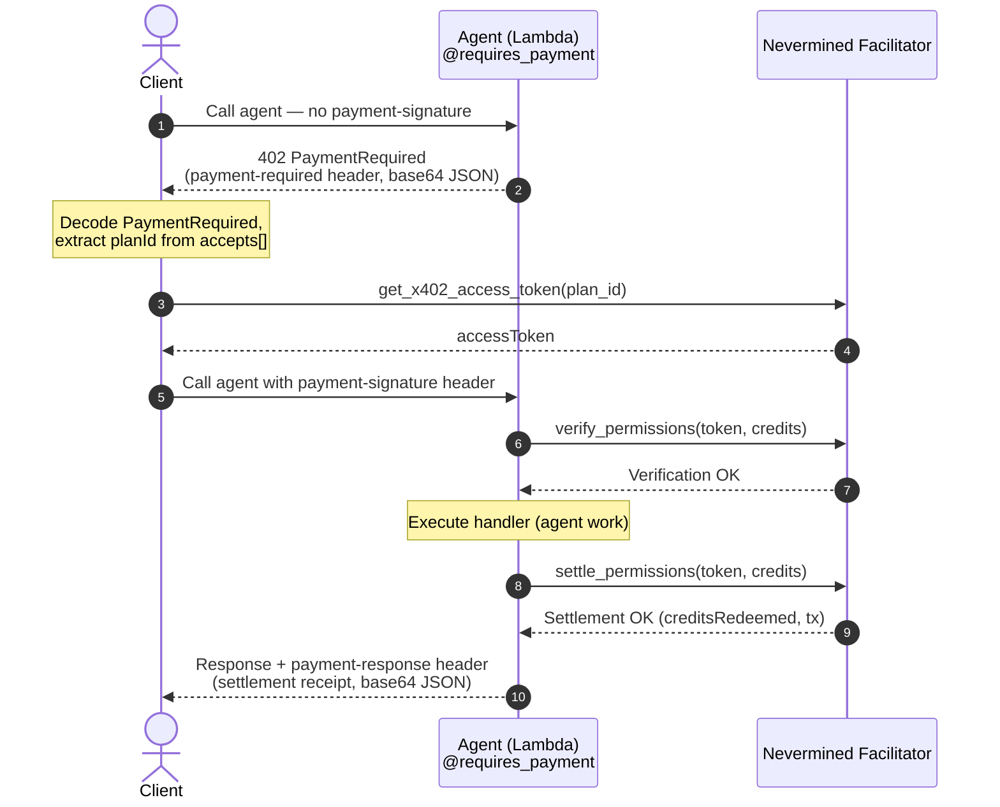
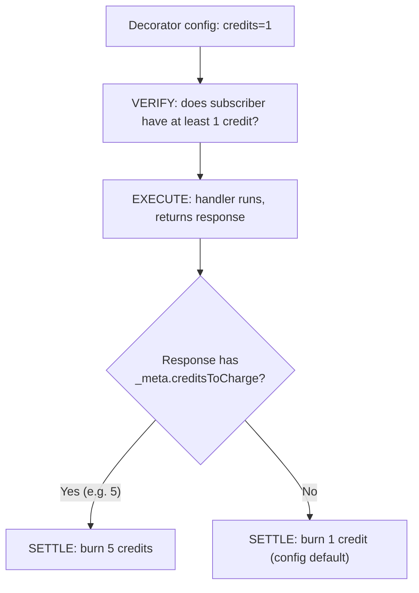

<Note>
  **Start here:** need to register a service and create a plan first? Follow the
  [5-minute setup](/docs/integrate/quickstart/5-minute-setup).
</Note>

Add payment protection to agents running on [Amazon Bedrock AgentCore](https://docs.aws.amazon.com/bedrock-agentcore/) using the [x402 protocol](https://github.com/coinbase/x402). The `@requires_payment` decorator handles verification and settlement automatically, wrapping verify - work - settle in a single Lambda invocation.

## x402 Payment Flow



## MCP Event Format

AgentCore communicates using [MCP JSON-RPC 2.0](https://modelcontextprotocol.io/specification/2025-03-26). The decorator expects the AgentCore Gateway interceptor event format:

```json
{
  "mcp": {
    "gatewayRequest": {
      "httpMethod": "POST",
      "headers": {
        "payment-signature": "<x402-access-token>",
        "Content-Type": "application/json"
      },
      "body": {
        "jsonrpc": "2.0",
        "id": "req-1",
        "method": "tools/call",
        "params": {
          "name": "TargetName___toolName",
          "arguments": { "patient_id": "123" }
        }
      }
    }
  }
}
```

Key points:
- The x402 token travels in the `payment-signature` HTTP header
- Tool names follow AgentCore convention: `TargetName___toolName`
- Only `tools/call` method is billable by default

## Installation

```bash
pip install payments-py
```

<Note>
  No extra dependencies required. The AgentCore decorator uses only the core `payments-py` package.
  See the [Python SDK installation guide](/docs/api-reference/python/installation) for detailed setup instructions.
</Note>

## Quick Start: Protecting a Lambda Handler

The `@requires_payment` decorator wraps a Lambda handler with x402 payment verification and settlement.

```python filename="lambda_function.py"
import json
import os
from payments_py import Payments, PaymentOptions
from payments_py.x402.agentcore import requires_payment

# Initialize Payments
payments = Payments.get_instance(
    PaymentOptions(
        nvm_api_key=os.environ["NVM_API_KEY"],
        environment=os.environ.get("NVM_ENVIRONMENT", "sandbox"),
    )
)

PLAN_ID = os.environ["NVM_PLAN_ID"]
AGENT_ID = os.environ.get("NVM_AGENT_ID")

@requires_payment(
    payments=payments,
    plan_id=PLAN_ID,
    agent_id=AGENT_ID,
    credits=1,
    endpoint="https://gateway.bedrock-agentcore.amazonaws.com/mcp",
)
def lambda_handler(event, context=None):
    """Handler only runs when payment is verified."""
    body = event["mcp"]["gatewayRequest"]["body"]
    tool = body["params"]["name"]
    args = body["params"]["arguments"]

    # Agent work
    result = process_request(tool, args)

    return {
        "content": [{"type": "text", "text": json.dumps(result)}],
    }
```

The decorator automatically:
- Returns a `402 PaymentRequired` response when no token is provided
- Verifies the x402 token via the Nevermined facilitator
- Executes the handler on successful verification
- Burns credits after successful execution
- Adds `payment-response` header and `_meta.x402` transaction data to the response

## Response Formats

The handler can return any of these formats:

### Bare MCP result (simplest)

```python
return {
    "content": [{"type": "text", "text": "Hello!"}],
}
```

### With credits override

```python
return {
    "content": [{"type": "text", "text": "Expensive result"}],
    "_meta": {"creditsToCharge": 5},  # Override the decorator's credits
}
```

### Full MCP response body

```python
return {
    "jsonrpc": "2.0",
    "id": "req-1",
    "result": {
        "content": [{"type": "text", "text": "Hello!"}],
    },
}
```

### Complete InterceptorOutput

```python
return {
    "interceptorOutputVersion": "1.0",
    "mcp": {
        "transformedGatewayResponse": {
            "statusCode": 200,
            "headers": {"Content-Type": "application/json"},
            "body": {"jsonrpc": "2.0", "id": "req-1", "result": {...}},
        }
    },
}
```

The decorator wraps and enriches all formats with payment-response headers and `_meta.x402` transaction data.

## Credits Flow



The `credits` parameter is used for both verify (pre-flight check) and settle (default burn amount). The handler can override the settle amount by returning `_meta.creditsToCharge` in its response.

## Decorator Configuration

### Basic

```python
@requires_payment(payments=payments, plan_id="plan-123", credits=1)
def handler(event, context=None):
    ...
```

### With Agent ID

```python
@requires_payment(
    payments=payments,
    plan_id=PLAN_ID,
    credits=1,
    agent_id=os.environ.get("NVM_AGENT_ID"),
    endpoint="https://my-gateway.amazonaws.com/mcp",
)
def handler(event, context=None):
    ...
```

### Dynamic Credits

Calculate credits based on the event:

```python
def calc_credits(event):
    """Charge based on request complexity."""
    args = (
        event.get("mcp", {})
        .get("gatewayRequest", {})
        .get("body", {})
        .get("params", {})
        .get("arguments", {})
    )
    return 10 if args.get("detailed") else 1

@requires_payment(payments=payments, plan_id=PLAN_ID, credits=calc_credits)
def handler(event, context=None):
    ...
```

### Custom Token Header

```python
@requires_payment(
    payments=payments,
    plan_id=PLAN_ID,
    credits=1,
    token_header="X-Payment",  # Or a list: ["X-Payment", "Authorization"]
)
def handler(event, context=None):
    ...
```

### Lifecycle Hooks

```python
def on_before_verify(payment_required):
    print(f"Verifying payment for plan {payment_required.accepts[0].plan_id}")

def on_after_verify(verification):
    print(f"Verified! Payer: {verification.payer}")

def on_after_settle(credits_used, settlement):
    print(f"Settled {credits_used} credits, tx: {settlement.transaction}")

def on_payment_error(error):
    # Return custom error response or None for default 402
    return None

@requires_payment(
    payments=payments,
    plan_id=PLAN_ID,
    credits=1,
    on_before_verify=on_before_verify,
    on_after_verify=on_after_verify,
    on_after_settle=on_after_settle,
    on_payment_error=on_payment_error,
)
def handler(event, context=None):
    ...
```

## Client Implementation

```python filename="client.py"
import os
from payments_py import Payments, PaymentOptions

# Initialize Payments as subscriber
payments = Payments.get_instance(
    PaymentOptions(
        nvm_api_key=os.environ["NVM_SUBSCRIBER_API_KEY"],
        environment=os.environ.get("NVM_ENVIRONMENT", "sandbox"),
    )
)

PLAN_ID = os.environ["NVM_PLAN_ID"]
AGENT_ID = os.environ.get("NVM_AGENT_ID")

# Step 1: Check balance
balance = payments.plans.get_plan_balance(plan_id=PLAN_ID)
print(f"Balance: {balance.balance} credits")

# Step 2: Get x402 access token
token_result = payments.x402.get_x402_access_token(
    plan_id=PLAN_ID,
    agent_id=AGENT_ID,
)
access_token = token_result["accessToken"]

# Step 3: Call the agent with the token in payment-signature header
import requests

response = requests.post(
    "https://your-agent-endpoint.amazonaws.com/mcp",
    headers={
        "Content-Type": "application/json",
        "payment-signature": access_token,
    },
    json={
        "jsonrpc": "2.0",
        "id": "1",
        "method": "tools/call",
        "params": {
            "name": "getPatient",
            "arguments": {"patient_id": "123"},
        },
    },
)

# Step 4: Check settlement receipt
import base64, json

payment_response = response.headers.get("payment-response")
if payment_response:
    receipt = json.loads(base64.b64decode(payment_response))
    print(f"Credits redeemed: {receipt['creditsRedeemed']}")
    print(f"Transaction: {receipt['transactionHash']}")
```

## Decorator vs Interceptor

`payments-py` provides two patterns for AgentCore payment protection:

| | `@requires_payment` decorator | `AgentCoreInterceptor` class |
|---|---|---|
| **Invocations** | Single (verify + work + settle) | Two (REQUEST phase, RESPONSE phase) |
| **Use case** | Agent IS the Lambda | Separate interceptor Lambda |
| **Credits from response** | `_meta.creditsToCharge` override | `_meta.creditsToCharge` extraction |
| **Complexity** | One decorator, one function | Separate interceptor + target Lambda |
| **Gateway requirement** | Optional | Required (Gateway calls interceptor) |

Use the **decorator** when your agent runs as a Lambda function and you want the simplest integration. Use the **interceptor** when you need a separate payment layer in front of an existing agent target (MCP server, OpenAPI, Lambda) via the AgentCore Gateway.

## Environment Variables

```bash filename=".env"
# Nevermined (required)
NVM_API_KEY=sandbox:eyxxxx           # sandbox:eyxxxx OR live:eyxxxx
NVM_ENVIRONMENT=sandbox              # sandbox OR live
NVM_PLAN_ID=your-plan-id
NVM_AGENT_ID=your-agent-id           # Optional
```

## Next Steps

<CardGroup cols={2}>
  <Card title="Payment Patterns" icon="code" href="/docs/integrate/patterns/charge-credits">
    Advanced credit charging patterns
  </Card>

  <Card title="x402 Protocol" icon="link" href="/docs/development-guide/nevermined-x402">
    Deep dive into x402 payment flows
  </Card>

  <Card title="Strands Integration" icon="robot" href="/docs/integrate/add-to-your-agent/strands">
    Decorator for Strands AI agent tools
  </Card>

  <Card title="Payment Models" icon="calculator" href="/docs/products/x402-facilitator/payment-models">
    Configure credits, subscriptions, and dynamic pricing
  </Card>
</CardGroup>
