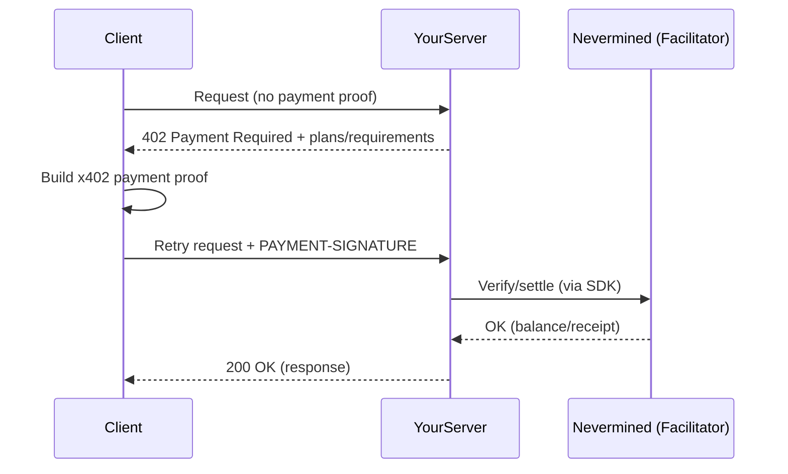

<Note>
  **Start here:** need to register a service and create a plan first? Follow the
  [5-minute setup](/docs/integrate/quickstart/5-minute-setup).
</Note>

Generic patterns for integrating Nevermined payments into any HTTP server or framework.

## The x402 Payment Flow

When using x402, the client typically **doesn't start with a token**. Instead, the server advertises payment requirements via `402 Payment Required`, and the client retries with a payment proof.



## Implementation Steps

**1) Read the payment proof from the request**

Nevermined x402 clients retry requests with a `PAYMENT-SIGNATURE` header:

```
PAYMENT-SIGNATURE: <payment_proof>
```

Pseudo-code:

```
paymentProof = request.headers["PAYMENT-SIGNATURE"]
if !paymentProof:
    return 402 Payment Required + plans
```

**2) Validate the payment proof with the Nevermined SDK**

<Tabs>
  <Tab title="TypeScript">
    ```typescript
    import { Payments } from '@nevermined-io/payments'

    const payments = Payments.getInstance({
      nvmApiKey: process.env.NVM_API_KEY,
      environment: 'sandbox'
    })

    const result = await payments.requests.isValidRequest(paymentProof, requestBody)

    if (!result.isValid) {
      // Return 402 (invalid/expired payment proof)
    }

    // Process request, result.balance contains remaining credits
    ```

  </Tab>
  <Tab title="Python">
    ```python
    from payments_py import Payments, PaymentOptions

    payments = Payments.get_instance(
        PaymentOptions(nvm_api_key=os.environ['NVM_API_KEY'], environment='sandbox')
    )

    result = payments.requests.is_valid_request(payment_proof, request_body)

    if not result['isValid']:
        # Return 402
        pass

    # Process request, result['balance'] contains remaining credits
    ```

  </Tab>
</Tabs>

**3) Return 402 with plans when payment is missing or invalid**

When payment is missing (first request) or invalid, return HTTP 402 with plan information:

```json
{
  "error": "Payment Required",
  "code": "PAYMENT_REQUIRED",
  "plans": [
    {
      "planId": "did:nv:your-plan-id",
      "agentId": "did:nv:your-agent-id"
    }
  ]
}
```

## HTTP Response Codes

| Code  | Meaning          | When to Use                                         |
| ----- | ---------------- | --------------------------------------------------- |
| `200` | Success          | Valid payment proof, request processed              |
| `402` | Payment Required | Missing/invalid payment proof, insufficient credits |
| `500` | Server Error     | Validation system failure                           |

## Language-Specific Examples

### Go

```go
package main

import (
    "encoding/json"
    "net/http"
    "os"
)

func queryHandler(w http.ResponseWriter, r *http.Request) {
    // Extract payment proof
    paymentProof := r.Header.Get("PAYMENT-SIGNATURE")
    if paymentProof == "" {
        w.WriteHeader(http.StatusPaymentRequired)
        json.NewEncoder(w).Encode(map[string]interface{}{
            "error": "Payment Required",
            "code":  "PAYMENT_REQUIRED",
            "plans": []interface{}{map[string]interface{}{
                "planId": os.Getenv("PLAN_ID"),
                "agentId": os.Getenv("AGENT_ID"),
            }},
        })
        return
    }

    // Parse body
    var body map[string]interface{}
    json.NewDecoder(r.Body).Decode(&body)

    // Validate with Nevermined (use the SDK for your language)
    valid, balance := validatePayment(paymentProof, body)
    if !valid {
        w.WriteHeader(http.StatusPaymentRequired)
        json.NewEncoder(w).Encode(map[string]interface{}{
            "error": "Payment Required",
            "code":  "INVALID_PAYMENT",
            "plans": []interface{}{map[string]interface{}{
                "planId": os.Getenv("PLAN_ID"),
                "agentId": os.Getenv("AGENT_ID"),
            }},
        })
        return
    }

    // Process request
    result := map[string]interface{}{
        "result":  "Your response here",
        "credits": balance,
    }

    w.Header().Set("Content-Type", "application/json")
    json.NewEncoder(w).Encode(result)
}
```

### Rust (Axum)

```rust
use axum::{
    extract::Json,
    http::{HeaderMap, StatusCode},
    response::IntoResponse,
};
use serde_json::{json, Value};

async fn query_handler(
    headers: HeaderMap,
    Json(body): Json<Value>,
) -> impl IntoResponse {
    let payment_proof = headers
        .get("payment-signature")
        .and_then(|v| v.to_str().ok())
        .unwrap_or("");

    if payment_proof.is_empty() {
        return (
            StatusCode::PAYMENT_REQUIRED,
            Json(json!({
                "error": "Payment Required",
                "code": "PAYMENT_REQUIRED",
                "plans": [{
                    "planId": std::env::var("PLAN_ID").unwrap_or_default(),
                    "agentId": std::env::var("AGENT_ID").unwrap_or_default()
                }]
            })),
        );
    }

    // Validate with Nevermined (implement SDK call)
    let (valid, balance) = validate_payment(payment_proof, &body).await;

    if !valid {
        return (
            StatusCode::PAYMENT_REQUIRED,
            Json(json!({
                "error": "Payment Required",
                "code": "INVALID_PAYMENT"
            })),
        );
    }

    (
        StatusCode::OK,
        Json(json!({
            "result": "Your response here",
            "credits": balance
        })),
    )
}
```

### Ruby (Sinatra)

```ruby
require 'sinatra'
require 'json'

post '/query' do
  content_type :json

  payment_proof = request.env['HTTP_PAYMENT_SIGNATURE'] || ''

  if payment_proof.empty?
    status 402
    return {
      error: 'Payment Required',
      code: 'PAYMENT_REQUIRED',
      plans: [{ planId: ENV['PLAN_ID'], agentId: ENV['AGENT_ID'] }]
    }.to_json
  end

  body = JSON.parse(request.body.read)

  valid, balance = validate_payment(payment_proof, body)
  unless valid
    status 402
    return { error: 'Payment Required', code: 'INVALID_PAYMENT' }.to_json
  end

  { result: 'Your response here', credits: balance }.to_json
end
```

### PHP

```php
<?php

$headers = getallheaders();
$paymentProof = $headers['PAYMENT-SIGNATURE'] ?? '';

if ($paymentProof === '') {
    http_response_code(402);
    echo json_encode([
        'error' => 'Payment Required',
        'code' => 'PAYMENT_REQUIRED',
        'plans' => [[
            'planId' => getenv('PLAN_ID'),
            'agentId' => getenv('AGENT_ID')
        ]]
    ]);
    exit;
}

$body = json_decode(file_get_contents('php://input'), true);

$result = validatePayment($paymentProof, $body);
if (!$result['valid']) {
    http_response_code(402);
    echo json_encode([
        'error' => 'Payment Required',
        'code' => 'INVALID_PAYMENT'
    ]);
    exit;
}

header('Content-Type: application/json');
echo json_encode([
    'result' => 'Your response here',
    'credits' => $result['balance']
]);
```

## REST API Validation

If you can't use the SDK, call the Nevermined REST API directly:

```bash
curl -X POST https://api.nevermined.app/api/v1/payments/validate \
  -H "Authorization: Bearer YOUR_NVM_API_KEY" \
  -H "Content-Type: application/json" \
  -d '{
    "paymentSignature": "<PAYMENT-SIGNATURE header value>",
    "requestBody": {}
  }'
```

Response:

```json
{
  "isValid": true,
  "balance": 95,
  "subscriberAddress": "0x..."
}
```

## Best Practices

<AccordionGroup>
  <Accordion title="Cache Validation Results" icon="clock">
    For high-traffic endpoints, consider caching validation results briefly (5-30 seconds) to reduce API calls.
  </Accordion>

{" "}
<Accordion title="Handle Timeouts" icon="hourglass">
  Set reasonable timeouts for validation calls (5-10 seconds) and have a
  fallback strategy.
</Accordion>

{" "}
<Accordion title="Log Payment Events" icon="clipboard-list">
  Log all payment validations for debugging and analytics: - Token hash (not
  full token) - Validation result - Credits consumed - Timestamp
</Accordion>

  <Accordion title="Return Helpful 402 Responses" icon="message">
    Always include plan information in 402 responses so clients know how to get access.
  </Accordion>
</AccordionGroup>

## Security Considerations

1. **Never log full tokens** - Hash them if you need to identify requests
2. **Use HTTPS** - Tokens should only travel over encrypted connections
3. **Validate on server** - Never trust client-side validation
4. **Set token expiration** - Accept reasonable token ages

## Next Steps

<CardGroup cols={2}>
  <Card title="Payment Patterns" icon="code" href="/docs/integrate/patterns/validate-requests">
    Advanced validation patterns
  </Card>

  <Card title="x402 Protocol" icon="link" href="/docs/development-guide/nevermined-x402">
    Implement standard HTTP 402 flows
  </Card>
</CardGroup>
