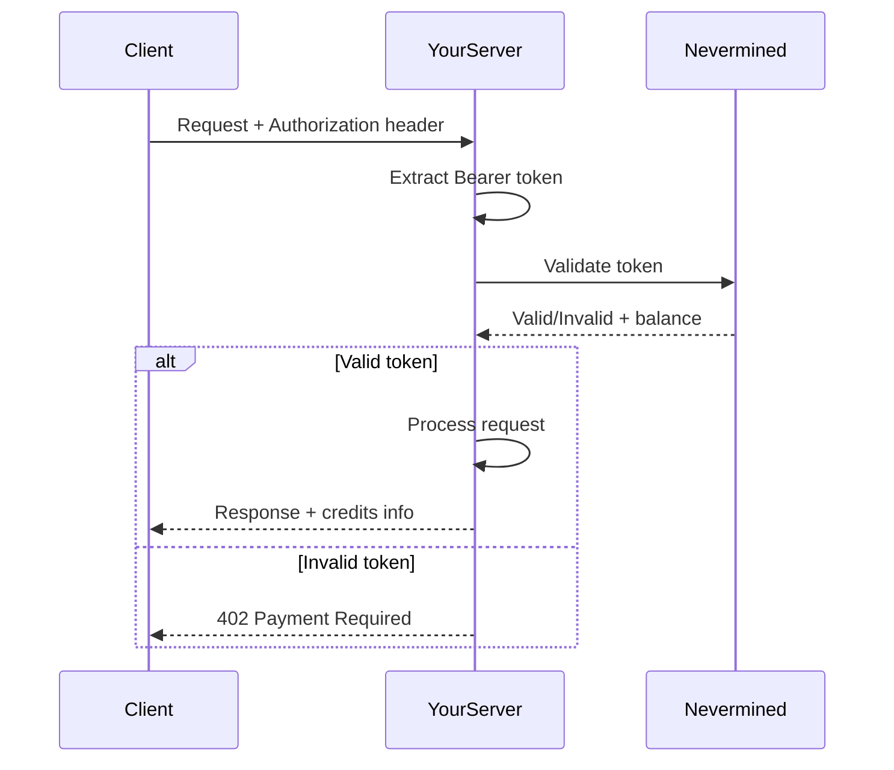

Generic patterns for integrating Nevermined payments into any HTTP server or framework.

## The Payment Flow

Regardless of your framework, the payment validation flow follows these steps:



## Implementation Steps

### Step 1: Extract the Bearer Token

```
Authorization: Bearer <access_token>
```

Extract the token from the `Authorization` header:

```
// Pseudo-code
token = request.headers["Authorization"]
if token starts with "Bearer ":
    token = token.substring(7)
else:
    return 402 Payment Required
```

### Step 2: Validate with Nevermined SDK

<Tabs>
  <Tab title="TypeScript">
    ```typescript
    import { Payments } from '@nevermined-io/payments'

    const payments = Payments.getInstance({
      nvmApiKey: process.env.NVM_API_KEY,
      environment: 'testing'
    })

    const result = await payments.requests.isValidRequest(token, requestBody)

    if (!result.isValid) {
      // Return 402
    }

    // Process request, result.balance contains remaining credits
    ```
  </Tab>
  <Tab title="Python">
    ```python
    from payments_py import Payments, PaymentOptions

    payments = Payments.get_instance(
        PaymentOptions(nvm_api_key=os.environ['NVM_API_KEY'], environment='testing')
    )

    result = payments.requests.is_valid_request(token, request_body)

    if not result['isValid']:
        # Return 402
        pass

    # Process request, result['balance'] contains remaining credits
    ```
  </Tab>
</Tabs>

### Step 3: Return 402 on Failure

When validation fails, return HTTP 402 with payment information:

```json
{
  "error": "Payment Required",
  "code": "INVALID_TOKEN",
  "plans": [
    {
      "planId": "did:nv:your-plan-id",
      "agentId": "did:nv:your-agent-id"
    }
  ]
}
```

## HTTP Response Codes

| Code | Meaning | When to Use |
|------|---------|-------------|
| `200` | Success | Valid payment, request processed |
| `401` | Unauthorized | Missing authentication |
| `402` | Payment Required | Invalid/expired token, insufficient credits |
| `500` | Server Error | Validation system failure |

## Language-Specific Examples

### Go

```go
package main

import (
    "encoding/json"
    "net/http"
    "os"
    "strings"
)

// Simple validation - in production, use the SDK
func validatePayment(token string, body map[string]interface{}) (bool, int, error) {
    // Call Nevermined validation endpoint
    // This is a simplified example - use the actual SDK
    return true, 100, nil
}

func queryHandler(w http.ResponseWriter, r *http.Request) {
    // Extract token
    auth := r.Header.Get("Authorization")
    if !strings.HasPrefix(auth, "Bearer ") {
        w.WriteHeader(http.StatusPaymentRequired)
        json.NewEncoder(w).Encode(map[string]interface{}{
            "error": "Payment Required",
            "code":  "MISSING_TOKEN",
        })
        return
    }

    token := strings.TrimPrefix(auth, "Bearer ")

    // Parse body
    var body map[string]interface{}
    json.NewDecoder(r.Body).Decode(&body)

    // Validate
    valid, balance, err := validatePayment(token, body)
    if err != nil || !valid {
        w.WriteHeader(http.StatusPaymentRequired)
        json.NewEncoder(w).Encode(map[string]interface{}{
            "error": "Payment Required",
            "code":  "INVALID_TOKEN",
        })
        return
    }

    // Process request
    result := map[string]interface{}{
        "result":  "Your response here",
        "credits": balance,
    }

    w.Header().Set("Content-Type", "application/json")
    json.NewEncoder(w).Encode(result)
}
```

### Rust (Axum)

```rust
use axum::{
    extract::Json,
    http::{HeaderMap, StatusCode},
    response::IntoResponse,
};
use serde_json::{json, Value};

async fn query_handler(
    headers: HeaderMap,
    Json(body): Json<Value>,
) -> impl IntoResponse {
    // Extract token
    let auth = headers
        .get("authorization")
        .and_then(|v| v.to_str().ok())
        .unwrap_or("");

    if !auth.starts_with("Bearer ") {
        return (
            StatusCode::PAYMENT_REQUIRED,
            Json(json!({
                "error": "Payment Required",
                "code": "MISSING_TOKEN"
            })),
        );
    }

    let token = &auth[7..];

    // Validate with Nevermined (implement SDK call)
    let (valid, balance) = validate_payment(token, &body).await;

    if !valid {
        return (
            StatusCode::PAYMENT_REQUIRED,
            Json(json!({
                "error": "Payment Required",
                "code": "INVALID_TOKEN"
            })),
        );
    }

    // Process request
    (
        StatusCode::OK,
        Json(json!({
            "result": "Your response here",
            "credits": balance
        })),
    )
}
```

### Ruby (Sinatra)

```ruby
require 'sinatra'
require 'json'

# Validation helper
def validate_payment(token, body)
  # Call Nevermined SDK/API
  # Return [valid, balance]
  [true, 100]
end

post '/query' do
  content_type :json

  # Extract token
  auth = request.env['HTTP_AUTHORIZATION'] || ''
  unless auth.start_with?('Bearer ')
    status 402
    return { error: 'Payment Required', code: 'MISSING_TOKEN' }.to_json
  end

  token = auth[7..]
  body = JSON.parse(request.body.read)

  # Validate
  valid, balance = validate_payment(token, body)
  unless valid
    status 402
    return { error: 'Payment Required', code: 'INVALID_TOKEN' }.to_json
  end

  # Process request
  { result: 'Your response here', credits: balance }.to_json
end
```

### PHP

```php
<?php

function validatePayment($token, $body) {
    // Call Nevermined SDK/API
    return ['valid' => true, 'balance' => 100];
}

// Extract token
$headers = getallheaders();
$auth = $headers['Authorization'] ?? '';

if (strpos($auth, 'Bearer ') !== 0) {
    http_response_code(402);
    echo json_encode([
        'error' => 'Payment Required',
        'code' => 'MISSING_TOKEN'
    ]);
    exit;
}

$token = substr($auth, 7);
$body = json_decode(file_get_contents('php://input'), true);

// Validate
$result = validatePayment($token, $body);

if (!$result['valid']) {
    http_response_code(402);
    echo json_encode([
        'error' => 'Payment Required',
        'code' => 'INVALID_TOKEN'
    ]);
    exit;
}

// Process request
header('Content-Type: application/json');
echo json_encode([
    'result' => 'Your response here',
    'credits' => $result['balance']
]);
```

## REST API Validation

If you can't use the SDK, call the Nevermined REST API directly:

```bash
curl -X POST https://api.nevermined.app/api/v1/payments/validate \
  -H "Authorization: Bearer YOUR_NVM_API_KEY" \
  -H "Content-Type: application/json" \
  -d '{
    "accessToken": "subscriber_token_here",
    "requestBody": {}
  }'
```

Response:

```json
{
  "isValid": true,
  "balance": 95,
  "subscriberAddress": "0x..."
}
```

## Best Practices

<AccordionGroup>
  <Accordion title="Cache Validation Results" icon="clock">
    For high-traffic endpoints, consider caching validation results briefly (5-30 seconds) to reduce API calls.
  </Accordion>

  <Accordion title="Handle Timeouts" icon="hourglass">
    Set reasonable timeouts for validation calls (5-10 seconds) and have a fallback strategy.
  </Accordion>

  <Accordion title="Log Payment Events" icon="clipboard-list">
    Log all payment validations for debugging and analytics:
    - Token hash (not full token)
    - Validation result
    - Credits consumed
    - Timestamp
  </Accordion>

  <Accordion title="Return Helpful 402 Responses" icon="message">
    Always include plan information in 402 responses so clients know how to get access.
  </Accordion>
</AccordionGroup>

## Security Considerations

1. **Never log full tokens** - Hash them if you need to identify requests
2. **Use HTTPS** - Tokens should only travel over encrypted connections
3. **Validate on server** - Never trust client-side validation
4. **Set token expiration** - Accept reasonable token ages

## Next Steps

<CardGroup cols={2}>
  <Card title="Payment Patterns" icon="code" href="/docs/integrate/patterns/validate-requests">
    Advanced validation patterns
  </Card>

  <Card title="x402 Protocol" icon="link" href="/docs/integrate/platforms/x402-protocol">
    Implement standard HTTP 402 flows
  </Card>
</CardGroup>
