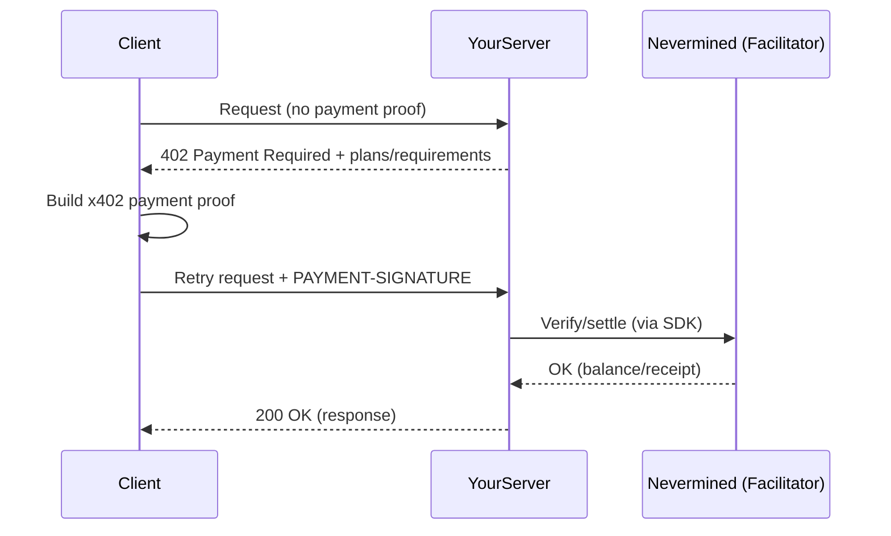

<Note>
  **Start here:** need to register a service and create a plan first? Follow the
  [5-minute setup](/docs/integrate/quickstart/5-minute-setup).
</Note>

Generic patterns for integrating Nevermined payments into any HTTP server or framework.

## The x402 Payment Flow

When using x402, the client typically **doesn't start with a token**. Instead, the server advertises payment requirements via `402 Payment Required`, and the client retries with a payment proof.



## Implementation Steps

### 1. Extract the x402 token from the request

x402 clients send the payment token in the `payment-signature` header (lowercase, per x402 v2 spec):

```
payment-signature: <x402_access_token>
```

### 2. Return 402 if token is missing

When no token is provided, return HTTP 402 with a base64-encoded `payment-required` header:

<Tabs>
  <Tab title="TypeScript">
    ```typescript
    import { Payments, buildPaymentRequired } from '@nevermined-io/payments'

    const PLAN_ID = process.env.NVM_PLAN_ID!
    const AGENT_ID = process.env.NVM_AGENT_ID

    // Build the payment required object
    const paymentRequired = buildPaymentRequired(PLAN_ID, {
      endpoint: req.path,
      agentId: AGENT_ID,
      httpVerb: req.method
    })

    // Check for token
    const token = req.headers['payment-signature']
    if (!token) {
      const paymentRequiredBase64 = Buffer.from(
        JSON.stringify(paymentRequired)
      ).toString('base64')

      return res
        .status(402)
        .setHeader('payment-required', paymentRequiredBase64)
        .json({ error: 'Payment Required', message: 'Missing x402 access token' })
    }
    ```
  </Tab>
  <Tab title="Python">
    ```python
    import base64
    import json
    from payments_py.x402.helpers import build_payment_required

    PLAN_ID = os.environ["NVM_PLAN_ID"]
    AGENT_ID = os.environ.get("NVM_AGENT_ID")

    # Build the payment required object
    payment_required = build_payment_required(
        plan_id=PLAN_ID,
        endpoint=request.path,
        agent_id=AGENT_ID,
        http_verb=request.method
    )

    # Check for token
    token = request.headers.get("payment-signature")
    if not token:
        payment_required_json = payment_required.model_dump_json(by_alias=True)
        payment_required_base64 = base64.b64encode(
            payment_required_json.encode()
        ).decode()

        return JSONResponse(
            status_code=402,
            content={"error": "Payment Required", "message": "Missing x402 access token"},
            headers={"payment-required": payment_required_base64}
        )
    ```
  </Tab>
</Tabs>

### 3. Verify permissions with the Facilitator

Before processing the request, verify the subscriber has sufficient credits:

<Tabs>
  <Tab title="TypeScript">
    ```typescript
    const payments = Payments.getInstance({
      nvmApiKey: process.env.NVM_API_KEY!,
      environment: 'sandbox'
    })

    const verification = await payments.facilitator.verifyPermissions({
      paymentRequired,
      x402AccessToken: token,
      maxAmount: BigInt(creditsRequired)  // e.g., 1n
    })

    if (!verification.isValid) {
      const paymentRequiredBase64 = Buffer.from(
        JSON.stringify(paymentRequired)
      ).toString('base64')

      return res
        .status(402)
        .setHeader('payment-required', paymentRequiredBase64)
        .json({ error: 'Payment Required', message: verification.invalidReason })
    }

    // Verification passed - process the request
    ```
  </Tab>
  <Tab title="Python">
    ```python
    from payments_py import Payments, PaymentOptions

    payments = Payments.get_instance(
        PaymentOptions(nvm_api_key=os.environ["NVM_API_KEY"], environment="sandbox")
    )

    verification = payments.facilitator.verify_permissions(
        payment_required=payment_required,
        x402_access_token=token,
        max_amount=str(credits_required)  # e.g., "1"
    )

    if not verification.is_valid:
        payment_required_json = payment_required.model_dump_json(by_alias=True)
        payment_required_base64 = base64.b64encode(
            payment_required_json.encode()
        ).decode()

        return JSONResponse(
            status_code=402,
            content={"error": "Payment Required", "message": verification.invalid_reason},
            headers={"payment-required": payment_required_base64}
        )

    # Verification passed - process the request
    ```
  </Tab>
</Tabs>

### 4. Process the request

Execute your business logic after verification passes.

### 5. Settle (burn credits) after successful response

After the request completes successfully, settle the credits and include the receipt in the response:

<Tabs>
  <Tab title="TypeScript">
    ```typescript
    // After processing the request successfully...
    const settlement = await payments.facilitator.settlePermissions({
      paymentRequired,
      x402AccessToken: token,
      maxAmount: BigInt(creditsUsed)
    })

    // Include settlement receipt in response header
    const settlementBase64 = Buffer.from(JSON.stringify(settlement)).toString('base64')

    return res
      .setHeader('payment-response', settlementBase64)
      .json({ result: yourResponseData })
    ```
  </Tab>
  <Tab title="Python">
    ```python
    # After processing the request successfully...
    settlement = payments.facilitator.settle_permissions(
        payment_required=payment_required,
        x402_access_token=token,
        max_amount=str(credits_used)
    )

    # Include settlement receipt in response header
    settlement_json = settlement.model_dump_json(by_alias=True)
    settlement_base64 = base64.b64encode(settlement_json.encode()).decode()

    return JSONResponse(
        content={"result": your_response_data},
        headers={"payment-response": settlement_base64}
    )
    ```
  </Tab>
</Tabs>

## x402 Headers Summary

| Header | Direction | Description |
|--------|-----------|-------------|
| `payment-signature` | Client → Server | x402 access token |
| `payment-required` | Server → Client (402) | Base64-encoded payment requirements |
| `payment-response` | Server → Client (200) | Base64-encoded settlement receipt |

## HTTP Response Codes

| Code  | Meaning          | When to Use                                         |
| ----- | ---------------- | --------------------------------------------------- |
| `200` | Success          | Valid payment proof, request processed              |
| `402` | Payment Required | Missing/invalid payment proof, insufficient credits |
| `500` | Server Error     | Validation system failure                           |

## Using Framework Middleware (Recommended)

For Express.js and FastAPI, use the built-in middleware that handles the entire x402 flow automatically:

<Tabs>
  <Tab title="Express.js">
    ```typescript
    import { paymentMiddleware } from '@nevermined-io/payments/express'

    app.use(paymentMiddleware(payments, {
      'POST /ask': { planId: PLAN_ID, credits: 1 }
    }))
    ```
    See [Express.js Integration](/docs/integrate/add-to-your-agent/express) for details.
  </Tab>
  <Tab title="FastAPI">
    ```python
    from payments_py.x402.fastapi import PaymentMiddleware

    app.add_middleware(
        PaymentMiddleware,
        payments=payments,
        routes={"POST /ask": {"plan_id": PLAN_ID, "credits": 1}}
    )
    ```
    See [FastAPI Integration](/docs/integrate/add-to-your-agent/fastapi) for details.
  </Tab>
</Tabs>

## Best Practices

<AccordionGroup>
  <Accordion title="Cache Validation Results" icon="clock">
    For high-traffic endpoints, consider caching validation results briefly (5-30 seconds) to reduce API calls.
  </Accordion>

{" "}
<Accordion title="Handle Timeouts" icon="hourglass">
  Set reasonable timeouts for validation calls (5-10 seconds) and have a
  fallback strategy.
</Accordion>

{" "}
<Accordion title="Log Payment Events" icon="clipboard-list">
  Log all payment validations for debugging and analytics: - Token hash (not
  full token) - Validation result - Credits consumed - Timestamp
</Accordion>

  <Accordion title="Return Helpful 402 Responses" icon="message">
    Always include plan information in 402 responses so clients know how to get access.
  </Accordion>
</AccordionGroup>

## Security Considerations

1. **Never log full tokens** - Hash them if you need to identify requests
2. **Use HTTPS** - Tokens should only travel over encrypted connections
3. **Validate on server** - Never trust client-side validation
4. **Set token expiration** - Accept reasonable token ages

## Next Steps

<CardGroup cols={2}>
  <Card title="Payment Patterns" icon="code" href="/docs/integrate/patterns/validate-requests">
    Advanced validation patterns
  </Card>

  <Card title="x402 Protocol" icon="link" href="/docs/development-guide/nevermined-x402">
    Implement standard HTTP 402 flows
  </Card>
</CardGroup>
