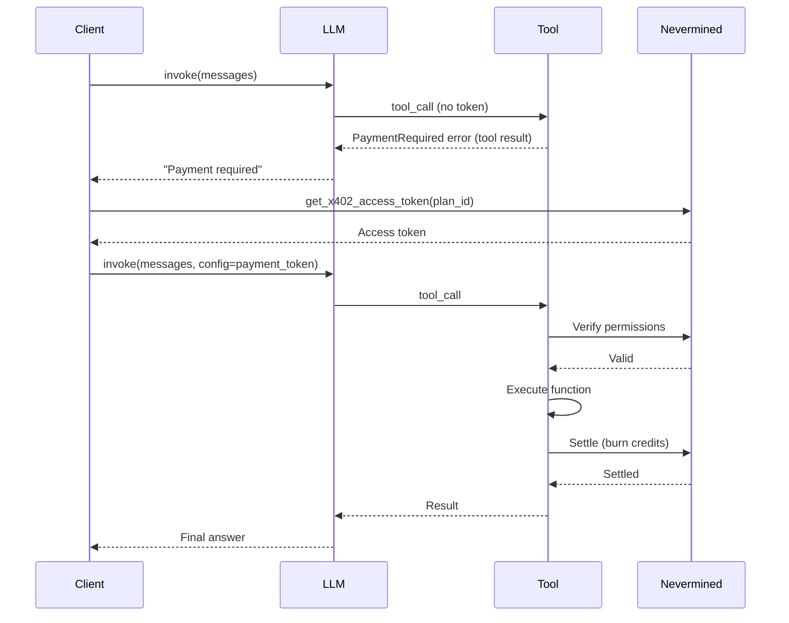
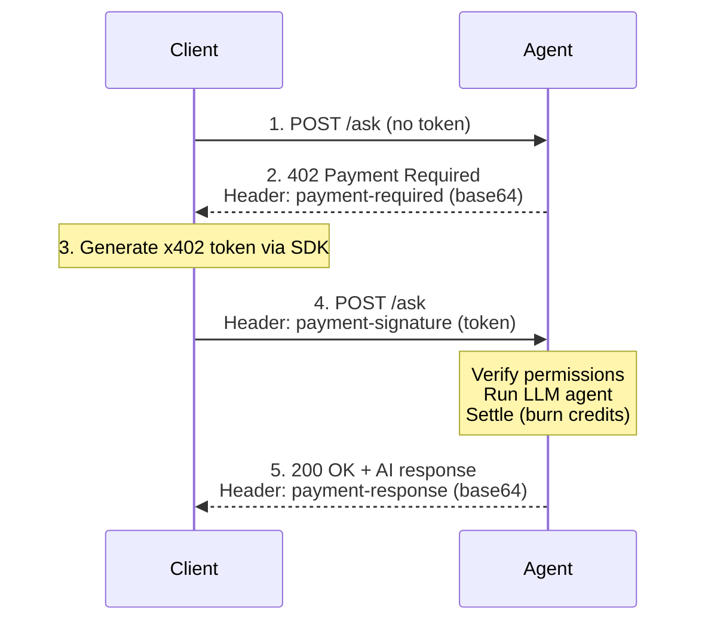

<Note>
  **Start here:** need to register a service and create a plan first? Follow the
  [5-minute setup](/docs/integrate/quickstart/5-minute-setup).
</Note>

Add payment protection to [LangChain](https://python.langchain.com/) and [LangChain.js](https://js.langchain.com/) tools using the [x402 protocol](https://github.com/coinbase/x402). The library provides two complementary approaches:

| Approach | Best for | Payment layer |
| -------- | -------- | ------------- |
| **`requiresPayment` wrapper/decorator** | Direct tool invocation, CLI scripts, notebooks | Per-tool wrapper |
| **Payment middleware on HTTP server** | Serving the agent over HTTP | HTTP middleware |

Both use the same Nevermined plan, credits, and settlement flow — choose whichever fits your deployment model.

## Installation

<Tabs>
  <Tab title="TypeScript">
    ```bash
    npm install @nevermined-io/payments @langchain/core @langchain/openai zod
    ```

    <Note>
      The `@nevermined-io/payments/langchain` sub-path export provides the `requiresPayment()` wrapper.
      For the HTTP server approach, also install `express`.
    </Note>
  </Tab>
  <Tab title="Python">
    ```bash
    pip install payments-py[langchain] langchain-openai
    ```

    <Note>
      The `[langchain]` extra installs the LangChain dependency required for the decorator.
      For the HTTP server approach, also install `fastapi` and `uvicorn`.
    </Note>
  </Tab>
</Tabs>

---

## Approach 1: Tool Decorator / Wrapper

### x402 Payment Flow (decorator)



### Quick Start

<Tabs>
  <Tab title="TypeScript">
    In LangChain.js, `requiresPayment()` is a higher-order function that wraps the tool implementation:

    ```typescript filename="agent.ts"
    import 'dotenv/config'
    import { tool } from '@langchain/core/tools'
    import { z } from 'zod'
    import { Payments } from '@nevermined-io/payments'
    import { requiresPayment } from '@nevermined-io/payments/langchain'

    const payments = Payments.getInstance({
      nvmApiKey: process.env.NVM_API_KEY!,
      environment: process.env.NVM_ENVIRONMENT || 'sandbox',
    })

    const PLAN_ID = process.env.NVM_PLAN_ID!

    // Protect a tool with payment — 1 credit per call
    const searchData = tool(
      requiresPayment(
        (args) => `Results for '${args.query}': ...`,
        { payments, planId: PLAN_ID, credits: 1 }
      ),
      {
        name: 'search_data',
        description: 'Search for data on a given topic. Costs 1 credit.',
        schema: z.object({ query: z.string() }),
      }
    )
    ```

    <Warning>
      The payment token is read from `config.configurable.payment_token`.
      Pass it when invoking the tool or agent.
    </Warning>
  </Tab>
  <Tab title="Python">
    In Python, `@requires_payment` is a decorator applied before `@tool`:

    ```python filename="agent.py"
    import os
    from dotenv import load_dotenv
    from langchain_core.runnables import RunnableConfig
    from langchain_core.tools import tool
    from payments_py import Payments, PaymentOptions
    from payments_py.x402.langchain import requires_payment

    load_dotenv()

    payments = Payments.get_instance(
        PaymentOptions(
            nvm_api_key=os.environ["NVM_API_KEY"],
            environment=os.environ.get("NVM_ENVIRONMENT", "sandbox"),
        )
    )

    PLAN_ID = os.environ["NVM_PLAN_ID"]

    # Protect a tool with payment — 1 credit per call
    @tool
    @requires_payment(payments=payments, plan_id=PLAN_ID, credits=1)
    def search_data(query: str, config: RunnableConfig) -> str:
        """Search for data on a given topic. Costs 1 credit."""
        return f"Results for '{query}': ..."
    ```

    <Warning>
      The tool function **must** accept a `config: RunnableConfig` parameter.
      The decorator uses it to read the payment token from
      `config["configurable"]["payment_token"]`.
    </Warning>
  </Tab>
</Tabs>

### Invoking with payment

<Tabs>
  <Tab title="TypeScript">
    ```typescript filename="client.ts"
    import { Payments } from '@nevermined-io/payments'

    // Subscriber side — acquire token
    const subscriber = Payments.getInstance({
      nvmApiKey: process.env.NVM_SUBSCRIBER_API_KEY!,
      environment: process.env.NVM_ENVIRONMENT || 'sandbox',
    })

    const token = await subscriber.x402.getX402AccessToken(PLAN_ID)
    const accessToken = token.accessToken

    // Invoke tool directly
    const result = await searchData.invoke(
      { query: 'AI trends' },
      { configurable: { payment_token: accessToken } }
    )
    ```
  </Tab>
  <Tab title="Python">
    ```python filename="client.py"
    from payments_py import Payments, PaymentOptions

    # Subscriber side — acquire token
    subscriber = Payments.get_instance(
        PaymentOptions(
            nvm_api_key=os.environ["NVM_SUBSCRIBER_API_KEY"],
            environment=os.environ.get("NVM_ENVIRONMENT", "sandbox"),
        )
    )

    token = subscriber.x402.get_x402_access_token(plan_id=PLAN_ID)
    access_token = token["accessToken"]

    # Invoke tool directly
    result = search_data.invoke(
        {"query": "AI trends"},
        config={"configurable": {"payment_token": access_token}},
    )
    ```
  </Tab>
</Tabs>

### LLM-driven tool calling

<Tabs>
  <Tab title="TypeScript">
    ```typescript
    import { HumanMessage } from '@langchain/core/messages'
    import { ChatOpenAI } from '@langchain/openai'

    const llm = new ChatOpenAI({ model: 'gpt-4o-mini', temperature: 0 })
    const tools = [searchData, summarizeData, researchTopic]
    const llmWithTools = llm.bindTools(tools)
    const toolMap = new Map(tools.map((t) => [t.name, t]))

    const messages = [new HumanMessage('Search for AI trends')]
    const aiMessage = await llmWithTools.invoke(messages)
    messages.push(aiMessage)

    for (const toolCall of aiMessage.tool_calls || []) {
      const result = await toolMap.get(toolCall.name)!.invoke(
        toolCall.args,
        { configurable: { payment_token: accessToken } }
      )
    }
    ```
  </Tab>
  <Tab title="Python">
    ```python
    llm = ChatOpenAI(model="gpt-4o-mini", temperature=0)
    tools = [search_data, summarize_data, research_topic]
    llm_with_tools = llm.bind_tools(tools)
    tool_map = {t.name: t for t in tools}

    messages = [HumanMessage(content="Search for AI trends")]
    ai_message = llm_with_tools.invoke(messages)
    messages.append(ai_message)

    for tool_call in ai_message.tool_calls:
        result = tool_map[tool_call["name"]].invoke(
            tool_call["args"],
            config={"configurable": {"payment_token": access_token}},
        )
    ```
  </Tab>
</Tabs>

### LangGraph ReAct agent

The same payment-protected tools work with LangGraph's `create_react_agent`:

<Tabs>
  <Tab title="TypeScript">
    ```typescript
    import { createReactAgent } from '@langchain/langgraph/prebuilt'

    const agent = createReactAgent({
      llm: new ChatOpenAI({ model: 'gpt-4o-mini' }),
      tools: [searchData, summarizeData, researchTopic],
      prompt: 'You are a helpful research assistant.',
    })

    const result = await agent.invoke(
      { messages: [{ role: 'human', content: 'Research AI agents and summarize' }] },
      { configurable: { payment_token: accessToken } }
    )
    ```
  </Tab>
  <Tab title="Python">
    ```python
    from langgraph.prebuilt import create_react_agent

    graph = create_react_agent(
        ChatOpenAI(model="gpt-4o-mini"),
        [search_data, summarize_data, research_topic],
        prompt="You are a helpful research assistant.",
    )

    result = graph.invoke(
        {"messages": [("human", "Research AI agents and summarize")]},
        config={"configurable": {"payment_token": access_token}},
    )
    ```
  </Tab>
</Tabs>

### Dynamic Credits

<Tabs>
  <Tab title="TypeScript">
    Three patterns for credit calculation:

    ```typescript
    // Pattern 1: Static number — always costs 1 credit
    const searchData = tool(
      requiresPayment(
        (args) => `Results for ${args.query}`,
        { payments, planId: PLAN_ID, credits: 1 }
      ),
      { name: 'search_data', description: '...', schema: z.object({ query: z.string() }) }
    )

    // Pattern 2: Arrow function — cost scales with output length
    const summarize = tool(
      requiresPayment(
        (args) => `Summary of ${args.text}`,
        {
          payments, planId: PLAN_ID,
          credits: (ctx) => Math.max(2, Math.min(Math.floor(String(ctx.result).length / 100), 10)),
        }
      ),
      { name: 'summarize', description: '...', schema: z.object({ text: z.string() }) }
    )

    // Pattern 3: Named function — complex logic on args + result
    function calcCredits(ctx: { args: Record<string, unknown>; result: unknown }): number {
      const topic = String(ctx.args.topic || '')
      const result = String(ctx.result || '')
      const base = 3
      const keywordExtra = Math.max(0, topic.split(' ').length - 3)
      const outputExtra = Math.floor(result.length / 200)
      return Math.min(base + keywordExtra + outputExtra, 15)
    }

    const research = tool(
      requiresPayment(
        (args) => `Report on ${args.topic}`,
        { payments, planId: PLAN_ID, credits: calcCredits }
      ),
      { name: 'research', description: '...', schema: z.object({ topic: z.string() }) }
    )
    ```

    The credits function receives `{ args, result }` after tool execution.
  </Tab>
  <Tab title="Python">
    Three patterns for credit calculation:

    ```python
    # Pattern 1: Static int — always costs 1 credit
    @tool
    @requires_payment(payments=payments, plan_id=PLAN_ID, credits=1)
    def search_data(query: str, config: RunnableConfig) -> str:
        ...

    # Pattern 2: Lambda — cost scales with output length
    @tool
    @requires_payment(
        payments=payments, plan_id=PLAN_ID,
        credits=lambda ctx: max(2, min(len(ctx.get("result", "")) // 100, 10)),
    )
    def summarize_data(text: str, config: RunnableConfig) -> str:
        ...

    # Pattern 3: Named function — complex logic on args + result
    def calc_credits(ctx: dict) -> int:
        args = ctx.get("args", {})
        result = ctx.get("result", "")
        base = 3
        keyword_extra = max(0, len(args.get("topic", "").split()) - 3)
        output_extra = len(result) // 200
        return min(base + keyword_extra + output_extra, 15)

    @tool
    @requires_payment(payments=payments, plan_id=PLAN_ID, credits=calc_credits)
    def research_topic(topic: str, config: RunnableConfig) -> str:
        ...
    ```

    The `ctx` dict passed to the credits function contains:
    - `args` — the tool's input arguments
    - `result` — the tool's return value (evaluated after execution)
  </Tab>
</Tabs>

---

## Approach 2: HTTP Server with Payment Middleware

For serving the agent over HTTP, use payment middleware on your framework. Payment is handled at the HTTP layer — tools are plain functions with no decorators or payment config.

### x402 Payment Flow (HTTP)



### Server: LangChain

<Tabs>
  <Tab title="TypeScript (Express)">
    ```typescript filename="src/server.ts"
    import 'dotenv/config'
    import express from 'express'
    import { HumanMessage, ToolMessage } from '@langchain/core/messages'
    import { tool } from '@langchain/core/tools'
    import { ChatOpenAI } from '@langchain/openai'
    import { z } from 'zod'
    import { Payments } from '@nevermined-io/payments'
    import { paymentMiddleware } from '@nevermined-io/payments/express'

    const payments = Payments.getInstance({
      nvmApiKey: process.env.NVM_API_KEY!,
      environment: process.env.NVM_ENVIRONMENT || 'sandbox',
    })

    const PLAN_ID = process.env.NVM_PLAN_ID!

    // Plain tools — no requiresPayment, no config parameter
    const searchData = tool(
      (args) => `Results for '${args.query}': ...`,
      { name: 'search_data', description: 'Search for data.', schema: z.object({ query: z.string() }) }
    )

    const summarizeData = tool(
      (args) => `Summary: ...`,
      { name: 'summarize_data', description: 'Summarize text.', schema: z.object({ text: z.string() }) }
    )

    // LLM + tools
    const llm = new ChatOpenAI({ model: 'gpt-4o-mini', temperature: 0 })
    const tools = [searchData, summarizeData]
    const llmWithTools = llm.bindTools(tools)
    const toolMap = new Map(tools.map((t) => [t.name, t]))

    async function runAgent(query: string): Promise<string> {
      const messages: any[] = [new HumanMessage(query)]
      for (let i = 0; i < 10; i++) {
        const ai = await llmWithTools.invoke(messages)
        messages.push(ai)
        if (!ai.tool_calls?.length) return String(ai.content)
        for (const tc of ai.tool_calls) {
          const result = await (toolMap.get(tc.name) as any).invoke(tc.args)
          messages.push(new ToolMessage({ content: result, tool_call_id: tc.id! }))
        }
      }
      return String(messages.at(-1)?.content || 'No response.')
    }

    // Express app with payment middleware
    const app = express()
    app.use(express.json())
    app.use(paymentMiddleware(payments, {
      'POST /ask': { planId: PLAN_ID, credits: 1 },
    }))

    app.post('/ask', async (req, res) => {
      const response = await runAgent(req.body.query)
      res.json({ response })
    })

    app.get('/health', (_req, res) => res.json({ status: 'ok' }))

    app.listen(8000, () => console.log('Running on http://localhost:8000'))
    ```
  </Tab>
  <Tab title="Python (FastAPI)">
    ```python filename="src/server.py"
    import os
    from dotenv import load_dotenv

    load_dotenv()

    import uvicorn
    from fastapi import FastAPI, Request
    from fastapi.responses import JSONResponse
    from langchain_core.messages import HumanMessage, ToolMessage
    from langchain_core.tools import tool
    from langchain_openai import ChatOpenAI
    from pydantic import BaseModel
    from payments_py import Payments, PaymentOptions
    from payments_py.x402.fastapi import PaymentMiddleware

    payments = Payments.get_instance(
        PaymentOptions(
            nvm_api_key=os.environ["NVM_API_KEY"],
            environment=os.environ.get("NVM_ENVIRONMENT", "sandbox"),
        )
    )

    PLAN_ID = os.environ["NVM_PLAN_ID"]
    AGENT_ID = os.environ.get("NVM_AGENT_ID")

    # Plain tools — no @requires_payment, no RunnableConfig
    @tool
    def search_data(query: str) -> str:
        """Search for data on a given topic."""
        return f"Results for '{query}': ..."

    @tool
    def summarize_data(text: str) -> str:
        """Summarize text into bullet points."""
        return f"Summary: ..."

    # LLM + tools
    llm = ChatOpenAI(model="gpt-4o-mini", temperature=0)
    tools = [search_data, summarize_data]
    llm_with_tools = llm.bind_tools(tools)
    tool_map = {t.name: t for t in tools}


    def run_agent(query: str) -> str:
        """Run the LangChain agent with a tool-call loop."""
        messages = [HumanMessage(content=query)]
        for _ in range(10):
            ai = llm_with_tools.invoke(messages)
            messages.append(ai)
            if not ai.tool_calls:
                return ai.content
            for tc in ai.tool_calls:
                result = tool_map[tc["name"]].invoke(tc["args"])
                messages.append(ToolMessage(content=result, tool_call_id=tc["id"]))
        return messages[-1].content


    # FastAPI app with payment middleware
    app = FastAPI(title="LangChain Agent with x402 Payments")

    app.add_middleware(
        PaymentMiddleware,
        payments=payments,
        routes={
            "POST /ask": {"plan_id": PLAN_ID, "credits": 1, "agent_id": AGENT_ID},
        },
    )


    class AskRequest(BaseModel):
        query: str


    @app.post("/ask")
    async def ask(body: AskRequest, request: Request) -> JSONResponse:
        response = run_agent(body.query)
        return JSONResponse(content={"response": response})


    @app.get("/health")
    async def health():
        return {"status": "ok"}


    if __name__ == "__main__":
        uvicorn.run(app, host="0.0.0.0", port=8000)
    ```
  </Tab>
</Tabs>

### Server: LangGraph

Replace the tool-call loop with LangGraph's `create_react_agent`:

<Tabs>
  <Tab title="TypeScript">
    ```typescript
    import { tool } from '@langchain/core/tools'
    import { ChatOpenAI } from '@langchain/openai'
    import { createReactAgent } from '@langchain/langgraph/prebuilt'
    import { z } from 'zod'

    // Plain tools — no payment wrappers
    const searchData = tool(
      (args) => `Results for '${args.query}': ...`,
      { name: 'search_data', description: 'Search.', schema: z.object({ query: z.string() }) }
    )

    const agent = createReactAgent({
      llm: new ChatOpenAI({ model: 'gpt-4o-mini' }),
      tools: [searchData, summarizeData],
    })

    async function runAgent(query: string): Promise<string> {
      const result = await agent.invoke({ messages: [{ role: 'human', content: query }] })
      const messages = result.messages || []
      return messages.at(-1)?.content || 'No response.'
    }
    ```
  </Tab>
  <Tab title="Python">
    ```python
    from langchain_core.tools import tool
    from langchain_openai import ChatOpenAI
    from langgraph.prebuilt import create_react_agent

    # Plain tools — no payment decorators
    @tool
    def search_data(query: str) -> str:
        """Search for data on a given topic."""
        return f"Results for '{query}': ..."

    llm = ChatOpenAI(model="gpt-4o-mini", temperature=0)
    graph = create_react_agent(llm, [search_data, summarize_data])


    def run_agent(query: str) -> str:
        result = graph.invoke({"messages": [("human", query)]})
        messages = result.get("messages", [])
        return messages[-1].content if messages else "No response."
    ```
  </Tab>
</Tabs>

The HTTP app, middleware, and route handlers are identical to the LangChain version above.

### Client: Full x402 HTTP Flow

<Tabs>
  <Tab title="TypeScript">
    ```typescript filename="src/client.ts"
    import 'dotenv/config'
    import { Payments } from '@nevermined-io/payments'

    const SERVER_URL = process.env.SERVER_URL || 'http://localhost:8000'
    const PLAN_ID = process.env.NVM_PLAN_ID!

    const payments = Payments.getInstance({
      nvmApiKey: process.env.NVM_SUBSCRIBER_API_KEY!,
      environment: process.env.NVM_ENVIRONMENT || 'sandbox',
    })

    // Step 1: Request without token → 402
    const resp402 = await fetch(`${SERVER_URL}/ask`, {
      method: 'POST',
      headers: { 'Content-Type': 'application/json' },
      body: JSON.stringify({ query: 'AI trends' }),
    })
    console.log(`Status: ${resp402.status}`) // 402

    // Step 2: Decode payment requirements
    const pr = JSON.parse(Buffer.from(resp402.headers.get('payment-required')!, 'base64').toString())
    console.log(`Plan: ${pr.accepts[0].planId}`)

    // Step 3: Acquire x402 token
    const token = await payments.x402.getX402AccessToken(PLAN_ID)
    const accessToken = token.accessToken

    // Step 4: Request with token → 200
    const resp200 = await fetch(`${SERVER_URL}/ask`, {
      method: 'POST',
      headers: {
        'Content-Type': 'application/json',
        'payment-signature': accessToken,
      },
      body: JSON.stringify({ query: 'AI trends' }),
    })
    const body = await resp200.json()
    console.log(`Response: ${body.response}`)

    // Step 5: Decode settlement receipt
    const settlement = JSON.parse(
      Buffer.from(resp200.headers.get('payment-response')!, 'base64').toString()
    )
    console.log(`Credits charged:   ${settlement.creditsRedeemed}`)
    console.log(`Remaining balance: ${settlement.remainingBalance}`)
    console.log(`Transaction:       ${settlement.transaction}`)
    ```
  </Tab>
  <Tab title="Python">
    ```python filename="src/client.py"
    import base64
    import json
    import os
    import httpx
    from payments_py import Payments, PaymentOptions

    SERVER_URL = os.environ.get("SERVER_URL", "http://localhost:8000")
    PLAN_ID = os.environ["NVM_PLAN_ID"]

    payments = Payments.get_instance(
        PaymentOptions(
            nvm_api_key=os.environ["NVM_SUBSCRIBER_API_KEY"],
            environment=os.environ.get("NVM_ENVIRONMENT", "sandbox"),
        )
    )

    with httpx.Client(timeout=60.0) as client:
        # Step 1: Request without token → 402
        resp = client.post(f"{SERVER_URL}/ask", json={"query": "AI trends"})
        assert resp.status_code == 402

        # Step 2: Decode payment requirements
        pr = json.loads(base64.b64decode(resp.headers["payment-required"]))
        print(f"Plan: {pr['accepts'][0]['planId']}")

        # Step 3: Acquire x402 token
        token = payments.x402.get_x402_access_token(plan_id=PLAN_ID)
        access_token = token["accessToken"]

        # Step 4: Request with token → 200
        resp = client.post(
            f"{SERVER_URL}/ask",
            headers={"payment-signature": access_token},
            json={"query": "AI trends"},
        )
        print(f"Response: {resp.json()['response']}")

        # Step 5: Decode settlement receipt
        settlement = json.loads(base64.b64decode(resp.headers["payment-response"]))
        print(f"Credits charged:   {settlement['creditsRedeemed']}")
        print(f"Remaining balance: {settlement['remainingBalance']}")
        print(f"Transaction:       {settlement['transaction']}")
    ```
  </Tab>
</Tabs>

### x402 HTTP Headers

| Header | Direction | Description |
| ------ | --------- | ----------- |
| `payment-signature` | Client → Server | x402 access token |
| `payment-required` | Server → Client (402) | Base64-encoded payment requirements |
| `payment-response` | Server → Client (200) | Base64-encoded settlement receipt |

The settlement receipt (`payment-response`) contains:

| Field | Description |
| ----- | ----------- |
| `creditsRedeemed` | Number of credits charged |
| `remainingBalance` | Subscriber's remaining credit balance |
| `transaction` | Blockchain transaction hash |
| `network` | Blockchain network (CAIP-2 format) |
| `payer` | Subscriber wallet address |

---

## Decorator Configuration

### With Agent ID

<Tabs>
  <Tab title="TypeScript">
    ```typescript
    const myTool = tool(
      requiresPayment(
        (args) => `Result for ${args.query}`,
        {
          payments,
          planId: PLAN_ID,
          credits: 1,
          agentId: process.env.NVM_AGENT_ID,
        }
      ),
      { name: 'my_tool', description: '...', schema: z.object({ query: z.string() }) }
    )
    ```
  </Tab>
  <Tab title="Python">
    ```python
    @tool
    @requires_payment(
        payments=payments,
        plan_id=PLAN_ID,
        credits=1,
        agent_id=os.environ.get("NVM_AGENT_ID"),
    )
    def my_tool(query: str, config: RunnableConfig) -> str:
        ...
    ```
  </Tab>
</Tabs>

### Multiple Plans (Python only)

```python
@tool
@requires_payment(
    payments=payments,
    plan_ids=["plan-basic", "plan-premium"],
    credits=1,
)
def my_tool(query: str, config: RunnableConfig) -> str:
    ...
```

### Scheme and Network

<Tabs>
  <Tab title="TypeScript">
    ```typescript
    const myTool = tool(
      requiresPayment(
        (args) => `Result`,
        { payments, planId: PLAN_ID, credits: 1, network: 'eip155:84532' }
      ),
      { name: 'my_tool', description: '...', schema: z.object({ query: z.string() }) }
    )
    ```
  </Tab>
  <Tab title="Python">
    ```python
    # Explicit card-delegation scheme for fiat payments
    @tool
    @requires_payment(
        payments=payments,
        plan_id=PLAN_ID,
        credits=1,
        scheme="nvm:card-delegation",
    )
    def my_fiat_tool(query: str, config: RunnableConfig) -> str:
        ...
    ```
  </Tab>
</Tabs>

<Note>
The decorator/wrapper automatically detects the payment scheme from plan metadata.
Plans with fiat pricing (`isCrypto: false`) use `nvm:card-delegation` (Stripe).
**No code changes are needed on the agent side.**
</Note>

## Complete Examples

Working seller/buyer agents with LangGraph — includes both Python and TypeScript variants:

<Tabs>
  <Tab title="TypeScript">
    - [seller-simple-agent/ts](https://github.com/nevermined-io/hackathons/tree/main/agents/seller-simple-agent/ts) — Seller with `paymentMiddleware` + `requiresPayment` demo
    - [buyer-simple-agent/ts](https://github.com/nevermined-io/hackathons/tree/main/agents/buyer-simple-agent/ts) — Buyer CLI agent with x402 token generation

    Each includes:
    - `src/server.ts` / `src/agent.ts` — LangGraph `createReactAgent` with payment-protected tools
    - `src/demo.ts` — `requiresPayment` wrapper demo (seller only)
    - `src/client.ts` — HTTP client with full x402 payment flow
  </Tab>
  <Tab title="Python">
    - [seller-simple-agent](https://github.com/nevermined-io/hackathons/tree/main/agents/seller-simple-agent) — `src/langgraph_agent.py` with `@requires_payment` decorator
    - [buyer-simple-agent](https://github.com/nevermined-io/hackathons/tree/main/agents/buyer-simple-agent) — `src/langgraph_agent.py` with buyer tools

    Each includes:
    - `src/langgraph_agent.py` — LangGraph `create_react_agent` with payment-protected tools
    - `src/agent_langgraph.py` — Interactive CLI entry point
  </Tab>
</Tabs>

## Environment Variables

```bash filename=".env"
# Nevermined (required)
NVM_API_KEY=sandbox:your-api-key         # Builder/server API key
NVM_SUBSCRIBER_API_KEY=sandbox:your-key  # Subscriber/client API key
NVM_ENVIRONMENT=sandbox
NVM_PLAN_ID=your-plan-id
NVM_AGENT_ID=your-agent-id              # Optional

# LLM Provider
OPENAI_API_KEY=sk-your-openai-key
```

## Next Steps

<CardGroup cols={2}>
  <Card title="Express Middleware (TS)" icon="js" href="/docs/integrate/add-to-your-agent/express">
    Deep dive into paymentMiddleware for Express
  </Card>

  <Card title="FastAPI Middleware (Python)" icon="python" href="/docs/integrate/add-to-your-agent/fastapi">
    Deep dive into PaymentMiddleware for FastAPI
  </Card>

  <Card title="x402 Protocol" icon="link" href="/docs/development-guide/nevermined-x402">
    Deep dive into x402 payment flows
  </Card>

  <Card title="Payment Models" icon="calculator" href="/docs/products/x402-facilitator/payment-models">
    Configure credits, subscriptions, and dynamic pricing
  </Card>
</CardGroup>
