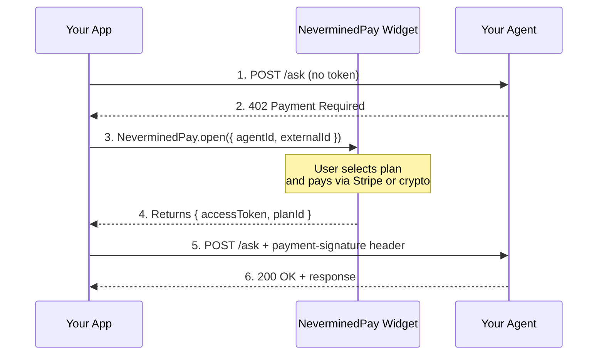

Let your users pay for agent access without leaving your application. The **NeverminedPay** widget opens an iframe-based checkout inside your page, handles the entire payment flow (Stripe or crypto), and returns an access token your app can use immediately.

## When to Use Embedded Checkout

<CardGroup cols={2}>
  <Card title="Keep Users In Your App" icon="browser">
    No redirects to external checkout pages. The payment flow happens inside your UI.
  </Card>

  <Card title="Guest Checkout" icon="user-plus">
    Users don't need a Nevermined account. Pass an `externalId` to identify them in your system.
  </Card>

  <Card title="x402 Integration" icon="lock">
    Combine with x402-protected endpoints. When your API returns `402`, open the widget, get a token, and retry.
  </Card>

  <Card title="Any Frontend Stack" icon="code">
    Works with plain HTML, React, Vue, or any framework. It's just a script tag and a function call.
  </Card>
</CardGroup>

## How It Works



## Quick Start

### 1. Add the widget script

```html
<!-- Production -->
<script src="https://pay.nevermined.app/widget.js"></script>

<!-- Local development (if running the webapp locally) -->
<script src="http://localhost:4200/widget.js"></script>
```

### 2. Open the checkout

```javascript
const result = await NeverminedPay.open({
  agentId: 'did:nv:abc123...',   // Required — your agent's DID
  planId: '12345...',            // Optional — pre-select a plan
  externalId: 'user-42',        // Optional — your app's user ID (enables guest checkout)
})

// result.accessToken — x402 token to authenticate requests
// result.planId — the plan the user purchased
```

### 3. Use the token

```javascript
const response = await fetch('/ask', {
  method: 'POST',
  headers: {
    'Content-Type': 'application/json',
    'payment-signature': result.accessToken,
  },
  body: JSON.stringify({ query: 'Hello!' }),
})
```

## Widget API

### `NeverminedPay.open(options)`

Opens the checkout overlay. Returns a `Promise` that resolves on successful payment or rejects if the user closes the widget.

| Parameter    | Type     | Required | Description |
|-------------|----------|----------|-------------|
| `agentId`   | `string` | Yes      | The agent DID whose plans to display |
| `planId`    | `string` | No       | Pre-select a specific plan (skips plan selection) |
| `externalId`| `string` | No       | Your app's user identifier. Enables guest checkout without requiring a Nevermined account |

**Returns:** `Promise<{ accessToken: string, planId: string }>`

### `NeverminedPay.close()`

Programmatically closes the checkout overlay.

## Plain HTML Integration

This example shows a complete chatbot UI that handles the x402 payment flow with the embedded widget. When the agent returns `402`, the app shows a "Purchase credits" button that opens the widget.

<Accordion title="Full HTML example">

```html filename="index.html"
<!DOCTYPE html>
<html lang="en">
<head>
  <meta charset="UTF-8" />
  <title>My AI Agent</title>
</head>
<body>
  <div id="chat"></div>
  <input id="input" placeholder="Ask the agent..." />
  <button onclick="sendMessage()">Send</button>

  <script src="https://pay.nevermined.app/widget.js"></script>
  <script>
    const AGENT_ID = 'your-agent-did'
    const EXTERNAL_ID = 'user-123' // Your app's user ID
    let accessToken = null

    async function sendMessage() {
      const query = document.getElementById('input').value
      if (!query) return

      const headers = { 'Content-Type': 'application/json' }
      if (accessToken) headers['payment-signature'] = accessToken

      const resp = await fetch('/ask', {
        method: 'POST',
        headers,
        body: JSON.stringify({ query }),
      })

      if (resp.status === 402) {
        // Decode the payment-required header to get planId and agentId
        const prHeader = resp.headers.get('payment-required')
        let planId, agentId
        if (prHeader) {
          const decoded = JSON.parse(atob(prHeader))
          const accepted = decoded.accepts?.[0]
          planId = accepted?.planId
          agentId = accepted?.extra?.agentId
        }

        // Open the embedded checkout
        try {
          const result = await NeverminedPay.open({
            agentId: agentId || AGENT_ID,
            planId,
            externalId: EXTERNAL_ID,
          })

          accessToken = result.accessToken

          // Retry the original request with the new token
          const retry = await fetch('/ask', {
            method: 'POST',
            headers: {
              'Content-Type': 'application/json',
              'payment-signature': accessToken,
            },
            body: JSON.stringify({ query }),
          })
          const data = await retry.json()
          appendMessage('Agent: ' + data.response)
        } catch (e) {
          appendMessage('Checkout was closed.')
        }
      } else {
        const data = await resp.json()
        appendMessage('Agent: ' + data.response)
      }
    }

    function appendMessage(text) {
      const div = document.createElement('div')
      div.textContent = text
      document.getElementById('chat').appendChild(div)
    }
  </script>
</body>
</html>
```

</Accordion>

## React Integration

In a React app, wrap the widget in a custom hook for clean state management.

### Hook

```typescript filename="src/hooks/useNeverminedPay.ts"
import { useState, useCallback } from 'react'

declare global {
  interface Window {
    NeverminedPay: {
      open: (opts: {
        agentId: string
        planId?: string
        externalId?: string
      }) => Promise<{ accessToken: string; planId: string }>
      close: () => void
    }
  }
}

interface UseNeverminedPayOptions {
  agentId: string
  externalId?: string
}

export function useNeverminedPay({ agentId, externalId }: UseNeverminedPayOptions) {
  const [accessToken, setAccessToken] = useState<string | null>(null)
  const [isCheckoutOpen, setIsCheckoutOpen] = useState(false)

  const openCheckout = useCallback(
    async (planId?: string) => {
      setIsCheckoutOpen(true)
      try {
        const result = await window.NeverminedPay.open({
          agentId,
          planId,
          externalId,
        })
        setAccessToken(result.accessToken)
        return result
      } finally {
        setIsCheckoutOpen(false)
      }
    },
    [agentId, externalId],
  )

  return { accessToken, isCheckoutOpen, openCheckout }
}
```

### Component

```tsx filename="src/components/Chat.tsx"
import { useState } from 'react'
import { useNeverminedPay } from '../hooks/useNeverminedPay'

const AGENT_ID = import.meta.env.VITE_AGENT_ID

export function Chat() {
  const [query, setQuery] = useState('')
  const [messages, setMessages] = useState<string[]>([])
  const { accessToken, openCheckout } = useNeverminedPay({
    agentId: AGENT_ID,
    externalId: 'user-123',
  })

  async function handleSend() {
    if (!query.trim()) return

    const headers: Record<string, string> = { 'Content-Type': 'application/json' }
    if (accessToken) headers['payment-signature'] = accessToken

    const resp = await fetch('/ask', {
      method: 'POST',
      headers,
      body: JSON.stringify({ query }),
    })

    if (resp.status === 402) {
      // Parse planId from 402 response
      const prHeader = resp.headers.get('payment-required')
      let planId: string | undefined
      if (prHeader) {
        const decoded = JSON.parse(atob(prHeader))
        planId = decoded.accepts?.[0]?.planId
      }

      try {
        await openCheckout(planId)
        // Token is now set — retry automatically
        const retry = await fetch('/ask', {
          method: 'POST',
          headers: {
            'Content-Type': 'application/json',
            'payment-signature': accessToken!,
          },
          body: JSON.stringify({ query }),
        })
        const data = await retry.json()
        setMessages((prev) => [...prev, `Agent: ${data.response}`])
      } catch {
        setMessages((prev) => [...prev, 'Checkout was closed.'])
      }
    } else {
      const data = await resp.json()
      setMessages((prev) => [...prev, `Agent: ${data.response}`])
    }
  }

  return (
    <div>
      {messages.map((msg, i) => (
        <p key={i}>{msg}</p>
      ))}
      <input value={query} onChange={(e) => setQuery(e.target.value)} />
      <button onClick={handleSend}>Send</button>
    </div>
  )
}
```

<Note>
  Add the widget script to your `index.html` so it's available before your React
  components mount:
  ```html
  <script src="https://pay.nevermined.app/widget.js"></script>
  ```
</Note>

## Backend Setup

Your backend needs to protect endpoints with the x402 payment middleware. The middleware automatically returns `402` with the `payment-required` header when a request doesn't include a valid token.

```typescript filename="server.ts"
import express from 'express'
import { Payments } from '@nevermined-io/payments'
import { paymentMiddleware } from '@nevermined-io/payments/express'

const payments = Payments.getInstance({
  nvmApiKey: process.env.NVM_API_KEY!,
  environment: 'sandbox',
})

const app = express()
app.use(express.json())

// Expose payment headers so the browser can read them
app.use((_req, res, next) => {
  res.setHeader('Access-Control-Expose-Headers', 'payment-required, payment-response')
  next()
})

// Protect your endpoint
app.use(
  paymentMiddleware(payments, {
    'POST /ask': {
      planId: process.env.NVM_PLAN_ID!,
      agentId: process.env.NVM_AGENT_ID!,
      credits: 1,
    },
  }),
)

app.post('/ask', async (req, res) => {
  const { query } = req.body
  const response = await generateResponse(query) // Your LLM call
  res.json({ response })
})
```

<Warning>
  When using the widget from a browser, make sure your backend exposes the
  `payment-required` and `payment-response` headers via
  `Access-Control-Expose-Headers`. Otherwise `fetch()` won't be able to read
  the 402 response headers.
</Warning>

## Guest Checkout

Pass `externalId` to enable guest checkout. Users can pay without creating a Nevermined account — they'll go through Stripe checkout directly. The `externalId` links the purchase to your app's user, so you can track their credits on your side.

```javascript
const result = await NeverminedPay.open({
  agentId: 'did:nv:abc123...',
  externalId: 'your-user-id-42', // Maps to a user in your system
})
```

## Demo Application

A complete working demo is available as an open-source repository. It includes an Express.js backend with a payment-protected chatbot endpoint and a plain HTML frontend with the embedded widget.

<Card title="pay-widget-demo" icon="github" href="https://github.com/nevermined-io/pay-widget-demo">
  Full working example: Express + NeverminedPay widget chatbot with guest checkout
</Card>

## Next Steps

<CardGroup cols={2}>
  <Card title="Express.js Integration" icon="node-js" href="/docs/integrate/add-to-your-agent/express">
    Full reference for the x402 payment middleware
  </Card>

  <Card title="Fiat Payments" icon="credit-card" href="/docs/integrate/patterns/fiat-payments">
    Learn about Stripe checkout and card delegation flows
  </Card>

  <Card title="x402 Protocol" icon="link" href="/docs/development-guide/nevermined-x402">
    Deep dive into the x402 payment protocol
  </Card>

  <Card title="Stablecoin Payments" icon="coins" href="/docs/integrate/patterns/stablecoin-payments">
    Accept crypto payments with the lowest fees
  </Card>
</CardGroup>
