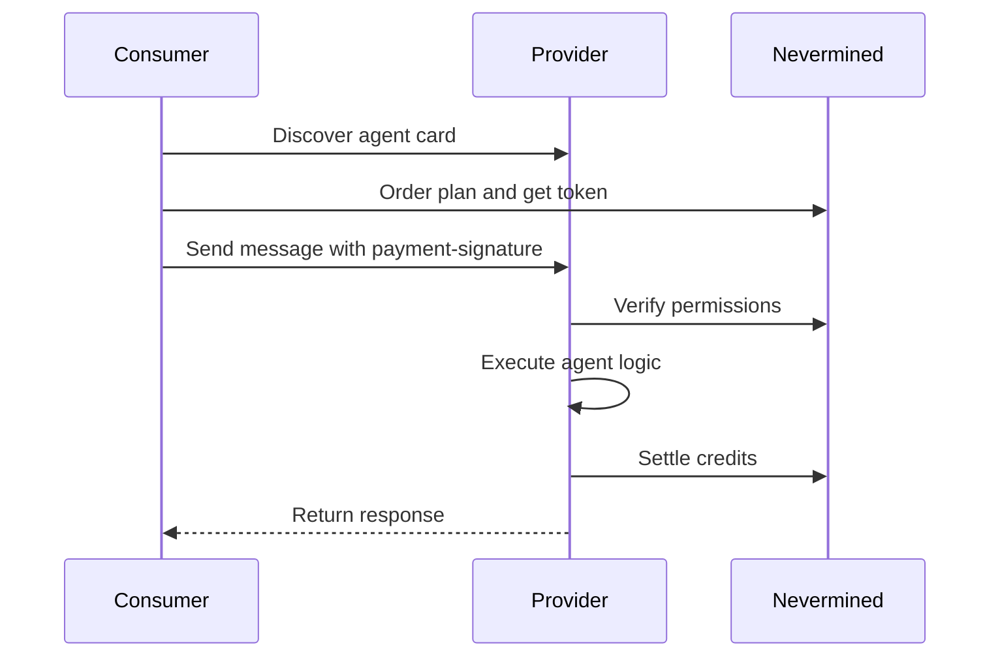
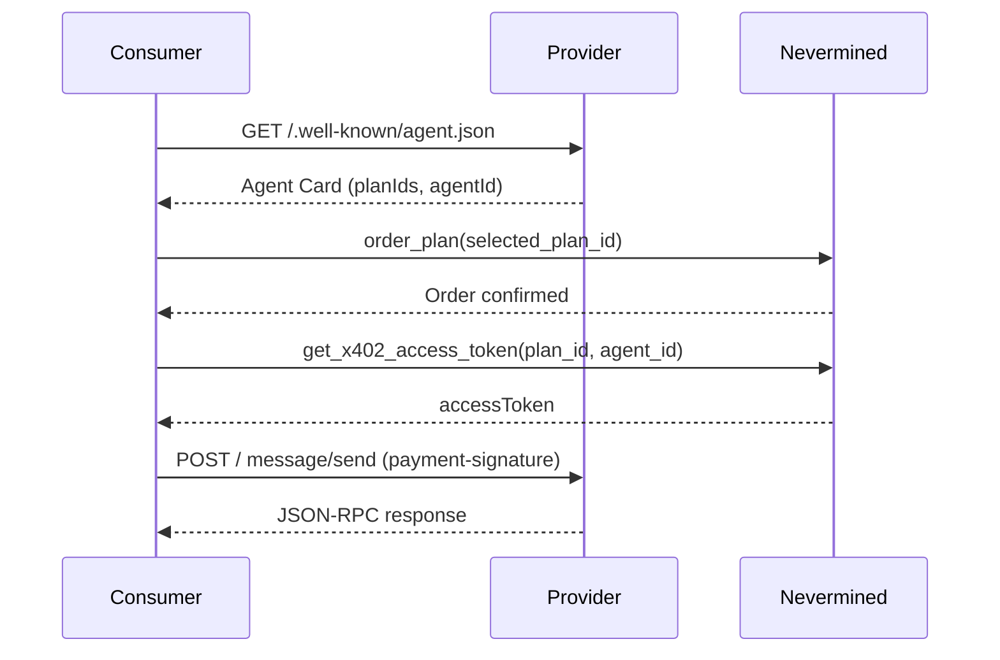

Nevermined Payments integrates with [Google A2A](https://a2a-protocol.org/) to enable heterogenous multi-agent sytems to authorize and charge per request between agents:

- Discovery: publish your AI Agent Card at `/.well-known/agent.json`.
- Streaming and re-subscribe: set `capabilities.streaming: true` for `message/stream` and `tasks/resubscribe`.
- Authentication: credentials are sent in HTTP headers (e.g., `payment-signature: <token>`), not in the JSON‑RPC payload.
- Authorization/charging: the agent emits a final event with `metadata.creditsUsed`; Nevermined validates and burns credits accordingly.

## Architecture



## Features

The libraries provide an `a2a` module that enables seamless integration into new or existing A2A agents, including payment-signature authentication, asynchronous task management, and push notification support. Main features:

- **Payment Signature Authentication**: The server extracts access tokens from the `payment-signature` header and injects them into the task context.
- **Credits Validation**: Validates that the user has sufficient credits before executing a task.
- **Credits Burning/Redemption**: Redeem the credits specified in the result after successful execution.
- **Multi-Plan Support**: Agent cards can advertise multiple plans via `planIds`, allowing consumers to choose which plan to subscribe to.
- **Push Notifications**: Supports the A2A standard flow for push notification configuration and delivery.
- **Asynchronous Task Handling**: Supports intermediate and final state events, compatible with polling and streaming.
- **Unified SDK**: Provides both agent and client integration.

## Quickstart

If you already have a Google A2A agent, or you are building a new one, add the Payments Library to your agent and obtain an API key:

<Steps>
  <Step title="1. Get Your API Key">
    To interact with the Nevermined API, you need an API key.

    1. Go to the [Nevermined App](https://nevermined.app/).
    2. Log in via Web3Auth.
    3. Navigate to the **Settings** section in the user menu.
    4. Click on the **API Keys** tab.
    5. Generate a new key, give it a descriptive name, and copy it.
    6. Store this key securely as an environment variable (e.g., `NVM_API_KEY`).
  </Step>
  <Step title="2. Install and Initialize the Payments Library">
    Install the Payments Library and initialize the `Payments` client with your API key.

    <Tabs>
      <Tab title="TypeScript">
        ```bash
        npm install @nevermined-io/payments
        ```
      </Tab>
      <Tab title="Python">
        ```bash
        pip install payments-py
        ```
      </Tab>
    </Tabs>
  </Step>
</Steps>

## Initialize the Payments Library

<Tabs>
  <Tab title="TypeScript">
    ```typescript
    import { Payments } from "@nevermined-io/payments"

    const payments = Payments.getInstance({
      nvmApiKey,
      environment: 'sandbox',
    })
    ```
  </Tab>
  <Tab title="Python">
    ```python
    from payments_py import Payments, PaymentOptions

    payments = Payments.get_instance(
        PaymentOptions(nvm_api_key="<YOUR_API_KEY>", environment="sandbox")
    )
    ```
  </Tab>
</Tabs>

## A2A Server

### Add the Payment Extension to the Agent Card

Because your AI agent charges for requests, add a payment extension to your agent card.
Add a payment extension under `capabilities.extensions` carrying Nevermined metadata:

#### Single Plan

```json
{
  "capabilities": {
    "streaming": true,
    "pushNotifications": true,
    "extensions": [
      {
        "uri": "urn:nevermined:payment",
        "description": "Dynamic cost per request",
        "required": false,
        "params": {
          "paymentType": "dynamic",
          "credits": 1,
          "planId": "<planId>",
          "agentId": "<agentId>"
        }
      }
    ]
  },
  "url": "https://your-agent.example.com/a2a/"
}
```

#### Multiple Plans

When your agent supports multiple plans, use `planIds` (array) instead of `planId` (string):

```json
{
  "capabilities": {
    "extensions": [
      {
        "uri": "urn:nevermined:payment",
        "params": {
          "paymentType": "dynamic",
          "credits": 5,
          "planIds": ["<planId-basic>", "<planId-premium>"],
          "agentId": "<agentId>",
          "costDescription": "1-5 credits depending on request complexity"
        }
      }
    ]
  }
}
```

<Note>
Provide either `planId` or `planIds`, not both. When multiple plans are configured, the 402 Payment Required response includes all plans in `accepts[]`, allowing consumers to choose.
</Note>

Important notes:

- The `url` must match exactly the URL registered in Nevermined for the agent/plan.
- The final streaming event must include `metadata.creditsUsed` with the consumed cost.

### Define the Payment Agent Card in Your A2A Agent

<Tabs>
  <Tab title="TypeScript">
    ```typescript
    const baseAgentCard = {
      name: 'My A2A Server',
      description: 'A2A test server that requires payment',
      capabilities: {
        streaming: true,
        pushNotifications: true,
        stateTransitionHistory: true,
      },
      defaultInputModes: ['text'],
      defaultOutputModes: ['text'],
      skills: [],
      url: 'http://localhost:3005/a2a/',
      version: '1.0.0',
    }

    const agentCard = payments.a2a.buildPaymentAgentCard(baseAgentCard, {
      paymentType: "dynamic",
      credits: 1,
      planId: process.env.PLAN_ID,
      agentId: process.env.AGENT_ID,
    })
    ```
  </Tab>
  <Tab title="Python">
    ```python
    from payments_py.a2a import build_payment_agent_card

    base_agent_card = {
        "name": "Py A2A Agent",
        "description": "A2A test agent",
        "capabilities": {
            "streaming": True,
            "pushNotifications": True,
            "stateTransitionHistory": True,
        },
        "defaultInputModes": ["text"],
        "defaultOutputModes": ["text"],
        "skills": [],
        "url": "https://your-agent.example.com/a2a/",
        "version": "1.0.0",
    }

    # Single plan
    agent_card = build_payment_agent_card(
        base_card=base_agent_card,
        payment_metadata={
            "paymentType": "dynamic",
            "credits": 1,
            "costDescription": "Dynamic cost per request",
            "planId": "<planId>",
            "agentId": "<agentId>",
        },
    )

    # Or with multiple plans
    agent_card = build_payment_agent_card(
        base_card=base_agent_card,
        payment_metadata={
            "paymentType": "dynamic",
            "credits": 5,
            "costDescription": "1-5 credits per request",
            "planIds": ["<planId-basic>", "<planId-premium>"],
            "agentId": "<agentId>",
        },
    )
    ```
  </Tab>
</Tabs>

### Start the A2A Server

The agent is initialized using the Nevermined Payments Library and the A2A protocol.

#### Using the Decorator (Simple)

The `@a2a_requires_payment` decorator is the quickest way to create a payment-protected A2A agent in Python:

<Tabs>
  <Tab title="TypeScript">
    ```typescript
    // Start server on port 3005 for A2A
    class Executor implements AgentExecutor {
      async handleTask(context, eventBus) {
        // Returns { result: TaskHandlerResult, expectsMoreUpdates: boolean }
      }
      async cancelTask(taskId) { /* ... */ }

      // Publishes the final status-update event when no more updates are expected
      async execute(requestContext, eventBus) {
        const { result, expectsMoreUpdates } = await this.handleTask(requestContext, eventBus)
        if (expectsMoreUpdates) return
        // Publish final status-update event...
      }
    }

    serverResult = await paymentsBuilder.a2a.start({
      port: 3005,
      basePath: '/a2a/',
      agentCard: agentCard,
      executor: A2AE2EFactory.createResubscribeStreamingExecutor(),
    })

    serverManager.addServer(serverResult)
    ```
  </Tab>
  <Tab title="Python">
    ```python
    from payments_py.a2a import AgentResponse, a2a_requires_payment

    @a2a_requires_payment(
        payments=payments,
        agent_card=agent_card,
        default_credits=1,
    )
    async def my_agent(context) -> AgentResponse:
        text = context.get_user_input()
        return AgentResponse(text=f"Echo: {text}", credits_used=1)

    # Start serving (blocking)
    my_agent.serve(port=8080)
    ```
  </Tab>
</Tabs>

#### Using `PaymentsA2AServer` (Advanced)

For more control over the executor and event lifecycle:

```python
from payments_py.a2a.server import PaymentsA2AServer
from a2a.server.agent_execution import AgentExecutor
from a2a.server.events.event_queue import EventQueue

class MyExecutor(AgentExecutor):
    async def execute(self, ctx, event_queue: EventQueue):
        # Your agent logic — publish events to event_queue
        ...

    async def cancel(self, ctx, event_queue: EventQueue):
        ...

result = PaymentsA2AServer.start(
    agent_card=agent_card,
    executor=MyExecutor(),
    payments_service=payments,
    port=8080,
    base_path="/",
)

import asyncio
asyncio.run(result.server.serve())
```

## A2A Client

The client interacts with the agent using JSON-RPC requests. It discovers available plans from the agent card, purchases a plan, obtains an access token, and sends messages.

### Discovering Plans from the Agent Card



<Tabs>
  <Tab title="TypeScript">
    ```typescript

    const paymentsSubscriber = Payments.getInstance({
      nvmApiKey,
      environment: 'sandbox',
    })

    const client = paymentsSubscriber.a2a.getClient({
      agentBaseUrl: 'http://localhost:3005/a2a/',
      agentId: process.env.AGENT_ID,
      planId: process.env.PLAN_ID
    })
    ```
  </Tab>
  <Tab title="Python">
    ```python
    import httpx
    from payments_py import Payments, PaymentOptions

    payments = Payments.get_instance(
        PaymentOptions(nvm_api_key="<SUBSCRIBER_API_KEY>", environment="sandbox")
    )

    # 1. Discover plans from the agent card
    async with httpx.AsyncClient() as client:
        resp = await client.get("http://agent-url/.well-known/agent.json")
        card = resp.json()

    extensions = card["capabilities"]["extensions"]
    payment_ext = next(e for e in extensions if e["uri"] == "urn:nevermined:payment")
    plan_ids = payment_ext["params"].get("planIds") or [payment_ext["params"]["planId"]]
    agent_id = payment_ext["params"]["agentId"]
    ```
  </Tab>
</Tabs>

### Sending a Task

After [purchasing access to the payment plan](/docs/development-guide/order-plans) associated with the AI agent, a client [can generate an access token](/docs/development-guide/query-agents) and start sending tasks:

<Tabs>
  <Tab title="TypeScript">
    ```typescript
    // Purchase the Plan
    const orderResult = await paymentsSubscriber.plans.orderPlan(planId)
    // Get the X402 access token associated to the agent and plan
    const { accessToken } = await paymentsSubscriber.x402.getX402AccessToken(planId, agentId)


    // Test sending an A2A message with correct format
    const response = await client.sendMessage(
      "Testing push notification!",
      accessToken
    );
    const taskId = response?.result?.id
    ```
  </Tab>
  <Tab title="Python">
    ```python
    from payments_py.a2a import PaymentsClient

    # 2. Order (purchase) the plan
    payments.plans.order_plan(plan_ids[0])

    # 3. Create the A2A client (handles token acquisition automatically)
    client = PaymentsClient(
        agent_base_url="http://agent-url/",
        payments=payments,
        agent_id=agent_id,
        plan_id=plan_ids[0],
    )

    # 4. Send a simple request
    result = await client.send_message({
        "message": {
            "messageId": "msg-1",
            "role": "user",
            "parts": [{"kind": "text", "text": "Hello"}],
        }
    })

    # 5. Or stream events
    async for event in client.send_message_stream({
        "message": {
            "messageId": "msg-2",
            "role": "user",
            "parts": [{"kind": "text", "text": "Stream this"}],
        }
    }):
        print(event)
        if getattr(event, "final", False):
            break
    ```
  </Tab>
</Tabs>

## Full example code

Find a complete working example in the repository: [nevermined-io/a2a-agent-client-sample](https://github.com/nevermined-io/a2a-agent-client-sample).
