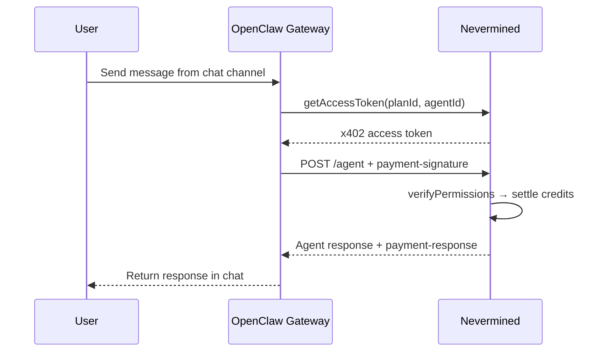

Nevermined integrates with [OpenClaw](https://openclaw.ai) to bring AI agent payments directly into messaging platforms. Install the plugin on an OpenClaw gateway and every connected channel gains full access to the Nevermined payment infrastructure:

- **Chat-native payments**: subscribers order plans, check balances, and query paid agents from Telegram, Discord, WhatsApp, or any other connected channel.
- **x402 built in**: the plugin handles the full payment lifecycle — token acquisition, permission verification, and credit settlement — automatically.
- **Builder and subscriber tools**: 7 payment tools and 2 slash commands cover both sides of the marketplace, from agent registration to paid queries.
- **Paid HTTP endpoint**: enable a single config flag and the gateway exposes an x402-compatible endpoint that verifies, processes, and settles requests without custom code.

## Architecture



## Features

The [Nevermined OpenClaw plugin](https://github.com/nevermined-io/openclaw-plugin) provides a complete set of tools for both builders and subscribers:

- **Payment Signature Authentication**: the paid endpoint extracts access tokens from the `payment-signature` header and verifies them against Nevermined.
- **Credit Verification and Settlement**: validates subscriber balance before processing and burns credits only after successful execution.
- **Multi-Channel Support**: one plugin instance handles payments across every channel your OpenClaw gateway connects to.
- **Agent Registration from Chat**: register agents and create payment plans directly from any messaging channel — no dashboard required.
- **Flexible Pricing**: supports fiat (Stripe/USD), ERC20 tokens (USDC), and native cryptocurrency payment plans.
- **Balance Awareness**: when configured, the plugin injects the current credit balance into the agent's context so your Claw can proactively warn users about low credits.

## Quickstart

<Steps>
  <Step title="1. Get Your API Key">
    To interact with the Nevermined API, you need an API key. Follow the [Get Your API Key](/docs/getting-started/get-your-api-key) guide to create one.
  </Step>
  <Step title="2. Install the Plugin">
    From your OpenClaw gateway server:

    ```bash
    openclaw plugin install @nevermined-io/openclaw-plugin
    ```

    Restart the gateway after installation:

    ```bash
    openclaw gateway restart
    ```

    You should see in the logs:

    ```
    Registered 7 Nevermined payment tools
    ```
  </Step>
  <Step title="3. Authenticate">
    Send `/nvm_login` from any connected chat channel to authenticate with your Nevermined account.

    ```
    /nvm_login
    ```

    This opens a browser window for authentication. The API key is captured and stored automatically.

    For headless servers, pass the key directly:

    ```
    /nvm_login sandbox:eyJhbG...
    ```

    Use `sandbox` for testing, `live` for production.
  </Step>
</Steps>

## Register an Agent and Payment Plan

Once authenticated, register your agent directly from chat. Send a message like:

> Register a Nevermined agent called "Legal Assistant" at URL `https://my-gateway.example.com/nevermined/agent` with a plan named "Legal Queries" priced at 1000000 to address `0xYourWalletAddress` with token `0x036CbD53842c5426634e7929541eC2318f3dCF7e` granting 10 credits.

The gateway calls `nevermined_registerAgent` and returns an `agentId` and `planId`. Save these for configuration.

### Enable the Paid Endpoint

Add the returned IDs to your gateway config (`~/.openclaw/openclaw.json`) and enable the paid endpoint:

```json
{
  "plugins": {
    "entries": {
      "nevermined": {
        "enabled": true,
        "config": {
          "nvmApiKey": "sandbox:eyJhbG...",
          "environment": "sandbox",
          "planId": "<your-plan-id>",
          "agentId": "<your-agent-id>",
          "enablePaidEndpoint": true,
          "agentEndpointPath": "/nevermined/agent",
          "creditsPerRequest": 1
        }
      }
    }
  }
}
```

Restart the gateway. The paid endpoint handles the full x402 lifecycle automatically:

1. Extracts the `payment-signature` header from incoming requests
2. Calls `verifyPermissions` to check the subscriber has credits
3. Processes the request through your agent handler
4. Calls `settlePermissions` to burn credits
5. Returns the response with a `payment-response` header

## Query a Paid Agent

From the subscriber side (same or different gateway), the full flow works from chat:

**Order a plan:**

> Order the Legal Assistant plan `<plan-id>`

The gateway calls `nevermined_orderPlan` and credits are granted.

**Query the agent:**

> Ask the Legal Assistant at `https://my-gateway.example.com/nevermined/agent` to summarize the latest GDPR amendments

The gateway calls `nevermined_queryAgent`, which acquires an x402 token, sends the prompt with a `payment-signature` header, and returns the response — all in one step.

**Check your balance:**

> Check my Nevermined balance for plan `<plan-id>`

Credits are decremented after each successful query.

## Custom Agent Handlers

The plugin includes a default handler for demonstration. To use your own logic, pass a custom `agentHandler` when registering the plugin:

```typescript
import neverminedPlugin from '@nevermined-io/openclaw-plugin'

neverminedPlugin.register(api, {
  agentHandler: async (body) => {
    const response = await myAIModel.generate(body.prompt)
    return { result: response }
  },
})
```

The handler receives `{ prompt: string }` and returns any JSON-serializable object.

## Learn More

<CardGroup cols={2}>
  <Card
    title="Getting Started"
    icon="rocket"
    href="/docs/api-reference/openclaw-plugin/getting-started"
  >
    Install and configure the plugin
  </Card>
  <Card
    title="Setup"
    icon="gear"
    href="/docs/api-reference/openclaw-plugin/setup"
  >
    Full configuration reference
  </Card>
  <Card
    title="Commands"
    icon="terminal"
    href="/docs/api-reference/openclaw-plugin/commands"
  >
    All tools and slash commands
  </Card>
  <Card
    title="Build a Paid Agent"
    icon="book-open"
    href="/docs/api-reference/openclaw-plugin/guide"
  >
    Step-by-step tutorial
  </Card>
</CardGroup>
