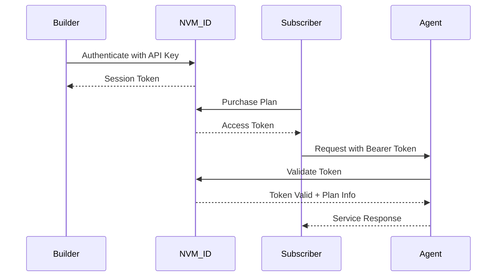

<Warning>
NVM ID documentation is under development. This section provides an overview based on current implementation details.
</Warning>

## What is NVM ID?

NVM ID is Nevermined's identity and access management system that handles authentication, authorization, and user management across the platform. It provides the security layer that ensures only authorized users can access AI services.

## Current Implementation

### API Key Authentication

Builders authenticate using Nevermined API keys:

```typescript
const payments = Payments.getInstance({
  nvmApiKey: process.env.NVM_API_KEY,
  environment: 'production'
})
```

### Bearer Token Access

Subscribers receive bearer tokens for API access:

```typescript
// Get access token after purchasing plan
const credentials = await payments.agents.getAgentAccessToken(
  planId,
  agentId
)

// Use token for authenticated requests
const response = await fetch(agentEndpoint, {
  headers: {
    'Authorization': `Bearer ${credentials.accessToken}`
  }
})
```

## Key Components

<CardGroup cols={2}>
  <Card title="API Keys" icon="key">
    Master keys for builders and developers
  </Card>
  <Card title="Access Tokens" icon="ticket">
    JWT tokens for API authentication
  </Card>
  <Card title="Plan Validation" icon="shield-check">
    Ensures users have active subscriptions
  </Card>
  <Card title="Request Signing" icon="signature">
    Cryptographic request validation
  </Card>
</CardGroup>

## Authentication Flow



## Current Features

### For Builders
- API key generation and management
- Session management
- Usage analytics access

### For Subscribers
- Wallet-based authentication
- Access token generation
- Multi-plan management

## Planned Features

<Note>
The following features are planned for future releases:
</Note>

### Enhanced Identity Management
- User profiles with metadata
- Multi-factor authentication
- Social login integration
- Enterprise SSO support

### Advanced Access Control
- Role-based permissions
- Fine-grained access policies
- API rate limiting per user
- Geographic restrictions

### Compliance Features
- KYC/AML integration
- Age verification
- Data privacy controls
- Audit logging

## Integration Points

### With NVM Pay
- Links identity to payment plans
- Validates subscription status
- Tracks usage per user

### With AI Agents
- Authenticates API requests
- Enforces access policies
- Provides user context

## Security Considerations

<AccordionGroup>
  <Accordion title="API Key Security">
    - Store keys in environment variables
    - Rotate keys regularly
    - Never expose in client code
    - Use separate keys for dev/prod
  </Accordion>
  
  <Accordion title="Token Management">
    - Tokens expire automatically
    - Refresh tokens not yet implemented
    - Validate on every request
    - Handle expiration gracefully
  </Accordion>
  
  <Accordion title="Best Practices">
    - Use HTTPS for all requests
    - Implement request timeouts
    - Log security events
    - Monitor for anomalies
  </Accordion>
</AccordionGroup>

## Coming Soon

- Detailed API documentation
- User management dashboard
- Advanced authentication methods
- Compliance toolkit
- Enterprise features