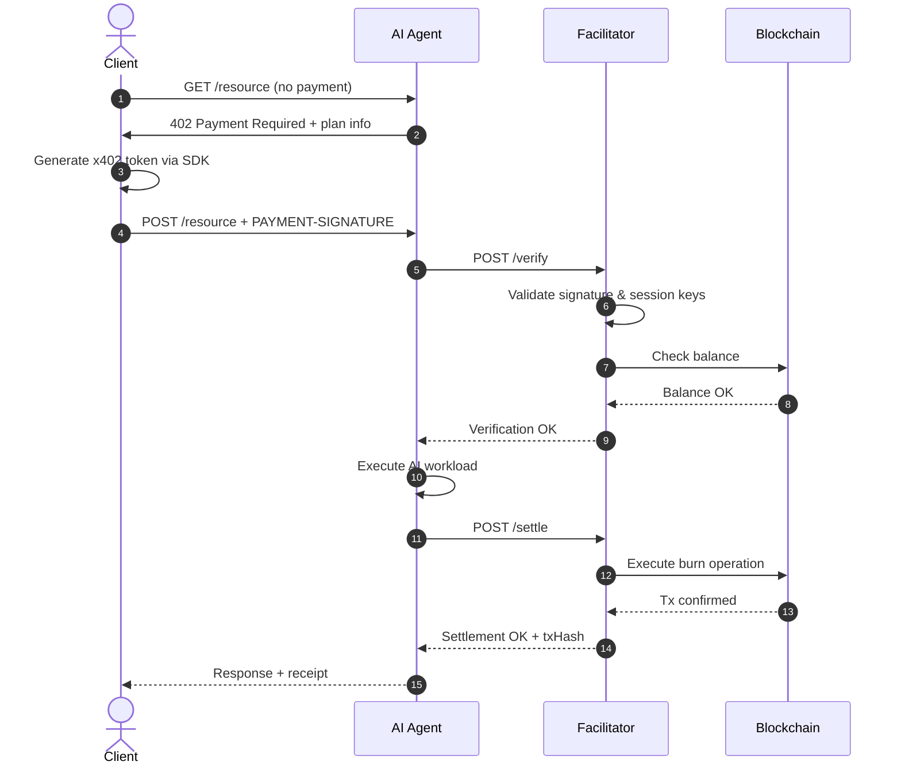

This guide explains the end-to-end x402 flow from both the subscriber (client) and resource server (API/agent) perspectives.

If you're new to the programmable extension concepts, see:

- [Making x402 programmable](https://nevermined.ai/blog/making-x402-programmable)
- [Building Agentic Payments with Nevermined, x402, A2A, and AP2](https://nevermined.ai/blog/building-agentic-payments-with-nevermined-x402-a2a-and-ap2)

## The Nevermined x402 programmable extension

Nevermined extends x402 with a smart-account-friendly scheme so the payment payload can authorize **programmable settlement** (credits/subscriptions/PAYG) instead of only an ERC-20 transfer.

```json
{
  "x402Version": 2,
  "scheme": "contract",
  "network": "base-sepolia",
  "extensions": {
    "nevermined": {
      "info": {
        "plan_id": "did:nv:plan-123",
        "agent_id": "did:nv:agent-456",
        "max_amount": "1000000",
        "network": "base-sepolia"
      }
    }
  },
  "payload": {
    "session_key": "<delegated-session-key-or-proof>"
  }
}
```

## Subscriber flow (client side)

### Step 1: Discover payment requirements (HTTP 402)

When calling a protected endpoint, the server returns a `402 Payment Required` response and includes the payment requirements (plan/agent binding, maximum amount, network, scheme).

<Tabs>
  <Tab title="TypeScript">
    ```typescript
    // Call protected endpoint - get 402 response
    const response = await fetch('https://api.example.com/protected')

    if (response.status === 402) {
      const paymentRequired = await response.json()
      const nvmInfo = paymentRequired.extensions.nevermined.info
      // nvmInfo.plan_id, nvmInfo.agent_id, nvmInfo.max_amount, nvmInfo.network
    }
    ```
  </Tab>
  <Tab title="Python">
    ```python
    import requests

    response = requests.get('https://api.example.com/protected')

    if response.status_code == 402:
        payment_required = response.json()
        nvm_info = payment_required['extensions']['nevermined']['info']
    ```
  </Tab>
</Tabs>

### Step 2: Build the x402 payment payload

The client creates a payment payload that encodes the allowed permissions (for example, a session-key capability scoped to a plan/agent and a spend cap).

<Tabs>
  <Tab title="TypeScript">
    ```typescript
    import { Payments } from '@nevermined-io/payments'

    const payments = Payments.getInstance({
      nvmApiKey: process.env.NVM_API_KEY,
      environment: 'sandbox'
    })

    const { plan_id, agent_id, network } = paymentRequired.extensions.nevermined.info

    // Create a delegated permission (session key / proof) the facilitator can verify.
    // The exact mechanics depend on the plan model and scheme (see the blog posts above).
    const { accessToken } = await payments.x402.getX402AccessToken(plan_id, agent_id)

    const paymentPayload = {
      x402Version: 2,
      scheme: 'contract',
      network,
      payload: { session_key: accessToken },
      extensions: paymentRequired.extensions
    }
    ```
  </Tab>
  <Tab title="Python">
    ```python
    import os
    from payments_py import Payments, PaymentOptions

    payments = Payments.get_instance(
        PaymentOptions(nvm_api_key=os.environ['NVM_API_KEY'], environment='sandbox')
    )

    token_res = payments.x402.get_x402_access_token(
        nvm_info['plan_id'], nvm_info['agent_id']
    )
    access_token = token_res['accessToken']

    payment_payload = {
        'x402Version': 2,
        'scheme': 'contract',
        'network': nvm_info['network'],
        'payload': {'session_key': access_token},
        'extensions': payment_required['extensions']
    }
    ```
  </Tab>
</Tabs>

### Step 3: Retry request with payment header

The payment payload is sent in-band with HTTP (commonly via the `PAYMENT-SIGNATURE` header).

<Tabs>
  <Tab title="TypeScript">
    ```typescript
    const encodedPayload = Buffer.from(JSON.stringify(paymentPayload)).toString('base64')

    const result = await fetch('https://api.example.com/protected', {
      method: 'POST',
      headers: {
        'Content-Type': 'application/json',
        'PAYMENT-SIGNATURE': encodedPayload
      },
      body: JSON.stringify({ prompt: 'Hello' })
    })
    ```
  </Tab>
  <Tab title="Python">
    ```python
    import base64
    import json

    encoded_payload = base64.b64encode(
        json.dumps(payment_payload).encode()
    ).decode()

    result = requests.post(
        'https://api.example.com/protected',
        headers={
            'Content-Type': 'application/json',
            'PAYMENT-SIGNATURE': encoded_payload
        },
        json={'prompt': 'Hello'}
    )
    ```
  </Tab>
</Tabs>

## Resource server flow (API/agent side)

### Step 1: Return 402 when payment is missing

If the payment header is not present, respond with `402` plus the payment requirements you accept.

<Tabs>
  <Tab title="TypeScript">
    ```typescript
    const paymentHeader = req.headers['payment-signature']

    if (!paymentHeader) {
      return res.status(402).json({
        error: 'Payment Required',
        x402Version: 2,
        extensions: {
          nevermined: {
            info: {
              plan_id: process.env.PLAN_ID,
              agent_id: process.env.AGENT_ID,
              max_amount: '1000000',
              network: 'base-sepolia'
            }
          }
        }
      })
    }
    ```
  </Tab>
  <Tab title="Python">
    ```python
    payment_header = request.headers.get('PAYMENT-SIGNATURE')

    if not payment_header:
        return jsonify({
            'error': 'Payment Required',
            'x402Version': 2,
            'extensions': {
                'nevermined': {
                    'info': {
                        'plan_id': os.environ['PLAN_ID'],
                        'agent_id': os.environ['AGENT_ID'],
                        'max_amount': '1000000',
                        'network': 'base-sepolia'
                    }
                }
            }
        }), 402
    ```
  </Tab>
</Tabs>

### Step 2: Verify with the facilitator

Decode the payment payload and ask the facilitator to verify it (including simulating any allowed on-chain actions).

<Tabs>
  <Tab title="TypeScript">
    ```typescript
    import { Payments } from '@nevermined-io/payments'

    const payments = Payments.getInstance({
      nvmApiKey: process.env.NVM_API_KEY,
      environment: 'sandbox'
    })

    // Decode and parse the payment payload
    const paymentPayload = JSON.parse(
      Buffer.from(paymentHeader, 'base64').toString()
    )

    const { plan_id, max_amount } = paymentPayload.extensions.nevermined.info

    // Verify with facilitator
    const verification = await payments.facilitator.verifyPermissions({
      planId: plan_id,
      maxAmount: BigInt(max_amount),
      x402AccessToken: paymentPayload.payload.session_key,
      subscriberAddress: req.body.subscriber_address
    })

    if (!verification.success) {
      return res.status(402).json({ error: 'Payment verification failed' })
    }
    ```
  </Tab>
  <Tab title="Python">
    ```python
    from payments_py.x402 import NeverminedFacilitator, PaymentRequirements

    facilitator = NeverminedFacilitator(
        nvm_api_key=os.environ['NVM_API_KEY'],
        environment='sandbox'
    )

    # Decode and parse the payment payload
    payment_payload = json.loads(base64.b64decode(payment_header))
    nvm_info = payment_payload['extensions']['nevermined']['info']

    # Verify with facilitator
    requirements = PaymentRequirements(
        plan_id=nvm_info['plan_id'],
        agent_id=nvm_info['agent_id'],
        max_amount=nvm_info['max_amount'],
        extra={'subscriber_address': request.json.get('subscriber_address')}
    )

    verify_result = await facilitator.verify(payment_payload, requirements)

    if not verify_result.is_valid:
        return jsonify({'error': 'Payment verification failed'}), 402
    ```
  </Tab>
</Tabs>

### Step 3: Execute Workload

```typescript
// Only execute after verification succeeds
const result = await processAIRequest(req.body)
```

### Step 4: Settle Payment

<Tabs>
  <Tab title="TypeScript">
    ```typescript
    // Settle after work is complete
    const settlement = await payments.facilitator.settlePermissions({
      planId: plan_id,
      maxAmount: BigInt(max_amount),
      x402AccessToken: paymentPayload.payload.session_key,
      subscriberAddress: req.body.subscriber_address
    })

    // Return response with transaction hash
    res.json({
      result,
      receipt: {
        txHash: settlement.transactionHash,
        creditsCharged: settlement.amount
      }
    })
    ```
  </Tab>
  <Tab title="Python">
    ```python
    # Settle after work is complete
    settlement = await facilitator.settle(payment_payload, requirements)

    # Return response with transaction hash
    return jsonify({
        'result': result,
        'receipt': {
            'txHash': settlement.transaction_hash,
            'creditsCharged': settlement.amount
        }
    })
    ```
  </Tab>
</Tabs>

## Complete Request Lifecycle



## Error Handling

| Error | HTTP Status | Cause |
|-------|-------------|-------|
| Missing payment header | 402 | No `PAYMENT-SIGNATURE` header |
| Invalid signature | 402 | Signature verification failed |
| Insufficient balance | 402 | User needs to purchase more credits |
| Expired session | 402 | Session key has expired |
| Settlement failed | 500 | On-chain transaction failed |

## Next Steps

<CardGroup cols={2}>
  <Card title="Payment Models" icon="calculator" href="/docs/products/x402-facilitator/payment-models">
    Configure credits, subscriptions, and dynamic pricing
  </Card>

  <Card title="x402 Integration" icon="plug" href="/docs/development-guide/nevermined-x402">
    Complete integration guide with code examples
  </Card>
</CardGroup>
