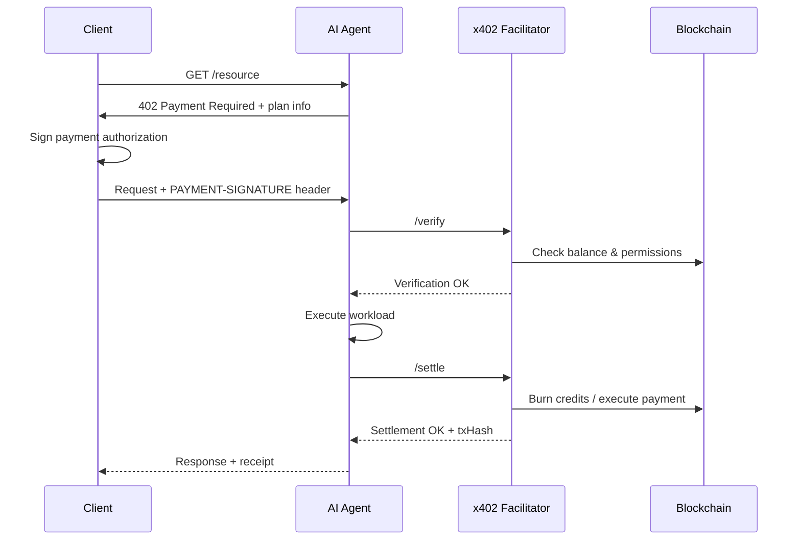

The Nevermined x402 Facilitator is a payment verification and settlement service that implements the x402 protocol standard. It enables AI agents to charge per-request using secure, locally-signed payment authorizations.

## What is x402?

The x402 protocol defines a payment-enforced HTTP flow:

1. Client calls an API endpoint
2. Server responds with **HTTP 402 Payment Required** and payment instructions
3. Client signs a payment authorization locally (private key never leaves device)
4. Signed authorization is included in the retry request
5. Server forwards it to the **Facilitator** for verification and settlement

## Why Use the x402 Facilitator?

<CardGroup cols={2}>
  <Card title="Standard Protocol" icon="globe">
    Compatible with the x402 standard while adding Nevermined's programmable settlement layer
  </Card>

  <Card title="Smart Account Support" icon="wallet">
    ERC-4337 Smart Accounts with session keys for granular permission control
  </Card>

  <Card title="Flexible Billing" icon="calculator">
    Subscriptions, credits, time windows, and dynamic pricing - not just pay-per-request
  </Card>

  <Card title="On-Chain Settlement" icon="link">
    Transparent, verifiable settlement on blockchain with instant finality
  </Card>
</CardGroup>

## How It Works

## Facilitator Responsibilities

### Verification

The Facilitator validates incoming payment requests:

- x402 envelope structure and version
- EIP-712 signature authenticity
- Session key validity and permissions
- Subscriber balance and plan state
- UserOperation simulation

### Settlement

After the agent completes its work, the Facilitator:

- Executes `order` operations (auto top-up if needed)
- Executes `burn` operations (deduct credits)
- Submits UserOps on-chain
- Returns transaction hashes for transparency

## Nevermined's x402 Extensions

Standard x402 focuses on single ERC-20 pay-per-request flows. Nevermined extends this:

| Capability | Standard x402 | Nevermined x402 |
|------------|--------------|-----------------|
| Payment authorization | EIP-3009 | ERC-4337 UserOps + session keys |
| Wallet model | EOA signatures | Smart Accounts with permissions |
| Billing models | Pay-per-request | Subscriptions, credits, time-based |
| Delegated execution | Basic | Programmable burn, order, redeem |
| Settlement | ERC-20 transfer | Smart contract settlement |

## Permission Delegation

Subscribers can delegate specific permissions to agents via session keys:

| Permission | Description |
|------------|-------------|
| `order` | Allow facilitator to auto-purchase credits |
| `redeem` | Allow facilitator to deduct credits per request |
| `burn` | Allow facilitator to burn usage units |
| `<custom>` | Additional session-key-scoped behaviors |

## Getting Started

<CardGroup cols={2}>
  <Card title="How It Works" icon="gears" href="/docs/products/x402-facilitator/how-it-works">
    Deep dive into the x402 flow and implementation
  </Card>

  <Card title="Payment Models" icon="calculator" href="/docs/products/x402-facilitator/payment-models">
    Configure credits, subscriptions, and dynamic pricing
  </Card>

  <Card title="Integration Guide" icon="plug" href="/docs/integrate/platforms/x402-protocol">
    Add x402 support to your agent
  </Card>

  <Card title="Google A2A" icon="sparkles" href="/docs/integrate/platforms/google-a2a">
    Combine x402 with Google Agent-to-Agent messaging
  </Card>
</CardGroup>
