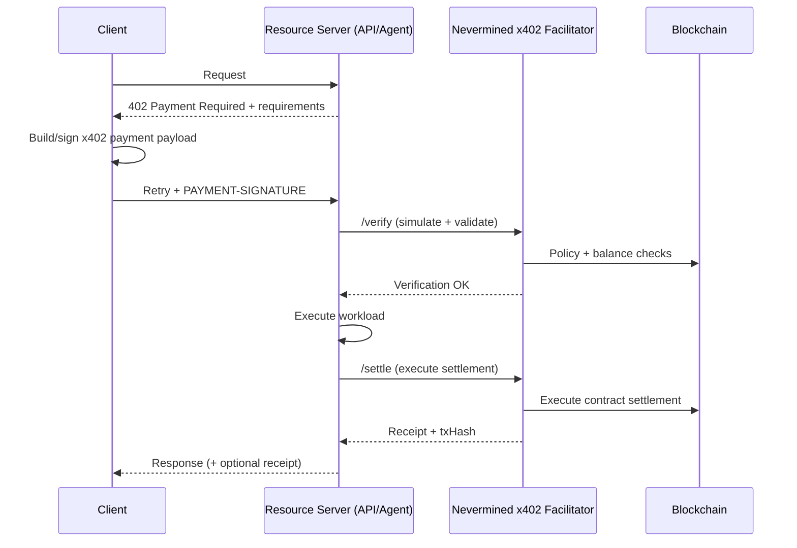

The Nevermined x402 Facilitator is an **enforcement and settlement engine** for x402. It lets any API, agent, MCP tool, or protected resource accept **HTTP-native payments** without running on-chain infrastructure.

It supports both:

- **Standard x402 settlement** ("pay-per-request" style)
- **Nevermined's programmable x402 extension** (smart accounts + policies + contract settlement)

## What is x402?

x402 standardizes a payment-enforced HTTP flow:

1. Client calls an endpoint normally
2. Server responds with **HTTP 402 Payment Required** and payment requirements
3. Client builds a payment authorization (locally signed)
4. Client retries the request including the x402 payment payload (typically in a `PAYMENT-SIGNATURE` header)
5. Server delegates verification and settlement to the **Facilitator**

For more background and examples:

- [Making x402 programmable](https://nevermined.ai/blog/making-x402-programmable)
- [Building Agentic Payments with Nevermined, x402, A2A, and AP2](https://nevermined.ai/blog/building-agentic-payments-with-nevermined-x402-a2a-and-ap2)

## Why use a Facilitator?

A facilitator is the third party that:

- verifies payment proofs
- simulates/enforces what is allowed (amount, plan, merchant/agent binding)
- executes settlement on-chain
- returns a canonical receipt (e.g., transaction hash)

This is particularly important for **programmable x402**, where settlement may be more than a single ERC-20 transfer (credits, subscriptions, policy-based settlement).

## How it works

## Nevermined's programmable x402 extension

Standard x402 is often implemented as an "exact transfer" authorization (e.g., EIP-3009). Nevermined extends x402 to support:

- **Smart Accounts (ERC-4337)** and delegated **session keys**
- **Smart-contract settlement** (credits, subscriptions, PAYG, dynamic charging)
- **Policy enforcement** (merchant allowlists, spend caps, validity windows)

This keeps the HTTP handshake the same, but upgrades settlement from "transfer" to **programmable execution**.

## Facilitator responsibilities

### Verification

- x402 envelope structure/version
- signature authenticity
- session key validity + scoped permissions
- plan state + subscriber balance
- simulation of allowed on-chain actions (UserOps)

### Settlement

After the server completes its work, the facilitator can execute the settlement action permitted by the payment payload, such as:

- `order` (purchase/top-up)
- `redeem` / `burn` (consume credits)
- "exact" transfers (when using standard x402)

## Getting started

<CardGroup cols={2}>
  <Card title="How It Works" icon="gears" href="/docs/products/x402-facilitator/how-it-works">
    End-to-end flow (client + server) with x402 headers and facilitator calls
  </Card>

  <Card title="Payment Models" icon="calculator" href="/docs/products/x402-facilitator/payment-models">
    Credits, subscriptions, and dynamic pricing using programmable settlement
  </Card>

  <Card title="x402 Protocol" icon="plug" href="/docs/integrate/platforms/x402-protocol">
    Integrate x402 into your API/agent
  </Card>

  <Card title="Google A2A" icon="sparkles" href="/docs/integrate/platforms/google-a2a">
    Use x402 with A2A + AP2-style payment intent messaging
  </Card>
</CardGroup>
