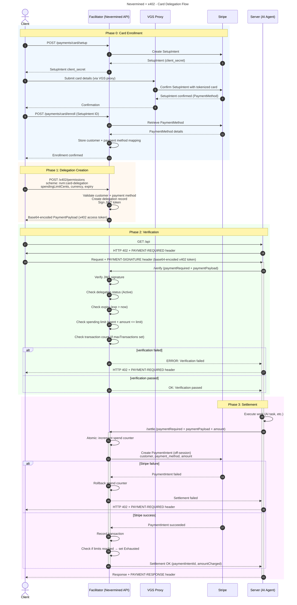

## Abstract

This specification defines a **card-delegation extension** to the [x402 protocol](https://x402.org/) that enables payment settlement through traditional credit/debit cards via Stripe. While standard x402 settles payments via EIP-3009 ERC-20 token transfers and the smart accounts extension uses ERC-4337 UserOperations, this extension allows settlement through Stripe PaymentIntents backed by pre-authorized card delegations.

The scheme identifier is: `nvm:card-delegation`

The extension is designed to be **fully compatible** with existing x402 clients and servers, requiring only the addition of the `nvm:card-delegation` extension payload.

```
Version: 0.1
Status: Draft
Last Updated: February 2026
```

## 1. Introduction

### 1.1 Background

The x402 protocol standardizes HTTP-native payments where:

1. A client requests a protected resource
2. The server responds with HTTP 402 and payment requirements
3. The client builds and signs a payment authorization
4. The client retries the request with the payment payload
5. A facilitator verifies and settles the payment

Standard x402 implementations use EIP-3009 signatures to authorize ERC-20 token transfers, and the smart accounts extension uses ERC-4337 UserOperations for programmable on-chain settlement. Both approaches require clients to hold cryptocurrency and interact with blockchain infrastructure.

### 1.2 Motivation

Many real-world payment scenarios involve users and organizations that prefer or require traditional payment methods:

- **Enterprise adoption** --- organizations with existing credit card infrastructure should not need crypto wallets to consume AI services
- **Regulatory compliance** --- some jurisdictions require fiat-denominated billing and traditional payment rails
- **User experience** --- end users are familiar with credit card payments and may not want to manage blockchain wallets
- **Budgetary controls** --- organizations need spending limits, approval workflows, and reconciliation against traditional accounting systems
- **Instant onboarding** --- new users can start consuming services immediately with an existing payment card, without acquiring tokens

This extension enables these use cases by replacing on-chain settlement with Stripe PaymentIntents, authorized through pre-established card delegations managed by the facilitator.

### 1.3 Design Goals

This extension:

- **MUST** be compatible with the existing x402 HTTP handshake
- **MUST** use the standard x402 payload structure with an extension field
- **MUST** support spending limits and transaction caps per delegation
- **SHOULD** leverage Stripe's off-session payment capabilities for seamless settlement
- **SHOULD** support multi-party settlement via Stripe Connect for merchant routing
- **MUST** ensure PCI compliance by never exposing raw card data to the facilitator or server
- **MUST** allow facilitators to verify and settle payments on behalf of clients

## 2. Terminology

The key words "MUST", "MUST NOT", "REQUIRED", "SHALL", "SHALL NOT", "SHOULD", "SHOULD NOT", "RECOMMENDED", "NOT RECOMMENDED", "MAY", and "OPTIONAL" in this document are to be interpreted as described in [RFC 2119](https://www.rfc-editor.org/rfc/rfc2119).

### 2.1 Roles

| Role | Description |
|------|-------------|
| **Client** | The entity requesting access to a protected resource. Authenticates via JWT tokens issued by the facilitator. |
| **Server** | The entity providing the protected resource (API, agent, service). Coordinates with the facilitator. |
| **Facilitator** | A third-party service that verifies delegations, manages spending limits, and executes Stripe PaymentIntents on behalf of clients. |
| **Payment Provider** | The payment processor (Stripe) that handles card authorization, capture, and fund transfer. |

### 2.2 Definitions

| Term | Definition |
|------|------------|
| **Delegation** | A pre-authorized permission granting the facilitator the ability to charge a client's card within defined spending limits and time constraints. |
| **SetupIntent** | A Stripe object used to collect and confirm a customer's payment method for future off-session charges, without immediately charging the card. |
| **PaymentIntent** | A Stripe object representing the intent to collect a payment. Used during settlement to charge the delegated card. |
| **Off-session payment** | A Stripe payment executed without the cardholder being actively present, using a previously saved payment method. |
| **Connected Account** | A Stripe Connect account belonging to a merchant (server operator) that receives funds from settlements. |
| **Spending Limit** | The maximum amount (in cents) that can be charged against a delegation over its lifetime. |
| **VGS (Very Good Security)** | A PCI-compliant proxy service used to tokenize and vault sensitive card data before it reaches the facilitator. |

## 3. Extension Structure

### 3.1 Scheme Identifier

The scheme identifier is: `nvm:card-delegation`

### 3.2 Payload Schema

#### PaymentRequired Response (402)

When a server requires payment via card delegation, it returns:

```json
{
  "x402Version": 2,
  "error": "Payment required to access resource",
  "resource": {
    "url": "/api/v1/agents/80918427023170428029540261117198154464497879145267720259488529685089104529015/tasks",
    "description": "AI agent task execution",
    "mimeType": "application/json"
  },
  "accepts": [{
    "scheme": "nvm:card-delegation",
    "network": "stripe",
    "planId": "plan_abc123",
    "extra": {
      "version": "1",
      "agentId": "80918427023170428029540261117198154464497879145267720259488529685089104529015",
      "httpVerb": "POST"
    }
  }],
  "extensions": {}
}
```

#### PaymentPayload (Client Response)

The client responds with a PaymentPayload containing a JWT token that encodes the delegation authorization:

```json
{
  "x402Version": 2,
  "resource": {
    "url": "/api/v1/agents/80918427023170428029540261117198154464497879145267720259488529685089104529015/tasks",
    "description": "AI agent task execution",
    "mimeType": "application/json"
  },
  "accepted": {
    "scheme": "nvm:card-delegation",
    "network": "stripe",
    "planId": "plan_abc123",
    "extra": {
      "version": "1",
      "agentId": "80918427023170428029540261117198154464497879145267720259488529685089104529015",
      "httpVerb": "POST"
    }
  },
  "payload": {
    "token": "eyJhbGciOiJSUzI1NiIsInR5cCI6IkpXVCJ9.eyJpc3MiOiJodHRwczovL2FwaS5uZXZlcm1pbmVkLmFwcCIsInN1YiI6InVzZXJfMTIzNDU2Nzg5MCIsImF1ZCI6Im52bTpjYXJkLWRlbGVnYXRpb24iLCJqdGkiOiJkZWxlZy04ZjE0ZTQ1Zi1jZTM0LTQ3OTctYjg4ZS05NjgzNzRiMGQ0YjYiLCJpYXQiOjE3MDkxMjk2MDAsImV4cCI6MTcxMTgwODAwMCwibnZtIjp7ImRlbGVnYXRpb25JZCI6ImRlbGVnLThmMTRlNDVmLWNlMzQtNDc5Ny1iODhlLTk2ODM3NGIwZDRiNiIsInByb3ZpZGVyIjoic3RyaXBlIiwicHJvdmlkZXJDdXN0b21lcklkIjoiY3VzX1BhQmNEZUZnSGlKayIsInByb3ZpZGVyUGF5bWVudE1ldGhvZElkIjoicG1fMUFiQ2RFZkdoSWpLbE0iLCJzcGVuZGluZ0xpbWl0Q2VudHMiOjEwMDAwLCJjdXJyZW5jeSI6InVzZCIsIm1lcmNoYW50QWNjb3VudElkIjoiYWNjdF8xQWJDZEVmR2hJaktsTSIsInBsYW5JZCI6InBsYW5fYWJjMTIzIiwibWF4VHJhbnNhY3Rpb25zIjoxMDB9fQ.signature"
  },
  "extensions": {}
}
```

### 3.3 Field Definitions

#### PaymentRequired Root Fields

| Field | Type | Required | Description |
|-------|------|----------|-------------|
| `x402Version` | `number` | Yes | Protocol version. MUST be `2`. |
| `error` | `string` | Yes | Human-readable error message. |
| `resource` | `object` | Yes | Protected resource information. |
| `accepts` | `array` | Yes | Array of accepted payment schemes. |
| `extensions` | `object` | Yes | Empty object `{}` for x402 spec alignment. |

#### Resource Fields

| Field | Type | Required | Description |
|-------|------|----------|-------------|
| `url` | `string` | Yes | The protected resource URL. |
| `description` | `string` | No | Human-readable description. |
| `mimeType` | `string` | No | Expected response MIME type (e.g., `"application/json"`). |

#### Scheme Fields (in `accepts[]` / `accepted`)

| Field | Type | Required | Description |
|-------|------|----------|-------------|
| `scheme` | `string` | Yes | Payment scheme. MUST be `"nvm:card-delegation"`. |
| `network` | `string` | Yes | Payment network identifier. MUST be `"stripe"`. |
| `planId` | `string` | No | Plan identifier associated with this delegation. |
| `extra` | `object` | Yes | Additional scheme-specific fields. |

#### Extra Fields

| Field | Type | Required | Description |
|-------|------|----------|-------------|
| `version` | `string` | Yes | Scheme version (e.g., `"1"`). |
| `agentId` | `string` | No | Agent identifier (if resource has multiple agents). |
| `httpVerb` | `string` | No | HTTP method for the endpoint. |

#### PaymentPayload Fields

| Field | Type | Required | Description |
|-------|------|----------|-------------|
| `x402Version` | `number` | Yes | Protocol version. MUST be `2`. |
| `resource` | `object` | No | Echoed from PaymentRequired. |
| `accepted` | `object` | Yes | Selected scheme from `accepts[]`. |
| `payload` | `object` | Yes | Scheme-specific authorization data. |
| `extensions` | `object` | Yes | Empty object `{}` for x402 spec alignment. |

#### Payload Fields

| Field | Type | Required | Description |
|-------|------|----------|-------------|
| `token` | `string` | Yes | JWT token encoding the card delegation authorization. See JWT Claims below. |

#### JWT Claims

The `token` field contains a signed JWT with the following claims:

| Claim | Type | Required | Description |
|-------|------|----------|-------------|
| `iss` | `string` | Yes | Token issuer. MUST be the facilitator URL (e.g., `"https://api.nevermined.app"`). |
| `sub` | `string` | Yes | Subject identifier. The userId of the client who created the delegation. |
| `aud` | `string` | Yes | Audience. MUST be `"nvm:card-delegation"`. |
| `jti` | `string` | Yes | JWT ID. The delegationId (UUID) that uniquely identifies this delegation. |
| `iat` | `number` | Yes | Issued-at timestamp (Unix epoch seconds). |
| `exp` | `number` | Yes | Expiration timestamp (Unix epoch seconds). |
| `nvm.delegationId` | `string` | Yes | Unique delegation identifier (UUID). MUST match the `jti` claim. |
| `nvm.provider` | `string` | Yes | Payment provider identifier. MUST be `"stripe"`. |
| `nvm.providerCustomerId` | `string` | Yes | Stripe Customer ID (e.g., `"cus_PaBcDeFgHiJk"`). |
| `nvm.providerPaymentMethodId` | `string` | Yes | Stripe PaymentMethod ID for the enrolled card (e.g., `"pm_1AbCdEfGhIjKlM"`). |
| `nvm.spendingLimitCents` | `number` | Yes | Maximum amount in cents that can be charged over the delegation lifetime. |
| `nvm.currency` | `string` | Yes | ISO 4217 currency code (e.g., `"usd"`, `"eur"`). |
| `nvm.merchantAccountId` | `string` | No | Stripe Connected Account ID for the merchant receiving funds (e.g., `"acct_1AbCdEfGhIjKlM"`). |
| `nvm.planId` | `string` | No | Plan identifier associated with this delegation. |
| `nvm.maxTransactions` | `number` | No | Maximum number of individual transactions allowed under this delegation. |

<Note>
The `nvm` claims are namespaced under a single `nvm` object within the JWT payload to avoid collisions with standard JWT claims. The `jti` and `nvm.delegationId` MUST contain the same value for consistency.
</Note>

## 4. Protocol Flow

### 4.1 Overview

The protocol flow extends standard x402 with a card enrollment phase and replaces on-chain settlement with Stripe PaymentIntents:



### 4.2 Step-by-Step Flow

The following steps detail the complete payment and execution flow. Steps are grouped into four phases: **Card Enrollment**, **Delegation Creation**, **Verification**, and **Settlement**.

---

#### Phase 0: Card Enrollment (Steps 1-10)

Card enrollment is a one-time process that securely saves a client's payment method for future use.

**Step 1.** Client requests a SetupIntent from the facilitator.

```http
POST /payments/card/setup HTTP/1.1
Host: facilitator.example.com
Authorization: Bearer <user-auth-token>
```

**Step 2.** Facilitator creates a Stripe SetupIntent and returns the `client_secret` to the client.

**Step 3.** Client submits card details through a VGS (Very Good Security) proxy. The VGS proxy tokenizes the card data before it reaches any Nevermined infrastructure, ensuring PCI compliance.

**Step 4.** VGS forwards the tokenized card data to Stripe to confirm the SetupIntent.

**Step 5.** Stripe confirms the SetupIntent and attaches the PaymentMethod.

**Step 6.** Client notifies the facilitator that enrollment is complete.

```http
POST /payments/card/enroll HTTP/1.1
Host: facilitator.example.com
Authorization: Bearer <user-auth-token>
Content-Type: application/json

{
  "setupIntentId": "seti_1AbCdEfGhIjKlM"
}
```

**Step 7.** Facilitator retrieves the confirmed PaymentMethod from Stripe and stores the customer-to-payment-method mapping.

**Step 8.** Facilitator confirms enrollment to the client.

<Note>
Card enrollment only needs to happen once per payment method. A single enrolled card can back multiple delegations with different spending limits and expiry times.
</Note>

---

#### Phase 1: Delegation Creation (Steps 9-12)

**Step 9.** Client requests a delegation from the facilitator, specifying the scheme, spending limits, and optional constraints. The request body follows the `GenerateX402TokenDto` structure, where `accepted` identifies the payment scheme and `delegationConfig` contains card-delegation-specific options.

```http
POST /x402/permissions HTTP/1.1
Host: facilitator.example.com
Authorization: Bearer <user-auth-token>
Content-Type: application/json

{
  "resource": {
    "url": "/api/v1/agents/80918427023170428029540261117198154464497879145267720259488529685089104529015/tasks",
    "description": "AI agent task execution",
    "mimeType": "application/json"
  },
  "accepted": {
    "scheme": "nvm:card-delegation",
    "network": "stripe",
    "planId": "plan_abc123",
    "extra": {
      "version": "1"
    }
  },
  "delegationConfig": {
    "providerPaymentMethodId": "pm_1AbCdEfGhIjKlM",
    "spendingLimitCents": 10000,
    "durationSecs": 2592000,
    "currency": "usd",
    "maxTransactions": 100,
    "merchantAccountId": "acct_1AbCdEfGhIjKlM"
  }
}
```

**Step 10.** Facilitator validates the client's enrolled payment method and creates a delegation record with status `Active`.

**Step 11.** Facilitator signs a JWT token containing the delegation claims (see Section 3.3) and wraps it in a standard x402 PaymentPayload structure. The `resource` and `accepted` fields echo back the values from the client's request:

```json
{
  "x402Version": 2,
  "resource": {
    "url": "/api/v1/agents/80918427023170428029540261117198154464497879145267720259488529685089104529015/tasks",
    "description": "AI agent task execution",
    "mimeType": "application/json"
  },
  "accepted": {
    "scheme": "nvm:card-delegation",
    "network": "stripe",
    "planId": "plan_abc123",
    "extra": { "version": "1" }
  },
  "payload": {
    "token": "<signed-delegation-jwt>"
  },
  "extensions": {}
}
```

**Step 12.** Facilitator base64-encodes the PaymentPayload and returns it to the client. This token is what the client will include in the `PAYMENT-SIGNATURE` header when accessing protected resources.

```json
{
  "accessToken": "eyJ4NDAyVmVyc2lvbiI6Mi...",
  "permissionHash": "0x1a2b3c..."
}
```

---

#### Phase 2: Verification (Steps 13-22)

**Step 13.** Client initiates an HTTP request to a Server (AI Agent).

```http
GET /api/resource HTTP/1.1
Host: agent.example.com
```

**Step 14.** Server validates whether the request contains a valid payment in the `PAYMENT-SIGNATURE` header.

**Step 15.** If payment is absent, Server responds with `HTTP 402 Payment Required` status and the `PaymentRequired` object in the `PAYMENT-REQUIRED` header (base64-encoded).

```http
HTTP/1.1 402 Payment Required
PAYMENT-REQUIRED: eyJ4NDAyVmVyc2lvbiI6MiwiZXJyb3IiOiJQYXltZW50IHJlcXVpcmVkLi4u
```

**Step 16.** The Client selects the `nvm:card-delegation` scheme from `accepts[]` and uses the base64-encoded PaymentPayload (received in Step 12) as the x402 access token.

**Step 17.** Client sends an HTTP request to the server including the base64-encoded PaymentPayload in the `PAYMENT-SIGNATURE` HTTP header.

```http
GET /api/resource HTTP/1.1
Host: agent.example.com
PAYMENT-SIGNATURE: <base64-encoded-PaymentPayload>
```

**Step 18.** Server validates the incoming data and forwards the payment data to the facilitator for verification.

```http
POST /verify HTTP/1.1
Host: facilitator.example.com
Content-Type: application/json

{
  "paymentRequired": { ... },
  "x402AccessToken": "<base64-encoded-PaymentPayload>",
  "maxAmount": "500"
}
```

**Step 19.** Facilitator base64-decodes the PaymentPayload, extracts the JWT from the `payload.token` field, and performs the following verification checks:

1. **JWT signature verification** --- validates the JWT was signed by the facilitator's private key
2. **Delegation status check** --- confirms the delegation record exists and has status `Active`
3. **Expiry check** --- confirms `exp` claim is in the future
4. **Budget check** --- confirms `spentCents + requestedAmountCents <= nvm.spendingLimitCents`
5. **Transaction count check** --- if `nvm.maxTransactions` is set, confirms the transaction count has not been exceeded

**Step 20.** IF any verification check fails, the facilitator returns an error to the server.

**Step 21.** IF all verification checks pass, the facilitator confirms verification to the server.

**Step 22.** The Server, after obtaining the verification result from the Facilitator (and BEFORE executing any task), checks the verification result:
- If the verification was INVALID, the Server returns to the client a `HTTP 402 PAYMENT-FAILED` response
- If the verification was correct, the Server continues with the request execution

<Note>
The verification phase ensures that the delegation CAN be settled before the server performs any work. This protects the server from executing expensive operations without guaranteed payment.
</Note>

---

#### Phase 3: Settlement (Steps 23-32)

**Step 23.** The Server executes the task to fulfill the client request (AI Task or any necessary work).

**Step 24.** The Server calls the `/settle` endpoint of the Facilitator to settle the request.

```http
POST /settle HTTP/1.1
Host: facilitator.example.com
Content-Type: application/json

{
  "paymentRequired": { ... },
  "x402AccessToken": "<base64-encoded-PaymentPayload>",
  "maxAmount": "500"
}
```

The `maxAmount` specifies the amount in cents to charge for this request.

**Step 25.** Facilitator atomically increments the spend counter for the delegation.

**Step 26.** Facilitator creates an off-session Stripe PaymentIntent using the delegated customer and payment method.

```json
{
  "amount": 500,
  "currency": "usd",
  "customer": "cus_PaBcDeFgHiJk",
  "payment_method": "pm_1AbCdEfGhIjKlM",
  "off_session": true,
  "confirm": true,
  "transfer_data": {
    "destination": "acct_1AbCdEfGhIjKlM"
  }
}
```

**Step 27.** IF the Stripe PaymentIntent fails, the facilitator rolls back the spend counter and returns an error to the server.

**Step 28.** The Server returns to the client a `HTTP 402 PAYMENT-FAILED` response.

**Step 29.** IF the Stripe PaymentIntent succeeds, the facilitator records the transaction and checks whether spending limits or transaction counts have been reached. If limits are reached, the delegation status is updated to `Exhausted`.

**Step 30.** Facilitator confirms settlement to the server.

**Step 31.** Server returns to the client the response with the payment confirmation in the `PAYMENT-RESPONSE` header (base64-encoded).

```http
HTTP/1.1 200 OK
Content-Type: application/json
PAYMENT-RESPONSE: eyJzdWNjZXNzIjp0cnVlLCJwYXltZW50SW50ZW50SWQiOi4uLg==

{
  "result": "...",
  "payment": {
    "amountChargedCents": 500,
    "currency": "usd",
    "remainingBudgetCents": 9500
  }
}
```

**Decoded PAYMENT-RESPONSE:**

```json
{
  "success": true,
  "paymentIntentId": "pi_1AbCdEfGhIjKlM",
  "network": "stripe"
}
```

The `PAYMENT-RESPONSE` header contains x402-standard settlement fields. Additional Nevermined-specific info (like `amountChargedCents` and `remainingBudgetCents`) can be included in the response body.

<Warning>
Steps 27-28 represent a failure scenario where the server has already performed work but settlement failed. Implementations SHOULD have mechanisms to handle this edge case, such as retry logic or dispute resolution.
</Warning>

### 4.3 HTTP Header Summary

Per [x402 HTTP Transport v2](https://github.com/coinbase/x402/blob/main/specs/transports-v2/http.md), payment data is transmitted via HTTP headers:

| Header | Direction | Content |
|--------|-----------|---------|
| `PAYMENT-REQUIRED` | Server -> Client (402) | Base64-encoded `PaymentRequired` object |
| `PAYMENT-SIGNATURE` | Client -> Server | Base64-encoded `PaymentPayload` object (consistent for both `nvm:card-delegation` and `nvm:erc4337` schemes) |
| `PAYMENT-RESPONSE` | Server -> Client (200) | Base64-encoded settlement receipt |

## 5. Verification Requirements

### 5.1 JWT Verification

The facilitator MUST verify the following aspects of the JWT token:

| Check | Requirement |
|-------|-------------|
| Signature | JWT MUST be signed by the facilitator's private key and verifiable with the corresponding public key |
| Algorithm | JWT MUST use RS256 or ES256 signing algorithm |
| Issuer | `iss` claim MUST match the facilitator's configured issuer URL |
| Audience | `aud` claim MUST equal `"nvm:card-delegation"` |
| Expiry | `exp` claim MUST be in the future |
| Issued At | `iat` claim MUST be in the past |
| JWT ID | `jti` claim MUST match an existing delegation record |

### 5.2 Delegation Status Verification

The facilitator MUST verify:

| Check | Requirement |
|-------|-------------|
| Existence | A delegation record matching the `jti` / `nvm.delegationId` MUST exist |
| Status | Delegation status MUST be `Active` |
| Customer Match | `nvm.providerCustomerId` MUST match the delegation record |
| Payment Method | `nvm.providerPaymentMethodId` MUST match a valid, active payment method |

### 5.3 Budget and Limit Checks

The facilitator MUST verify:

| Check | Requirement |
|-------|-------------|
| Spending Limit | `spentCents + requestedAmountCents` MUST NOT exceed `nvm.spendingLimitCents` |
| Transaction Count | If `nvm.maxTransactions` is set, the current transaction count MUST be less than `nvm.maxTransactions` |
| Currency Match | The request currency MUST match `nvm.currency` |

## 6. Settlement Requirements

### 6.1 Execution Order

When executing settlement, the facilitator MUST:

1. Atomically increment the spend counter for the delegation
2. Create a Stripe PaymentIntent with `off_session: true` and `confirm: true`
3. If `nvm.merchantAccountId` is present, include `transfer_data.destination` for Stripe Connect routing
4. On Stripe failure, roll back the spend counter
5. On Stripe success, record the transaction and check limits
6. Return settlement receipt

### 6.2 Atomicity

<Warning>
The spend counter MUST be incremented atomically BEFORE the Stripe PaymentIntent is created. If the Stripe charge fails, the spend counter MUST be rolled back. This prevents race conditions where concurrent requests could exceed spending limits.
</Warning>

### 6.3 Delegation Lifecycle

Delegations transition through the following states:

| Status | Description |
|--------|-------------|
| `Active` | Delegation is valid and can be used for payments |
| `Exhausted` | Spending limit or transaction count has been reached |
| `Expired` | The `exp` timestamp has passed |
| `Revoked` | The client or facilitator has explicitly revoked the delegation |

The facilitator MUST update the delegation status to `Exhausted` when:
- `spentCents >= nvm.spendingLimitCents`
- Transaction count reaches `nvm.maxTransactions` (if set)

### 6.4 Stripe Connect Routing

When `nvm.merchantAccountId` is present, the facilitator MUST route funds to the merchant's Stripe Connected Account using Stripe Connect's `transfer_data` parameter. The facilitator MAY apply platform fees via the `application_fee_amount` parameter.

### 6.5 Receipt Format

The facilitator MUST return a receipt. The `PAYMENT-RESPONSE` header contains x402-standard fields:

| Field | Type | Description |
|-------|------|-------------|
| `success` | `boolean` | Whether settlement succeeded. |
| `paymentIntentId` | `string` | Stripe PaymentIntent ID of the settlement. |
| `network` | `string` | Payment network. MUST be `"stripe"`. |

Additional settlement details MAY be included in the response body:

| Field | Type | Description |
|-------|------|-------------|
| `amountChargedCents` | `number` | Amount charged in cents. |
| `currency` | `string` | Currency of the charge (ISO 4217). |
| `remainingBudgetCents` | `number` | Remaining spending budget in cents. |
| `transactionCount` | `number` | Total transactions executed under this delegation. |

## 7. Error Handling

### 7.1 Error Codes

| Code | Name | Description |
|------|------|-------------|
| `INVALID_PAYLOAD` | Invalid Payload | The payment payload structure is invalid or missing required fields |
| `INVALID_TOKEN` | Invalid Token | The JWT token signature verification failed |
| `EXPIRED_TOKEN` | Expired Token | The JWT token `exp` claim is in the past |
| `DELEGATION_NOT_FOUND` | Delegation Not Found | No delegation record found for the given `jti` / `delegationId` |
| `DELEGATION_INACTIVE` | Delegation Inactive | Delegation status is not `Active` (may be `Exhausted`, `Expired`, or `Revoked`) |
| `BUDGET_EXCEEDED` | Budget Exceeded | The requested amount would exceed the delegation spending limit |
| `TRANSACTION_LIMIT_REACHED` | Transaction Limit Reached | The maximum number of transactions has been reached |
| `PAYMENT_FAILED` | Payment Failed | Stripe PaymentIntent creation or confirmation failed |
| `CARD_DECLINED` | Card Declined | The card was declined by the issuing bank |
| `CURRENCY_MISMATCH` | Currency Mismatch | The request currency does not match the delegation currency |
| `MERCHANT_ACCOUNT_INVALID` | Merchant Account Invalid | The specified Stripe Connected Account is invalid or inactive |

### 7.2 Error Response Format

```json
{
  "error": {
    "code": "BUDGET_EXCEEDED",
    "message": "Requested amount exceeds remaining delegation budget",
    "details": {
      "delegationId": "deleg-8f14e45f-ce34-4797-b88e-968374b0d4b6",
      "spendingLimitCents": 10000,
      "spentCents": 9800,
      "requestedAmountCents": 500
    }
  }
}
```

## 8. Security Considerations

### 8.1 JWT Security

- JWT tokens MUST be signed using asymmetric cryptography (RS256 or ES256)
- The facilitator's signing private key MUST be stored in a secure key management system
- JWT tokens SHOULD have limited validity periods (RECOMMENDED: 30 days maximum)
- Replay protection is inherent through the atomic spend counter and transaction tracking

### 8.2 Spending Limits

- Every delegation MUST have a finite spending limit (`nvm.spendingLimitCents`)
- Spend counters MUST be incremented atomically to prevent race conditions
- The facilitator MUST reject requests that would exceed the spending limit, even by a single cent

### 8.3 Atomic Operations

- The spend counter increment and Stripe PaymentIntent creation MUST be treated as a logical unit
- If the Stripe charge fails after the counter is incremented, the counter MUST be rolled back
- Concurrent settlement requests for the same delegation MUST be serialized or use optimistic concurrency control

### 8.4 PCI Compliance

- Raw card numbers (PAN), CVV, and expiry dates MUST NEVER be transmitted to or stored by the facilitator
- Card enrollment MUST use a PCI-compliant proxy (VGS) that tokenizes card data before it reaches Nevermined infrastructure
- Only Stripe-issued tokens (Customer IDs, PaymentMethod IDs) are stored by the facilitator
- The facilitator MUST maintain PCI DSS compliance for the handling of any cardholder data references

### 8.5 Delegation Revocation

- Clients MUST be able to revoke delegations at any time
- Revoked delegations MUST immediately fail verification
- In-flight settlements at the time of revocation MAY complete if the Stripe PaymentIntent has already been confirmed

## 9. Implementation Notes

### 9.1 Stripe Integration

This extension requires the following Stripe features:

| Feature | Purpose |
|---------|---------|
| SetupIntents | Securely save payment methods for future use |
| PaymentIntents | Charge saved payment methods off-session |
| Stripe Connect | Route payments to merchant connected accounts |
| Off-session payments | Execute charges without cardholder presence |

Implementations MUST use Stripe API version `2023-10-16` or later.

### 9.2 VGS Proxy for Card Enrollment

Card enrollment flows MUST route through a VGS (Very Good Security) forward proxy to ensure PCI compliance:

1. The client collects card details in a VGS-secured iframe or form
2. VGS tokenizes the card data and forwards it to Stripe
3. The facilitator only ever receives Stripe-issued tokens (SetupIntent IDs, PaymentMethod IDs)

This architecture ensures that raw card data never touches Nevermined servers.

### 9.3 Stripe Connect for Merchant Routing

When merchants (server operators) have Stripe Connected Accounts, the facilitator routes settlement funds using Stripe Connect:

- **Direct charges** with `transfer_data.destination` send funds to the merchant
- The facilitator MAY deduct a platform fee using `application_fee_amount`
- Merchants MUST complete Stripe Connect onboarding before receiving funds
- The `nvm.merchantAccountId` in the JWT identifies the destination account

### 9.4 Idempotency

Implementations SHOULD use Stripe's `idempotency_key` parameter when creating PaymentIntents to prevent duplicate charges in case of network failures or retries. The idempotency key SHOULD be derived from the delegation ID and a request-specific nonce.

## 10. References

- [x402 Protocol](https://x402.org/)
- [Stripe PaymentIntents API](https://docs.stripe.com/api/payment_intents)
- [Stripe SetupIntents API](https://docs.stripe.com/api/setup_intents)
- [Stripe Connect](https://docs.stripe.com/connect)
- [Stripe Off-session Payments](https://docs.stripe.com/payments/save-and-reuse)
- [VGS (Very Good Security)](https://www.verygoodsecurity.com/)
- [RFC 7519: JSON Web Token (JWT)](https://www.rfc-editor.org/rfc/rfc7519)
- [RFC 2119: Key words for use in RFCs](https://www.rfc-editor.org/rfc/rfc2119)
