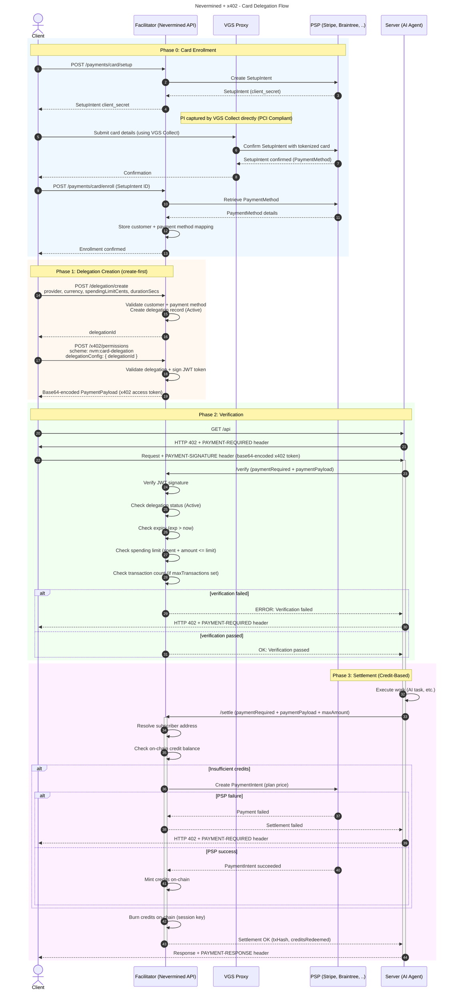

## Abstract

This specification defines a **delegation extension** to the [x402 protocol](https://x402.org/) that enables payment settlement through on-chain credit burns with delegated spending permissions. The delegation model is shared between crypto and fiat payment providers:

- **Crypto delegations** (`provider: 'erc4337'`): Use ERC-4337 smart accounts and session keys for on-chain settlement, with crypto-funded ordering when the subscriber's balance is insufficient.
- **Fiat delegations** (`provider: 'stripe' | 'braintree' | 'visa'`): Use the configured Payment Service Provider (Stripe PaymentIntents, Braintree `transaction.sale`, or — for Visa Agentic Tokens — Stripe Connect against the seller's connected account) backed by pre-authorized card delegations for automatic card-funded credit top-ups when the subscriber's balance is insufficient.

All providers use the same `DelegationConfig` interface with `spendingLimitCents` and `durationSecs` to control delegation scope. The PSP is selected per plan via the seller's `fiatPaymentProvider` metadata. Visa adds a per-delegation device-binding step (`consumerPrompt` + `assuranceData`) imposed by the Visa Trusted Agent Protocol.

The fiat scheme identifier is: `nvm:card-delegation`

The extension is designed to be **fully compatible** with existing x402 clients and servers, requiring only the addition of the delegation extension payload.

```
Version: 0.1
Status: Draft
Last Updated: February 2026
```

## 1. Introduction

### 1.1 Background

The x402 protocol standardizes HTTP-native payments where:

1. A client requests a protected resource
2. The server responds with HTTP 402 and payment requirements
3. The client builds and signs a payment authorization
4. The client retries the request with the payment payload
5. A facilitator verifies and settles the payment

Standard x402 implementations use EIP-3009 signatures to authorize ERC-20 token transfers, and the smart accounts extension uses ERC-4337 UserOperations for programmable on-chain settlement. Both approaches require clients to hold cryptocurrency and interact with blockchain infrastructure.

### 1.2 Motivation

Many real-world payment scenarios involve users and organizations that prefer or require traditional payment methods:

- **Enterprise adoption** --- organizations with existing credit card infrastructure should not need crypto wallets to consume AI services
- **Regulatory compliance** --- some jurisdictions require fiat-denominated billing and traditional payment rails
- **User experience** --- end users are familiar with credit card payments and may not want to manage blockchain wallets
- **Budgetary controls** --- organizations need spending limits, approval workflows, and reconciliation against traditional accounting systems
- **Instant onboarding** --- new users can start consuming services immediately with an existing payment card, without acquiring tokens

This extension enables these use cases by funding on-chain credit purchases through a Payment Service Provider (PSP) — currently Stripe or Braintree — authorized through pre-established delegations managed by the facilitator. Settlement itself uses the same on-chain credit burn mechanism as the smart accounts extension. The delegation model (`DelegationConfig`) is shared across all providers, giving the SDK and middleware a single interface for creating and managing payment permissions regardless of which PSP settles the charge.

### 1.3 Design Goals

This extension:

- **MUST** be compatible with the existing x402 HTTP handshake
- **MUST** use the standard x402 payload structure with an extension field
- **MUST** support spending limits and transaction caps per delegation
- **SHOULD** leverage the PSP's off-session payment capabilities for seamless settlement
- **SHOULD** support multi-party settlement so funds reach merchant-owned accounts (Stripe Connect, Braintree OAuth Connect)
- **MUST** ensure PCI compliance by never exposing raw card data to the facilitator or server
- **MUST** allow facilitators to verify and settle payments on behalf of clients

## 2. Terminology

The key words "MUST", "MUST NOT", "REQUIRED", "SHALL", "SHALL NOT", "SHOULD", "SHOULD NOT", "RECOMMENDED", "NOT RECOMMENDED", "MAY", and "OPTIONAL" in this document are to be interpreted as described in [RFC 2119](https://www.rfc-editor.org/rfc/rfc2119).

### 2.1 Roles

| Role | Description |
|------|-------------|
| **Client** | The entity requesting access to a protected resource. Authenticates via JWT tokens issued by the facilitator. |
| **Server** | The entity providing the protected resource (API, agent, service). Coordinates with the facilitator. |
| **Facilitator** | A third-party service that verifies delegations, manages spending limits, and executes PSP charges (Stripe PaymentIntents, Braintree `transaction.sale`) on behalf of clients. |
| **Payment Provider** | The payment processor (Stripe, Braintree, or Visa Trusted Agent Protocol) that handles card authorization, capture, and fund transfer. The active provider for a given plan is selected via the plan's `fiatPaymentProvider` metadata. For Visa, VGS issues the Agentic Token and Stripe Connect settles the charge. |

### 2.2 Definitions

| Term | Definition |
|------|------------|
| **Delegation** | A pre-authorized permission granting the facilitator the ability to execute payment operations on behalf of a client, within defined spending limits and time constraints. Delegations use the unified `DelegationConfig` interface for crypto (`erc4337`) and fiat (`stripe`, `braintree`, `visa`) providers. |
| **Visa Agentic Token** | A long-lived CMP-issued identifier (`vat_…`) that replaces a real PAN. Bound to Nevermined as the token requestor. Used as the `providerPaymentMethodId` for `provider: 'visa'` delegations. |
| **Device Binding** | A per-delegation WebAuthn/passkey ceremony embedded by Visa VTS that produces a single-use `assuranceData` blob bound to the delegation's spending limit, duration, and merchant context. Required by the Visa Trusted Agent Protocol. Browser-only. |
| **Consumer Prompt** | Human-readable approval text shown during Visa device binding. Forwarded verbatim to VGS `POST /intents`. Limited to 500 characters. |
| **SetupIntent** | A Stripe object used to collect and confirm a customer's payment method for future off-session charges, without immediately charging the card. |
| **PaymentIntent** | A Stripe object representing the intent to collect a payment. Used during settlement to charge the delegated card. |
| **Payment Method Nonce** | A single-use Braintree token returned by the Braintree Drop-in / hosted fields once the buyer enters card details. The facilitator exchanges the nonce for a permanent `paymentMethodToken` by vaulting the card. |
| **Payment Method Token** | A permanent Braintree handle that identifies a vaulted card. Used at settlement time as the equivalent of Stripe's `pm_...` ID. |
| **Off-session payment** | A PSP-side payment executed without the cardholder being actively present, using a previously saved payment method. |
| **Connected Account** | A merchant-owned PSP account (Stripe Connected Account or Braintree OAuth-connected merchant) that receives funds from settlements. |
| **Spending Limit** | The maximum amount (in cents) that can be charged against a delegation over its lifetime. |
| **VGS (Very Good Security)** | A PCI-compliant proxy service used to tokenize and vault sensitive card data before it reaches the facilitator. Used for the Stripe enrollment path; the Braintree path performs equivalent in-browser tokenization via the Braintree Drop-in / hosted fields. |

## 3. Extension Structure

### 3.1 Scheme Identifier

The scheme identifier is: `nvm:card-delegation`

### 3.2 Payload Schema

#### PaymentRequired Response (402)

When a server requires payment via card delegation, it returns:

```json
{
  "x402Version": 2,
  "error": "Payment required to access resource",
  "resource": {
    "url": "/api/v1/agents/80918427023170428029540261117198154464497879145267720259488529685089104529015/tasks",
    "description": "AI agent task execution",
    "mimeType": "application/json"
  },
  "accepts": [{
    "scheme": "nvm:card-delegation",
    "network": "stripe", // or "braintree" or "visa"
    "planId": "plan_abc123",
    "extra": {
      "version": "1",
      "agentId": "80918427023170428029540261117198154464497879145267720259488529685089104529015",
      "httpVerb": "POST"
    }
  }],
  "extensions": {}
}
```

#### PaymentPayload (Client Response)

The client responds with a PaymentPayload containing a JWT token that encodes the delegation authorization:

```json
{
  "x402Version": 2,
  "resource": {
    "url": "/api/v1/agents/80918427023170428029540261117198154464497879145267720259488529685089104529015/tasks",
    "description": "AI agent task execution",
    "mimeType": "application/json"
  },
  "accepted": {
    "scheme": "nvm:card-delegation",
    "network": "stripe", // or "braintree" or "visa"
    "planId": "plan_abc123",
    "extra": {
      "version": "1",
      "agentId": "80918427023170428029540261117198154464497879145267720259488529685089104529015",
      "httpVerb": "POST"
    }
  },
  "payload": {
    "token": "eyJhbGciOiJSUzI1NiIs...",
    "authorization": {
      "from": "0xD4f58B60330bC59cB0A07eE6A1A66ad64244eC8c",
      "sessionKeys": [{ "id": "redeem", "data": "0xabc123..." }]
    }
  },
  "extensions": {}
}
```

### 3.3 Field Definitions

#### PaymentRequired Root Fields

| Field | Type | Required | Description |
|-------|------|----------|-------------|
| `x402Version` | `number` | Yes | Protocol version. MUST be `2`. |
| `error` | `string` | Yes | Human-readable error message. |
| `resource` | `object` | Yes | Protected resource information. |
| `accepts` | `array` | Yes | Array of accepted payment schemes. |
| `extensions` | `object` | Yes | Empty object `{}` for x402 spec alignment. |

#### Resource Fields

| Field | Type | Required | Description |
|-------|------|----------|-------------|
| `url` | `string` | Yes | The protected resource URL. |
| `description` | `string` | No | Human-readable description. |
| `mimeType` | `string` | No | Expected response MIME type (e.g., `"application/json"`). |

#### Scheme Fields (in `accepts[]` / `accepted`)

| Field | Type | Required | Description |
|-------|------|----------|-------------|
| `scheme` | `string` | Yes | Payment scheme. MUST be `"nvm:card-delegation"`. |
| `network` | `string` | Yes | Payment network identifier. MUST be `"stripe"`, `"braintree"`, or `"visa"`, matching the plan's `fiatPaymentProvider` metadata (or `"visa"` when the delegation being consumed was issued via the Visa Trusted Agent Protocol). The SDK auto-resolves this from plan metadata and the delegation record; clients may also supply it explicitly. |
| `planId` | `string` | No | Plan identifier associated with this delegation. |
| `extra` | `object` | Yes | Additional scheme-specific fields. |

#### Extra Fields

| Field | Type | Required | Description |
|-------|------|----------|-------------|
| `version` | `string` | Yes | Scheme version (e.g., `"1"`). |
| `agentId` | `string` | No | Agent identifier (if resource has multiple agents). |
| `httpVerb` | `string` | No | HTTP method for the endpoint. |

#### PaymentPayload Fields

| Field | Type | Required | Description |
|-------|------|----------|-------------|
| `x402Version` | `number` | Yes | Protocol version. MUST be `2`. |
| `resource` | `object` | No | Echoed from PaymentRequired. |
| `accepted` | `object` | Yes | Selected scheme from `accepts[]`. |
| `payload` | `object` | Yes | Scheme-specific authorization data. |
| `extensions` | `object` | Yes | Empty object `{}` for x402 spec alignment. |

#### Payload Fields

| Field | Type | Required | Description |
|-------|------|----------|-------------|
| `token` | `string` | Yes | JWT token encoding the card delegation authorization. See JWT Claims below. |
| `authorization` | `object` | No | On-chain authorization for credit burns. Contains subscriber address and session keys. |
| `authorization.from` | `string` | Yes (if authorization present) | Subscriber's blockchain address (smart account). |
| `authorization.sessionKeys` | `array` | Yes (if authorization present) | Array of session key references for on-chain operations. |
| `authorization.sessionKeys[].id` | `string` | Yes | Session key identifier. Must be `"redeem"` for burn session keys. |
| `authorization.sessionKeys[].data` | `string` | Yes | Keccak-256 hash of the serialized session key. |

#### JWT Claims

The `token` field contains a signed JWT with the following claims:

| Claim | Type | Required | Description |
|-------|------|----------|-------------|
| `iss` | `string` | Yes | Token issuer. MUST be the facilitator URL (e.g., `"https://api.nevermined.app"`). |
| `sub` | `string` | Yes | Subject identifier. The userId of the client who created the delegation. |
| `aud` | `string` | Yes | Audience. MUST be `"nvm:card-delegation"`. |
| `jti` | `string` | Yes | JWT ID. The delegationId (UUID) that uniquely identifies this delegation. |
| `iat` | `number` | Yes | Issued-at timestamp (Unix epoch seconds). |
| `exp` | `number` | Yes | Expiration timestamp (Unix epoch seconds). |
| `nvm.delegationId` | `string` | Yes | Unique delegation identifier (UUID). MUST match the `jti` claim. |
| `nvm.provider` | `string` | Yes | Payment provider identifier. MUST be `"stripe"`, `"braintree"`, `"visa"`, or `"erc4337"`. |
| `nvm.providerCustomerId` | `string` | Yes | PSP-side customer identifier. For Stripe, the Customer ID (e.g., `"cus_PaBcDeFgHiJk"`). For Braintree, the customer ID derived from the buyer's userId. For Visa, the CMP cardholder identifier. |
| `nvm.providerPaymentMethodId` | `string` | Yes | PSP-side payment method handle for the enrolled card. For Stripe, the PaymentMethod ID (e.g., `"pm_1AbCdEfGhIjKlM"`). For Braintree, the `paymentMethodToken` returned when the card was vaulted. For Visa, the Agentic Token (e.g., `"vat_01HXYZABCDEF"`). |
| `nvm.vgsIntentId` | `string` | No | Visa-only: identifier of the VGS `POST /intents` mandate provisioned at delegation create time. Required for settlement to call `enroll-cryptogram` against the right intent. |
| `nvm.spendingLimitCents` | `number` | Yes | Maximum amount in cents that can be charged over the delegation lifetime. |
| `nvm.currency` | `string` | Yes | ISO 4217 currency code (e.g., `"usd"`, `"eur"`). |
| `nvm.merchantAccountId` | `string` | No | Merchant-side account identifier for routing settlement. For Stripe, the Connected Account ID (e.g., `"acct_1AbCdEfGhIjKlM"`). For Braintree, the seller's per-currency child `merchantAccountId` matching `nvm.currency`. |
| `nvm.planId` | `string` | No | Plan identifier associated with this delegation. |
| `nvm.maxTransactions` | `number` | No | Maximum number of individual transactions allowed under this delegation. |

<Note>
The `nvm` claims are namespaced under a single `nvm` object within the JWT payload to avoid collisions with standard JWT claims. The `jti` and `nvm.delegationId` MUST contain the same value for consistency.
</Note>

### 3.4 Visa Extensions

For `provider: 'visa'` delegations, the Visa Trusted Agent Protocol imposes two additional inputs on the create-delegation request (NOT carried in the resulting JWT):

| Field | Type | Required | Description |
|-------|------|----------|-------------|
| `consumerPrompt` | `string` | Yes | Human-readable approval text shown during device binding (≤ 500 characters). Forwarded verbatim to VGS `POST /intents` and rendered in the cardholder's VTS-embedded approval iframe. |
| `assuranceData` | `unknown` (typically an array) | Yes | Opaque payload produced by the VGS Agentic Auth browser SDK after the WebAuthn/passkey ceremony completes. Treated as opaque end-to-end and forwarded as-is to VGS. Size capped at 64 KiB at the DTO layer. |
| `planId` | `string` | Yes | Visa delegations MUST bind to a single plan seller (`BCK.VISA.0015`). |

The facilitator MUST reject `provider: 'visa'` requests that are missing either `consumerPrompt` or `assuranceData` with `BCK.VISA.0014` (HTTP 400). The facilitator MUST also reject Visa delegations whose plan seller has not completed Stripe Connect onboarding with `BCK.VISA.0016`, because Visa settlements route through Stripe Connect.

<Warning>
`assuranceData` is **cryptographically single-use** and bound to the spending limit, duration, and merchant context shown to the cardholder. Replaying or recombining it across delegations produces an upstream Visa rejection (surfaced as `BCK.VISA.0003`). The Nevermined SDK therefore cannot create Visa delegations programmatically — both inputs require the in-browser ceremony, which has no headless equivalent.
</Warning>

## 4. Protocol Flow

### 4.1 Overview

The protocol flow extends standard x402 with a card enrollment phase and replaces on-chain settlement with an external Payment Service Provider (PSP). Stripe, Braintree, and Visa (Trusted Agent Protocol) are all supported; the active PSP is selected per plan via the seller's `fiatPaymentProvider` metadata, and the design allows for additional providers to be added in the future. Visa adds a per-delegation device-binding step ahead of Phase 1, embedded in the cardholder's browser via Visa VTS.


```mermaid
---
title: Nevermined + x402 - Card Delegation Flow
---
sequenceDiagram
  autonumber

  %% ACTORS
  actor client as Client
  participant facilitator as Facilitator (Nevermined API)
  participant vgs as VGS Proxy
  participant psp as PSP (Stripe, Braintree, ..)
  participant server as Server (AI Agent)

  %% PHASE 0: CARD ENROLLMENT
  rect rgb(240, 248, 255)
    note over client,psp: Phase 0: Card Enrollment
    client->>facilitator: POST /payments/card/setup
    facilitator->>psp: Create SetupIntent
    psp-->>facilitator: SetupIntent (client_secret)
    facilitator-->>client: SetupIntent client_secret

    note over vgs: PI captured by VGS Collect directly (PCI Compliant)
    client->>vgs: Submit card details (using VGS Collect)
    vgs->>psp: Confirm SetupIntent with tokenized card
    psp-->>vgs: SetupIntent confirmed (PaymentMethod)
    vgs-->>client: Confirmation

    client->>facilitator: POST /payments/card/enroll (SetupIntent ID)
    facilitator->>psp: Retrieve PaymentMethod
    psp-->>facilitator: PaymentMethod details
    facilitator->>facilitator: Store customer + payment method mapping
    facilitator-->>client: Enrollment confirmed
  end

  %% PHASE 1: DELEGATION CREATION (create-first)
  rect rgb(255, 248, 240)
    note over client,facilitator: Phase 1: Delegation Creation (create-first)
    client->>facilitator: POST /delegation/create<br/>provider, currency, spendingLimitCents, durationSecs
    facilitator->>facilitator: Validate customer + payment method<br/>Create delegation record (Active)
    facilitator-->>client: delegationId
    client->>facilitator: POST /x402/permissions<br/>scheme: nvm:card-delegation<br/>delegationConfig: { delegationId }
    facilitator->>facilitator: Validate delegation + sign JWT token
    facilitator-->>client: Base64-encoded PaymentPayload (x402 access token)
  end

  %% PHASE 2: VERIFICATION
  rect rgb(240, 255, 240)
    note over client,server: Phase 2: Verification
    client->>server: GET /api
    server->>client: HTTP 402 + PAYMENT-REQUIRED header
    client->>server: Request + PAYMENT-SIGNATURE header (base64-encoded x402 token)

    activate server
    server->>facilitator: /verify (paymentRequired + paymentPayload)
    facilitator->>facilitator: Verify JWT signature
    facilitator->>facilitator: Check delegation status (Active)
    facilitator->>facilitator: Check expiry (exp > now)
    facilitator->>facilitator: Check spending limit (spent + amount <= limit)
    facilitator->>facilitator: Check transaction count (if maxTransactions set)

    alt verification failed
      facilitator-->>server: ERROR: Verification failed
      server-->>client: HTTP 402 + PAYMENT-REQUIRED header
    else verification passed
      facilitator-->>server: OK: Verification passed
    end
  end

  %% PHASE 3: SETTLEMENT
  rect rgb(255, 240, 255)
    note over server,psp: Phase 3: Settlement (Credit-Based)
    server->>server: Execute work (AI task, etc.)
    server->>facilitator: /settle (paymentRequired + paymentPayload + maxAmount)

    activate facilitator
    facilitator->>facilitator: Resolve subscriber address
    facilitator->>facilitator: Check on-chain credit balance

    alt Insufficient credits
      facilitator->>psp: Create PaymentIntent (plan price)
      alt PSP failure
        psp-->>facilitator: Payment failed
        facilitator-->>server: Settlement failed
        server-->>client: HTTP 402 + PAYMENT-REQUIRED header
      else PSP success
        psp-->>facilitator: PaymentIntent succeeded
        facilitator->>facilitator: Mint credits on-chain
      end
    end

    facilitator->>facilitator: Burn credits on-chain (session key)
    facilitator-->>server: Settlement OK (txHash, creditsRedeemed)
    deactivate facilitator

    server-->>client: Response + PAYMENT-RESPONSE header
    deactivate server
  end
```

### 4.2 Step-by-Step Flow

The following steps detail the complete payment and execution flow. Steps are grouped into four phases: **Card Enrollment**, **Delegation Creation**, **Verification**, and **Settlement**.

---

#### Phase 0: Card Enrollment (Steps 1-10)

Card enrollment is a one-time process that securely saves a client's payment method for future use.

**Step 1.** Client requests a SetupIntent from the facilitator.

```http
POST /payments/card/setup HTTP/1.1
Host: facilitator.example.com
Authorization: Bearer <user-auth-token>
```

**Step 2.** Facilitator creates a SetupIntent and returns the `client_secret` to the client.

**Step 3.** Client submits card details through a VGS (Very Good Security) proxy. The VGS proxy tokenizes the card data before it reaches any Nevermined infrastructure, ensuring PCI compliance.

**Step 4.** VGS forwards the tokenized card data to the PSP to confirm the SetupIntent.

**Step 5.** PSP confirms the SetupIntent and attaches the PaymentMethod.

**Step 6.** Client notifies the facilitator that enrollment is complete.

```http
POST /payments/card/enroll HTTP/1.1
Host: facilitator.example.com
Authorization: Bearer <user-auth-token>
Content-Type: application/json

{
  "setupIntentId": "seti_1AbCdEfGhIjKlM"
}
```

**Step 7.** Facilitator retrieves the confirmed PaymentMethod from the PSP and stores the customer-to-payment-method mapping.

**Step 8.** Facilitator confirms enrollment to the client.

<Note>
Card enrollment only needs to happen once per payment method. A single enrolled card can back multiple delegations with different spending limits and expiry times.
</Note>

---

#### Phase 1: Delegation Creation (Steps 9-12)

**Step 9.** Client creates a delegation using the `createDelegation` API, specifying the `provider` (required: `'stripe'`, `'braintree'`, `'visa'`, or `'erc4337'`), spending limits, and optional constraints. The `DelegationConfig` interface is shared across all providers. For Visa, the request MUST additionally include `consumerPrompt`, `assuranceData`, and `planId` (see Section 3.4); both extras are produced by the in-browser Visa VTS device-binding ceremony immediately before this request.

The supported flow is **create-first**: create the delegation with `createDelegation`, then request the access token by passing only its `delegationId` (shown below). Inline create-on-the-fly (passing creation fields in `delegationConfig` to `getX402AccessToken` instead of a `delegationId`) is **deprecated** and emits a runtime deprecation warning; it remains reachable for backward compatibility but should not be used in new integrations. `provider` and `currency` are required on `createDelegation` (no silent default); a delegation is plan-agnostic unless `planId` is supplied (Visa always requires `planId`).

**Using the `createDelegation` API directly:**

```http
POST /api/v1/delegation/create HTTP/1.1
Host: facilitator.example.com
Authorization: Bearer <user-auth-token>
Content-Type: application/json

{
  "provider": "stripe",
  "spendingLimitCents": 10000,
  "durationSecs": 2592000,
  "providerPaymentMethodId": "pm_1AbCdEfGhIjKlM",
  "currency": "usd",
  "maxTransactions": 100,
  "merchantAccountId": "acct_1AbCdEfGhIjKlM"
}
```

For Braintree-priced plans, the same payload uses `provider: "braintree"`, the `paymentMethodToken` returned at enrollment as `providerPaymentMethodId`, and the seller's per-currency Braintree `merchantAccountId`:

```json
{
  "provider": "braintree",
  "spendingLimitCents": 10000,
  "durationSecs": 2592000,
  "providerPaymentMethodId": "abc123token",
  "currency": "usd",
  "maxTransactions": 100,
  "merchantAccountId": "seller-usd-merchant-account-id"
}
```

For Visa Trusted Agent Protocol plans, the same payload uses `provider: "visa"`, the Visa Agentic Token (`vat_…`) as `providerPaymentMethodId`, a mandatory `planId`, and the two device-binding extras produced by the browser ceremony:

```json
{
  "provider": "visa",
  "spendingLimitCents": 5000,
  "durationSecs": 86400,
  "providerPaymentMethodId": "vat_01HXYZABCDEF",
  "currency": "usd",
  "maxTransactions": 5,
  "planId": "80918427023170428029540261117198154464497879145267720259488529685089104529015",
  "consumerPrompt": "Allow up to USD 50.00 over 5 transactions at example.com",
  "assuranceData": [
    {
      "methodResults": { "id": "…" },
      "verificationType": "DEVICE"
    }
  ]
}
```

**Requesting the token by `delegationId` (the supported create-first form):**

```http
POST /x402/permissions HTTP/1.1
Host: facilitator.example.com
Authorization: Bearer <user-auth-token>
Content-Type: application/json

{
  "resource": {
    "url": "/api/v1/agents/80918427023170428029540261117198154464497879145267720259488529685089104529015/tasks",
    "description": "AI agent task execution",
    "mimeType": "application/json"
  },
  "accepted": {
    "scheme": "nvm:card-delegation",
    "network": "stripe", // or "braintree" or "visa"
    "planId": "plan_abc123",
    "extra": {
      "version": "1"
    }
  },
  "delegationConfig": {
    "delegationId": "deleg-8f14e45f-ce34-4797-b88e-968374b0d4b6"
  }
}
```

For `provider: 'visa'`, only the `delegationId` form is reachable from non-browser callers — the inline `delegationConfig` shortcut would need the browser-only device-binding inputs.

**Step 10.** Facilitator validates the client's enrolled payment method and creates a delegation record with status `Active`. For `provider: 'visa'`, the facilitator additionally calls VGS `POST /intents` with the forwarded `consumerPrompt` + `assuranceData` to provision the upstream Visa mandate, persisting the returned intent id on the delegation as `vgsIntentId`. If VGS rejects the intent, the delegation is not created and the caller receives `BCK.VISA.0003`.

**Step 11.** Facilitator signs a JWT token containing the delegation claims (see Section 3.3) and wraps it in a standard x402 PaymentPayload structure. The `resource` and `accepted` fields echo back the values from the client's request:

```json
{
  "x402Version": 2,
  "resource": {
    "url": "/api/v1/agents/80918427023170428029540261117198154464497879145267720259488529685089104529015/tasks",
    "description": "AI agent task execution",
    "mimeType": "application/json"
  },
  "accepted": {
    "scheme": "nvm:card-delegation",
    "network": "stripe", // or "braintree" or "visa"
    "planId": "plan_abc123",
    "extra": { "version": "1" }
  },
  "payload": {
    "token": "<signed-delegation-jwt>"
  },
  "extensions": {}
}
```

**Step 12.** Facilitator base64-encodes the PaymentPayload and returns it to the client. This token is what the client will include in the `PAYMENT-SIGNATURE` header when accessing protected resources.

```json
{
  "accessToken": "eyJ4NDAyVmVyc2lvbiI6Mi...",
  "permissionHash": "0x1a2b3c..."
}
```

---

#### Phase 2: Verification (Steps 13-22)

**Step 13.** Client initiates an HTTP request to a Server (AI Agent).

```http
GET /api/resource HTTP/1.1
Host: agent.example.com
```

**Step 14.** Server validates whether the request contains a valid payment in the `PAYMENT-SIGNATURE` header.

**Step 15.** If payment is absent, Server responds with `HTTP 402 Payment Required` status and the `PaymentRequired` object in the `PAYMENT-REQUIRED` header (base64-encoded).

```http
HTTP/1.1 402 Payment Required
PAYMENT-REQUIRED: eyJ4NDAyVmVyc2lvbiI6MiwiZXJyb3IiOiJQYXltZW50IHJlcXVpcmVkLi4u
```

**Step 16.** The Client selects the `nvm:card-delegation` scheme from `accepts[]` and uses the base64-encoded PaymentPayload (received in Step 12) as the x402 access token.

**Step 17.** Client sends an HTTP request to the server including the base64-encoded PaymentPayload in the `PAYMENT-SIGNATURE` HTTP header.

```http
GET /api/resource HTTP/1.1
Host: agent.example.com
PAYMENT-SIGNATURE: <base64-encoded-PaymentPayload>
```

**Step 18.** Server validates the incoming data and forwards the payment data to the facilitator for verification.

```http
POST /verify HTTP/1.1
Host: facilitator.example.com
Content-Type: application/json

{
  "paymentRequired": { ... },
  "x402AccessToken": "<base64-encoded-PaymentPayload>",
  "maxAmount": "500"
}
```

**Step 19.** Facilitator base64-decodes the PaymentPayload, extracts the JWT from the `payload.token` field, and performs the following verification checks:

1. **JWT signature verification** --- validates the JWT was signed by the facilitator's private key
2. **Delegation status check** --- confirms the delegation record exists and has status `Active`
3. **Expiry check** --- confirms `exp` claim is in the future
4. **Credit balance check** --- if `planId` is present, checks the subscriber's on-chain credit balance
5. **Session key validation** --- if `authorization` is present, validates the burn session key exists and is active

**Step 20.** IF any verification check fails, the facilitator returns an error to the server.

**Step 21.** IF all verification checks pass, the facilitator confirms verification to the server.

**Step 22.** The Server, after obtaining the verification result from the Facilitator (and BEFORE executing any task), checks the verification result:
- If the verification was INVALID, the Server returns to the client a `HTTP 402 PAYMENT-FAILED` response
- If the verification was correct, the Server continues with the request execution

<Note>
The verification phase ensures that the delegation CAN be settled before the server performs any work. This protects the server from executing expensive operations without guaranteed payment.
</Note>

---

#### Phase 3: Settlement (Steps 23-32)

**Step 23.** The Server executes the task to fulfill the client request (AI Task or any necessary work).

**Step 24.** The Server calls the `/settle` endpoint of the Facilitator to settle the request.

```http
POST /settle HTTP/1.1
Host: facilitator.example.com
Content-Type: application/json

{
  "paymentRequired": { ... },
  "x402AccessToken": "<base64-encoded-PaymentPayload>",
  "maxAmount": "500"
}
```

The `maxAmount` specifies the number of **credits** to burn for this request (not cents).

**Step 25.** Facilitator resolves the subscriber's blockchain address and loads the plan from the on-chain registry.

**Step 26.** Facilitator checks the subscriber's on-chain credit balance for the plan.

**Step 27.** IF balance is insufficient for the requested `maxAmount`:
  - Calculate plan price in cents from `plan.price.amounts`
  - Atomically increment the delegation's spend counter (card charge ceiling)
  - Create an off-session PSP PaymentIntent to charge the card for the plan price
  - On PSP failure: roll back spend counter, return settlement failure
  - On PSP success: mint credits to the subscriber's blockchain address
  - Wait for the credit balance to update on-chain

**Step 28.** Facilitator burns the requested credits on-chain using the burn session key from the token's `authorization.sessionKeys`.

**Step 29.** IF the credit burn fails, the facilitator returns a settlement failure.

**Step 30.** Facilitator returns the settlement receipt to the server.

**Step 31.** Server returns to the client the response with the payment confirmation in the `PAYMENT-RESPONSE` header (base64-encoded).

```http
HTTP/1.1 200 OK
Content-Type: application/json
PAYMENT-RESPONSE: eyJzdWNjZXNzIjp0cnVlLCJwYXltZW50SW50ZW50SWQiOi4uLg==

{
  "result": "...",
  "payment": {
    "creditsRedeemed": 2,
    "remainingBalance": 98,
    "orderTx": "pi_1AbCdEfGhIjKlM"
  }
}
```

**Decoded PAYMENT-RESPONSE:**

```json
{
  "success": true,
  "transaction": "0x1234567890abcdef...",
  "network": "stripe",
  "creditsRedeemed": "2",
  "remainingBalance": "98",
  "orderTx": "pi_1AbCdEfGhIjKlM"
}
```

The `PAYMENT-RESPONSE` header contains x402-standard settlement fields. The `network` echoes the value used at verification (`stripe` or `braintree`). For Braintree, `orderTx` is the Braintree merchant transaction ID. Additional Nevermined-specific info (like `creditsRedeemed` and `remainingBalance`) can be included in the response body.

<Warning>
Steps 27-28 represent a failure scenario where the server has already performed work but settlement failed. Implementations SHOULD have mechanisms to handle this edge case, such as retry logic or dispute resolution.
</Warning>

### 4.3 HTTP Header Summary

Per [x402 HTTP Transport v2](https://github.com/coinbase/x402/blob/main/specs/transports-v2/http.md), payment data is transmitted via HTTP headers:

| Header | Direction | Content |
|--------|-----------|---------|
| `PAYMENT-REQUIRED` | Server -> Client (402) | Base64-encoded `PaymentRequired` object |
| `PAYMENT-SIGNATURE` | Client -> Server | Base64-encoded `PaymentPayload` object (consistent for both `nvm:card-delegation` and `nvm:erc4337` schemes) |
| `PAYMENT-RESPONSE` | Server -> Client (200) | Base64-encoded settlement receipt |

## 5. Verification Requirements

### 5.1 JWT Verification

The facilitator MUST verify the following aspects of the JWT token:

| Check | Requirement |
|-------|-------------|
| Signature | JWT MUST be signed by the facilitator's private key and verifiable with the corresponding public key |
| Algorithm | JWT MUST use RS256 or ES256 signing algorithm |
| Issuer | `iss` claim MUST match the facilitator's configured issuer URL |
| Audience | `aud` claim MUST equal `"nvm:card-delegation"` |
| Expiry | `exp` claim MUST be in the future |
| Issued At | `iat` claim MUST be in the past |
| JWT ID | `jti` claim MUST match an existing delegation record |

### 5.2 Delegation Status Verification

The facilitator MUST verify:

| Check | Requirement |
|-------|-------------|
| Existence | A delegation record matching the `jti` / `nvm.delegationId` MUST exist |
| Status | Delegation status MUST be `Active` |
| Customer Match | `nvm.providerCustomerId` MUST match the delegation record |
| Payment Method | `nvm.providerPaymentMethodId` MUST match a valid, active payment method |

### 5.3 Balance and Permission Checks

The facilitator MUST verify:

| Check | Requirement |
|-------|-------------|
| Credit Balance | If a `planId` is present, the subscriber's on-chain credit balance SHOULD be checked (informational — settle auto-orders if needed) |
| Session Key | If `authorization` is present, the burn session key hash MUST match an active `PermissionEntity` |
| Delegation Active | The delegation MUST have status `Active` |

<Note>
Unlike the previous cents-based budget check, verification always returns valid for active delegations. The settle step handles insufficient credits by auto-ordering via card charge. The delegation's spending limit serves as a ceiling on total card charges, not a per-request budget.
</Note>

## 6. Settlement Requirements

### 6.1 Execution Order

When executing settlement, the facilitator MUST:

1. Decode the x402 token and verify the delegation JWT
2. Resolve the subscriber's blockchain address from their userId
3. Load the plan from the on-chain asset registry
4. Check the subscriber's on-chain credit balance
5. If balance is insufficient for `maxAmount`:
   a. Calculate plan price: `sum(plan.price.amounts)` (in cents)
   b. Atomically increment delegation spend counter
   c. Create off-session PSP PaymentIntent for the plan price
   d. On PSP failure: roll back spend counter, return error
   e. Mint credits to subscriber using the node account
   f. Wait for balance update on-chain
6. Burn credits on-chain using the burn session key
7. Return settlement receipt with `creditsRedeemed` and `remainingBalance`

### 6.2 Atomicity

<Warning>
The spend counter MUST be incremented atomically BEFORE the PSP PaymentIntent is created. If the PSP charge fails, the spend counter MUST be rolled back. This prevents race conditions where concurrent requests could exceed spending limits.
</Warning>

### 6.3 Delegation Lifecycle

Delegations transition through the following states:

| Status | Description |
|--------|-------------|
| `Active` | Delegation is valid and can be used for payments |
| `Exhausted` | Spending limit or transaction count has been reached |
| `Expired` | The `exp` timestamp has passed |
| `Revoked` | The client or facilitator has explicitly revoked the delegation |

The facilitator MUST update the delegation status to `Exhausted` when:
- `spentCents >= nvm.spendingLimitCents`
- Transaction count reaches `nvm.maxTransactions` (if set)

### 6.4 PSP Connect Routing

When `nvm.merchantAccountId` is present, the facilitator MUST route funds to the merchant's connected account on the PSP that backs the plan:

- **Stripe**: route via Stripe Connect using the `transfer_data.destination` parameter on the PaymentIntent. The facilitator MAY apply platform fees via `application_fee_amount`.
- **Braintree**: settlement is split across two `transaction.sale` calls. The facilitator first charges the platform fee on the platform's gateway against the platform's per-currency `merchantAccountId`, then charges the merchant share on the merchant's OAuth-connected gateway against `nvm.merchantAccountId`. If the merchant leg fails, the platform leg MUST be voided to avoid collecting a fee for a payment that never reached the merchant.
- **Visa**: the facilitator calls VGS `enroll-cryptogram` against the delegation's `vgsIntentId` to mint a single-use Visa cryptogram, then submits the cryptogram to Stripe Connect (`transfer_data.destination` set to the seller's Stripe Connect account) as the PaymentMethod. The facilitator MAY apply platform fees via `application_fee_amount`. Each settlement consumes one cryptogram — they are not reusable, even within the same delegation's spending limit.

In all cases the facilitator MUST select a `merchantAccountId` whose currency matches `nvm.currency`. For Braintree this is enforced both at plan creation (sellers must have a child merchant account in the chosen currency) and at settlement time; a mismatch fails the charge with `CURRENCY_MISMATCH`. For Visa, the seller's Stripe Connect account is resolved from the plan's owner profile — if Connect onboarding is incomplete, delegation creation fails with `BCK.VISA.0016` before settlement is ever attempted.

### 6.5 Receipt Format

The facilitator MUST return a receipt. The `PAYMENT-RESPONSE` header contains x402-standard fields:

| Field | Type | Description |
|-------|------|-------------|
| `success` | `boolean` | Whether settlement succeeded. |
| `network` | `string` | Payment network. MUST be `"stripe"`, `"braintree"`, or `"visa"` (matching the `accepted.network` from verification). |

Additional settlement details MAY be included in the response body:

| Field | Type | Description |
|-------|------|-------------|
| `creditsRedeemed` | `string` | Number of credits burned on-chain. |
| `remainingBalance` | `string` | Subscriber's remaining credit balance. |
| `orderTx` | `string` | PSP PaymentIntent ID if auto top-up occurred (only present when card was charged). |
| `transaction` | `string` | Blockchain transaction hash of the credit burn. |

## 7. Error Handling

### 7.1 Error Codes

Errors come from two distinct response paths. **Scheme-level codes** are returned in the facilitator's `verify` / `settle` JSON body and can apply to any provider. **Nevermined API codes** appear in the `code` field of a structured `NVMException` response from `POST /api/v1/delegation/create` or `POST /api/v1/delegation/enroll-visa` — never on the x402 verify/settle path.

#### Scheme-level (`verify` / `settle`)

| Code | Name | Description |
|------|------|-------------|
| `INVALID_PAYLOAD` | Invalid Payload | The payment payload structure is invalid or missing required fields |
| `INVALID_TOKEN` | Invalid Token | The JWT token signature verification failed |
| `EXPIRED_TOKEN` | Expired Token | The JWT token `exp` claim is in the past |
| `DELEGATION_NOT_FOUND` | Delegation Not Found | No delegation record found for the given `jti` / `delegationId` |
| `DELEGATION_INACTIVE` | Delegation Inactive | Delegation status is not `Active` (may be `Exhausted`, `Expired`, or `Revoked`) |
| `BUDGET_EXCEEDED` | Budget Exceeded | **Deprecated.** The requested amount would exceed the delegation spending limit |
| `INSUFFICIENT_BALANCE` | Insufficient Balance | Credit balance too low and card charge failed |
| `MINT_FAILED` | Mint Failed | Credit minting failed after successful card charge |
| `BURN_FAILED` | Burn Failed | On-chain credit burn failed |
| `TRANSACTION_LIMIT_REACHED` | Transaction Limit Reached | The maximum number of transactions has been reached |
| `PAYMENT_FAILED` | Payment Failed | PSP PaymentIntent creation or confirmation failed |
| `CARD_DECLINED` | Card Declined | The card was declined by the issuing bank |
| `CURRENCY_MISMATCH` | Currency Mismatch | The request currency does not match the delegation currency |
| `MERCHANT_ACCOUNT_INVALID` | Merchant Account Invalid | The specified PSP Connected Account is invalid or inactive |

#### Nevermined API — Visa-specific

Returned by `POST /api/v1/delegation/create` (with `provider: 'visa'`) and `POST /api/v1/delegation/enroll-visa`. See [API error codes](/docs/development-guide/api-errors/codes) for the full catalogue.

| Code | Name | Description |
|------|------|-------------|
| `BCK.VISA.0003` | Visa Mandate Provisioning Failed | VGS rejected `POST /intents` (typically a stale or replayed `assuranceData`) |
| `BCK.VISA.0014` | Visa Device Binding Required | `provider: 'visa'` request missing `consumerPrompt` and/or `assuranceData` |
| `BCK.VISA.0015` | Visa Plan Binding Required | `provider: 'visa'` request missing `planId` |
| `BCK.VISA.0016` | Visa Seller Not Onboarded | The plan seller has not completed Stripe Connect onboarding |
| `BCK.VISA.0018` | Visa Card Already Enrolled | The PAN being enrolled is already a Visa Agentic Token under another account |

### 7.2 Error Response Format

```json
{
  "error": {
    "code": "BUDGET_EXCEEDED",
    "message": "Requested amount exceeds remaining delegation budget",
    "details": {
      "delegationId": "deleg-8f14e45f-ce34-4797-b88e-968374b0d4b6",
      "spendingLimitCents": 10000,
      "spentCents": 9800,
      "requestedAmountCents": 500
    }
  }
}
```

## 8. Security Considerations

### 8.1 JWT Security

- JWT tokens MUST be signed using asymmetric cryptography (RS256 or ES256)
- The facilitator's signing private key MUST be stored in a secure key management system
- JWT tokens SHOULD have limited validity periods (RECOMMENDED: 30 days maximum)
- Replay protection is inherent through the atomic spend counter and transaction tracking

### 8.2 Spending Limits

- Every delegation MUST have a finite spending limit (`nvm.spendingLimitCents`)
- Spend counters MUST be incremented atomically to prevent race conditions
- The facilitator MUST reject requests that would exceed the spending limit, even by a single cent

### 8.3 Atomic Operations

- The spend counter increment and PSP PaymentIntent creation MUST be treated as a logical unit
- If the PSP charge fails after the counter is incremented, the counter MUST be rolled back
- Concurrent settlement requests for the same delegation MUST be serialized or use optimistic concurrency control

### 8.4 PCI Compliance

- Raw card numbers (PAN), CVV, and expiry dates MUST NEVER be transmitted to or stored by the facilitator
- Card enrollment MUST use a PCI-compliant proxy (VGS) that tokenizes card data before it reaches Nevermined infrastructure
- Only PSP-issued tokens (Customer IDs, PaymentMethod IDs) are stored by the facilitator
- The facilitator MUST maintain PCI DSS compliance for the handling of any cardholder data references

### 8.5 Delegation Revocation

- Clients MUST be able to revoke delegations at any time
- Revoked delegations MUST immediately fail verification
- In-flight settlements at the time of revocation MAY complete if the PSP PaymentIntent has already been confirmed

### 8.6 Session Key Security

- Burn session keys MUST be scoped to specific plan IDs and subscriber addresses
- Session keys MUST have expiration times aligned with the delegation expiry
- Session keys MUST be stored securely in the facilitator's database
- The facilitator MUST validate that the session key referenced in the token matches an active permission record
- Session key policies MUST limit the maximum burn amount per operation

## 9. Implementation Notes

### 9.1 Stripe Integration

For Stripe-backed plans, this extension uses:

| Feature | Purpose |
|---------|---------|
| SetupIntents | Securely save payment methods for future use |
| PaymentIntents | Charge saved payment methods off-session |
| Stripe Connect | Route payments to merchant connected accounts |
| Off-session payments | Execute charges without cardholder presence |

Implementations MUST use Stripe API version `2023-10-16` or later.

### 9.2 Braintree Integration

For Braintree-backed plans, this extension uses:

| Feature | Purpose |
|---------|---------|
| Drop-in / hosted fields | PCI-compliant in-browser card capture; returns a single-use payment-method nonce |
| Vaulted payment methods | Exchange the nonce for a permanent `paymentMethodToken` via `paymentMethod.create` |
| `transaction.sale` | Charge a vaulted payment method off-session at settlement time |
| OAuth Connect (Braintree Auth) | Onboard merchants and discover their per-currency child merchant accounts |
| Per-currency merchant accounts | Route each charge to a `merchantAccountId` whose `currencyIsoCode` matches the plan currency |

Sellers MUST have at least one child merchant account in the plan's currency on their Braintree account; the facilitator discovers the available currencies at OAuth time via `merchantAccount.all()` and persists the resulting `currency → merchantAccountId` map on the seller's profile. Plan creation in a currency the seller does not support is rejected up-front.

### 9.3 Visa Trusted Agent Protocol Integration

For Visa-backed plans, this extension uses:

| Feature | Purpose |
|---------|---------|
| VGS Credential Management Platform (CMP) | Mint Visa Agentic Tokens (`vat_…`) from PANs captured in VGS Collect iframes. Tokens are keyed on PAN globally and bound to Nevermined as the token requestor. |
| VGS Agentic API | `POST /cards/{cardId}/agentic-tokens` enrolls a CMP card as an Agentic Token. `POST /intents` provisions a per-delegation mandate from `consumerPrompt` + `assuranceData`. `enroll-cryptogram` mints a single-use cryptogram at settlement time. |
| Visa VTS device binding | Per-delegation WebAuthn/passkey ceremony (with email OTP fallback) embedded by VTS in an iframe. Produces single-use `assuranceData` bound to the spending limit, duration, and merchant context. |
| Stripe Connect | Visa cryptograms settle as PaymentMethods on Stripe Connect against the seller's connected account. Required for every Visa plan seller. |

Card enrolment and delegation creation for Visa are both **browser-only** because the FIDO/passkey ceremony has no headless equivalent. The SDK can list and consume an existing Visa delegation (by `delegationId`) but cannot create one.

### 9.4 PCI-Compliant Card Capture

Card enrollment flows MUST tokenize card data in the browser before any data reaches Nevermined infrastructure:

- **Stripe path**: card details are collected in a VGS (Very Good Security) Collect iframe and tokenized by VGS before being forwarded to Stripe. The facilitator only ever sees Stripe-issued tokens (SetupIntent IDs, PaymentMethod IDs).
- **Braintree path**: card details are collected by the Braintree Drop-in or hosted fields, which post directly to Braintree and return a single-use payment-method nonce. The facilitator exchanges the nonce for a permanent `paymentMethodToken` via the server-side Braintree SDK; raw card data never reaches Nevermined infrastructure.
- **Visa path**: card details are collected in a VGS Collect iframe whose `form.createCard()` posts the tokenized card directly to CMP via VGS-internal routing. The browser receives a CMP `cardId`; the facilitator then enrolls that card as an Agentic Token. No PAN reaches Nevermined infrastructure on the enrolment path.

All three paths satisfy the requirement that raw card numbers, CVVs, and expiry dates never transit the facilitator.

### 9.5 Connect / OAuth for Merchant Routing

When merchants (server operators) have a connected PSP account, the facilitator routes settlement funds to that account:

- **Stripe**: merchants complete Stripe Connect onboarding. Direct charges use `transfer_data.destination`; the facilitator MAY deduct a platform fee using `application_fee_amount`. The `nvm.merchantAccountId` in the JWT identifies the destination account.
- **Braintree**: merchants complete OAuth Connect (Braintree Auth) authorization, granting the platform scoped access to their gateway. The facilitator builds a merchant-scoped `BraintreeGateway` per request and charges the merchant share on the merchant's connected account, using a child `merchantAccountId` whose currency matches the plan. The platform fee is charged separately on the platform's own gateway against a platform-side per-currency `merchantAccountId`.

### 9.6 Idempotency

Implementations SHOULD pass an idempotency key when creating Stripe PaymentIntents (`idempotency_key`) or Braintree transactions (transaction-level idempotency) to prevent duplicate charges in case of network failures or retries. The idempotency key SHOULD be derived from the delegation ID and a request-specific nonce.

## 10. References

- [x402 Protocol](https://x402.org/)
- [Stripe PaymentIntents API](https://docs.stripe.com/api/payment_intents)
- [Stripe SetupIntents API](https://docs.stripe.com/api/setup_intents)
- [Stripe Connect](https://docs.stripe.com/connect)
- [Stripe Off-session Payments](https://docs.stripe.com/payments/save-and-reuse)
- [Braintree Drop-in UI](https://developer.paypal.com/braintree/docs/guides/drop-in/overview)
- [Braintree Vault](https://developer.paypal.com/braintree/docs/guides/payment-methods)
- [Braintree OAuth Connect (Braintree Auth)](https://developer.paypal.com/braintree/docs/guides/extend/oauth/overview)
- [VGS (Very Good Security)](https://www.verygoodsecurity.com/)
- [VGS Credential Management Platform](https://www.verygoodsecurity.com/products/credential-management-platform)
- [Visa Trusted Agent Protocol](https://developer.visa.com/capabilities/trusted-agent-protocol/docs)
- [WebAuthn / FIDO2](https://www.w3.org/TR/webauthn-2/)
- [RFC 7519: JSON Web Token (JWT)](https://www.rfc-editor.org/rfc/rfc7519)
- [RFC 2119: Key words for use in RFCs](https://www.rfc-editor.org/rfc/rfc2119)
