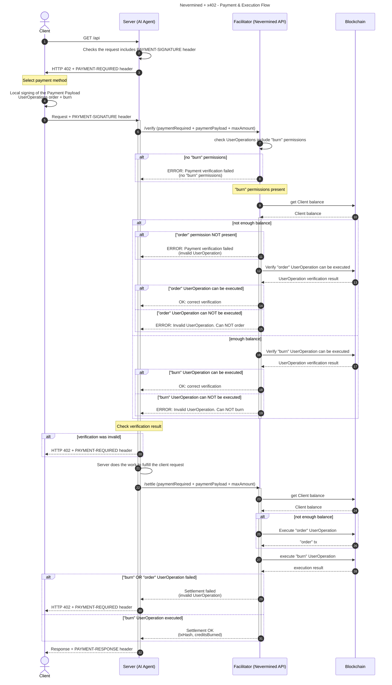

## Abstract

This specification defines a **smart-account extension** to the [x402 protocol](https://x402.org/) that enables programmable payment settlement using ERC-4337 smart accounts and session keys. While standard x402 settles payments via EIP-3009 ERC-20 token transfers, this extension allows settlement through arbitrary smart contract interactions—enabling subscription plans, credit-based metering, time-based access, and other programmable payment models.

The extension is designed to be **fully compatible** with existing x402 clients and servers, requiring only the addition of the `nvm:erc4337` extension payload.

```
Version: 0.3
Status: Draft
Last Updated: January 2026
```

## 1. Introduction

### 1.1 Background

The x402 protocol standardizes HTTP-native payments where:

1. A client requests a protected resource
2. The server responds with HTTP 402 and payment requirements
3. The client builds and signs a payment authorization
4. The client retries the request with the payment payload
5. A facilitator verifies and settles the payment

Standard x402 implementations use EIP-3009 signatures to authorize ERC-20 token transfers. This works well for simple pay-per-request scenarios but cannot express more complex payment relationships.

### 1.2 Motivation

Many real-world payment scenarios require more than direct token transfers:

- **Subscription plans** — pay once, access many times
- **Credit packages** — purchase credits in bulk, consume over time
- **Time-based access** — pay for access windows (hourly, daily, monthly)
- **Tiered pricing** — different rates based on usage volume
- **Spending limits** — caps on how much can be spent per period

This extension enables these use cases by replacing the EIP-3009 transfer authorization with ERC-4337 UserOperations that can execute arbitrary smart contract calls.

Also, end-user scenarios where clients are not experienced with blockchain wallets can benefit of using smart accounts. Smart Accounts bring a superior user experience by enabling social logins, meta-transactions, and session keys that delegate limited permissions to facilitators. This extension allows clients to leverage smart accounts for payment settlement in x402 flows.

Finally, Smart Contracts enable more complex business logic, especially for payments. By using smart accounts and session keys, this extension allows for programmable payment models that can adapt to various commercial requirements.

### 1.3 Design Goals

This extension:

- **MUST** be compatible with the existing x402 HTTP handshake
- **MUST** use the standard x402 payload structure with an extension field
- **SHOULD** be generic enough to support any smart contract interaction
- **SHOULD** leverage established standards (ERC-4337, EIP-712)
- **MUST** allow facilitators to verify and execute operations on behalf of clients

## 2. Terminology

The key words "MUST", "MUST NOT", "REQUIRED", "SHALL", "SHALL NOT", "SHOULD", "SHOULD NOT", "RECOMMENDED", "NOT RECOMMENDED", "MAY", and "OPTIONAL" in this document are to be interpreted as described in [RFC 2119](https://www.rfc-editor.org/rfc/rfc2119).

### 2.1 Roles

| Role              | Description                                                                                          |
| ----------------- | ---------------------------------------------------------------------------------------------------- |
| **Client**        | The entity requesting access to a protected resource. Signs payment authorizations locally.          |
| **Server**        | The entity providing the protected resource (API, agent, service). Coordinates with the facilitator. |
| **Facilitator**   | A third-party service that verifies payment authorizations and executes settlement on-chain.         |
| **Smart Account** | An ERC-4337 compliant smart contract wallet controlled by the client.                                |

### 2.2 Definitions

| Term                  | Definition                                                                                                                                |
| --------------------- | ----------------------------------------------------------------------------------------------------------------------------------------- |
| **UserOperation**     | An ERC-4337 structure representing an intent to execute a transaction from a smart account.                                               |
| **Session Key**       | A delegated signing key with scoped permissions, allowing a third party to execute specific actions on behalf of the smart account owner. |
| **Order**             | A UserOperation that purchases access (e.g., buying a subscription or credit package).                                                    |
| **Redeem** / **Burn** | A UserOperation that consumes access (e.g., deducting credits for a request).                                                             |

## 3. Extension Structure

### 3.1 Scheme Identifier

The scheme identifier is: `nvm:erc4337`

### 3.2 Payload Schema

#### PaymentRequired Response (402)

When a server requires payment, it returns:

```json
{
  "x402Version": 2,
  "error": "Payment required to access resource",
  "resource": {
    "url": "/api/v1/agents/80918427023170428029540261117198154464497879145267720259488529685089104529015/tasks",
    "description": "AI agent task execution",
    "mimeType": "application/json"
  },
  "accepts": [
    {
      "scheme": "nvm:erc4337",
      "network": "eip155:84532",
      "planId": "44742763076047497640080230236781474129970992727896593861997347135613135571071",
      "extra": {
        "version": "1",
        "agentId": "80918427023170428029540261117198154464497879145267720259488529685089104529015",
        "httpVerb": "POST"
      }
    }
  ],
  "extensions": {}
}
```

#### PaymentPayload (Client Response)

The client responds with a PaymentPayload containing the selected scheme and authorization:

```json
{
  "x402Version": 2,
  "resource": {
    "url": "/api/v1/agents/80918427023170428029540261117198154464497879145267720259488529685089104529015/tasks",
    "description": "AI agent task execution",
    "mimeType": "application/json"
  },
  "accepted": {
    "scheme": "nvm:erc4337",
    "network": "eip155:84532",
    "planId": "44742763076047497640080230236781474129970992727896593861997347135613135571071",
    "extra": {
      "version": "1",
      "agentId": "80918427023170428029540261117198154464497879145267720259488529685089104529015",
      "httpVerb": "POST"
    }
  },
  "payload": {
    "signature": "0x01845ADb2C711129d4f3966735eD98a9F09fC4cE57d4e89a9255457dd052fe0b95b6357b1c74783f490f542c25a2ffa3833432c3e4603b710e01f1f110be3f3a578b0698c81beaf6ccaa63fdc9a32842ed29eeaa531b",
    "authorization": {
      "from": "0xD4f58B60330bC59cB0A07eE6A1A66ad64244eC8c",
      "sessionKeysProvider": "zerodev",
      "sessionKeys": [
        {
          "id": "order",
          "data": "0x20a13d82dd9ee289fc5e5a90f4011c8dc03f8f5d5223aafd6b5cd67e3b1ab425"
        },
        {
          "id": "redeem",
          "data": "0x68e8e34d659149087451cafc89a7320114072e49fd89657ccba14cad82c0a533"
        }
      ]
    }
  },
  "extensions": {}
}
```

### 3.3 Field Definitions

#### PaymentRequired Root Fields

| Field         | Type     | Required | Description                                |
| ------------- | -------- | -------- | ------------------------------------------ |
| `x402Version` | `number` | Yes      | Protocol version. MUST be `2`.             |
| `error`       | `string` | Yes      | Human-readable error message.              |
| `resource`    | `object` | Yes      | Protected resource information.            |
| `accepts`     | `array`  | Yes      | Array of accepted payment schemes.         |
| `extensions`  | `object` | Yes      | Empty object `{}` for x402 spec alignment. |

#### Resource Fields

| Field         | Type     | Required | Description                                               |
| ------------- | -------- | -------- | --------------------------------------------------------- |
| `url`         | `string` | Yes      | The protected resource URL.                               |
| `description` | `string` | No       | Human-readable description.                               |
| `mimeType`    | `string` | No       | Expected response MIME type (e.g., `"application/json"`). |

#### Scheme Fields (in `accepts[]` / `accepted`)

| Field     | Type     | Required | Description                                                          |
| --------- | -------- | -------- | -------------------------------------------------------------------- |
| `scheme`  | `string` | Yes      | Payment scheme. MUST be `"nvm:erc4337"`.                             |
| `network` | `string` | Yes      | Blockchain network identifier using CAIP-2 (e.g., `"eip155:84532"`). |
| `planId`  | `string` | Yes      | 256-bit plan identifier.                                             |
| `extra`   | `object` | Yes      | Additional scheme-specific fields.                                   |

#### Extra Fields

| Field      | Type     | Required | Description                                             |
| ---------- | -------- | -------- | ------------------------------------------------------- |
| `version`  | `string` | Yes      | Scheme version (e.g., `"1"`).                           |
| `agentId`  | `string` | No       | 256-bit agent identifier (if plan has multiple agents). |
| `httpVerb` | `string` | No       | HTTP method for the endpoint.                           |

#### PaymentPayload Fields

| Field         | Type     | Required | Description                                |
| ------------- | -------- | -------- | ------------------------------------------ |
| `x402Version` | `number` | Yes      | Protocol version. MUST be `2`.             |
| `resource`    | `object` | No       | Echoed from PaymentRequired.               |
| `accepted`    | `object` | Yes      | Selected scheme from `accepts[]`.          |
| `payload`     | `object` | Yes      | Scheme-specific authorization data.        |
| `extensions`  | `object` | Yes      | Empty object `{}` for x402 spec alignment. |

#### Payload Fields (Authorization)

| Field           | Type     | Required | Description                                                     |
| --------------- | -------- | -------- | --------------------------------------------------------------- |
| `signature`     | `string` | Yes      | EIP-712 signature of the payment payload, signed by the client. |
| `authorization` | `object` | Yes      | Session key authorization data.                                 |

#### Authorization Fields

| Field                 | Type     | Required | Description                                                          |
| --------------------- | -------- | -------- | -------------------------------------------------------------------- |
| `from`                | `string` | Yes      | Client's smart account address (ERC-4337 compliant).                 |
| `sessionKeysProvider` | `string` | Yes      | Session key provider identifier (e.g., `"zerodev"`, `"biconomy"`).   |
| `sessionKeys`         | `array`  | Yes      | Array of session key objects. MUST contain at least one session key. |

#### Session Key Object

Each session key object MUST contain an `id` field and either `data` OR `hash`:

| Field  | Type     | Required    | Description                                                                           |
| ------ | -------- | ----------- | ------------------------------------------------------------------------------------- |
| `id`   | `string` | Yes         | Operation identifier. Common values: `"order"`, `"redeem"`.                           |
| `data` | `string` | Conditional | Base64-encoded session key data. Required if `hash` is not provided.                  |
| `hash` | `string` | Conditional | Keccak256 hash of the base64-encoded session key. Required if `data` is not provided. |

<Note>
  When `data` is provided, the facilitator can reconstruct and verify the
  session key directly. When only `hash` is provided, the facilitator MUST have
  a mechanism to retrieve the session key from off-chain storage using the hash.
</Note>

### 3.4 Session Key Operations

The extension defines standard operation identifiers:

| Operation ID | Purpose  | Description                                                                         |
| ------------ | -------- | ----------------------------------------------------------------------------------- |
| `order`      | Purchase | Executes a purchase operation (subscribe, buy credits, etc.). Used for auto top-up. |
| `redeem`     | Consume  | Consumes access (deduct credits, mark subscription usage). Required for settlement. |

Implementations MAY define additional operation identifiers for custom use cases.

## 4. Protocol Flow

### 4.1 Overview

The protocol flow maintains compatibility with standard x402 while extending the verification and settlement phases:



### 4.2 Step-by-Step Flow

The following steps detail the complete payment and execution flow. Steps are grouped into three phases: **Initial Request**, **Verification**, and **Settlement**.

---

#### Phase 1: Initial Request (Steps 1-5)

**Step 1.** Client initiates an HTTP request to a Server (AI Agent).

```http
GET /api/resource HTTP/1.1
Host: agent.example.com
```

**Step 2.** Server validates whether the request contains a valid payment in the `PAYMENT-SIGNATURE` header.

**Step 3.** If payment is absent, Server responds with `HTTP 402 Payment Required` status and the `PaymentRequired` object in the `PAYMENT-REQUIRED` header (base64-encoded).

```http
HTTP/1.1 402 Payment Required
PAYMENT-REQUIRED: eyJ4NDAyVmVyc2lvbiI6MiwiZXJyb3IiOiJQYXltZW50IHJlcXVpcmVkLi4u
```

**Decoded PAYMENT-REQUIRED:**

```json
{
  "x402Version": 2,
  "error": "Payment required to access resource",
  "resource": {
    "url": "/api/resource",
    "description": "Protected resource",
    "mimeType": "application/json"
  },
  "accepts": [
    {
      "scheme": "nvm:erc4337",
      "network": "eip155:84532",
      "planId": "44742763076047497640080230236781474129970992727896593861997347135613135571071",
      "extra": {
        "version": "1",
        "agentId": "80918427023170428029540261117198154464497879145267720259488529685089104529015"
      }
    }
  ],
  "extensions": {}
}
```

**Step 4.** The Client:

- Selects one of the `accepts` schemes returned by the server response
- Creates a PaymentPayload with the selected scheme in `accepted`
- Creates and signs locally a `UserOperation` representing the Payment Intent (using ERC-4337 and EIP-712)

**Step 5.** Client sends an HTTP request to the server including the x402 Payment Payload and the signed `UserOperation`s in the `PAYMENT-SIGNATURE` HTTP header.

```http
GET /api/resource HTTP/1.1
Host: agent.example.com
PAYMENT-SIGNATURE: <base64-encoded-x402-payload>
```

---

#### Phase 2: Verification (Steps 6-20)

**Step 6.** Server validates the incoming data and forwards the payment data to the facilitator to verify the Client request.

```http
POST /verify HTTP/1.1
Host: facilitator.example.com
Content-Type: application/json

{
  "paymentRequired": { ... },
  "paymentPayload": "<base64-encoded-payment-payload>",
  "maxAmount": "5"
}
```

The facilitator extracts `planId`, `subscriberAddress` (from `payload.authorization.from`), and `agentId` from the token.

**Step 7.** Facilitator checks the request and confirms if it includes "redeem" permissions.

**Step 8.** IF the request DOES NOT include "redeem" permissions:

- Facilitator rejects the request and returns an error to the server
- Server returns to the client a `HTTP 402` response with `PAYMENT-REQUIRED` header

**Step 9.** IF the request INCLUDES "redeem" permissions, the Facilitator queries the blockchain to check the Client balance.

**Step 10.** Blockchain returns the Client balance to the Facilitator.

**Step 11.** Facilitator checks if the "order" UserOperation is included. IF the "order" is NOT included AND the client has insufficient balance:

- Facilitator rejects the request and returns an error to the server
- Server returns to the client a `HTTP 402 PAYMENT-FAILED` response

**Step 12.** IF the "order" UserOperation is included, the Facilitator verifies if the "order" UserOperation can be executed.

**Step 13.** Blockchain returns the order verification result to the Facilitator.

**Step 14.** IF the "order" UserOperation verification is correct, the Facilitator confirms to the server that the verification is correct.

**Step 15.** IF the "order" UserOperation verification is INVALID, the Facilitator returns an error to the server.

**Step 16.** IF the Client has enough balance, the Facilitator verifies if the "redeem" UserOperation can be executed.

**Step 17.** The Blockchain returns the redeem verification result to the Facilitator.

**Step 18.** IF the "redeem" UserOperation verification is correct, the Facilitator confirms to the server that the verification is correct.

**Step 19.** IF the "redeem" UserOperation verification is INVALID, the Facilitator returns an error to the server.

**Step 20.** The Server, after obtaining the verification result from the Facilitator (and BEFORE executing any task), checks the verification result:

- If the verification was INVALID, the Server returns to the client a `HTTP 402 PAYMENT-FAILED` response
- If the verification was correct, the Server continues with the request execution

<Note>
  The verification phase ensures that the payment CAN be settled before the
  server performs any work. This protects the server from executing expensive
  operations without guaranteed payment.
</Note>

---

#### Phase 3: Settlement (Steps 21-32)

**Step 21.** The Server executes the task to fulfill the client request (AI Task or any necessary work).

**Step 22.** The Server calls the `/settle` endpoint of the Facilitator to settle the request.

```http
POST /settle HTTP/1.1
Host: facilitator.example.com
Content-Type: application/json

{
  "paymentRequired": { ... },
  "paymentPayload": "<base64-encoded-payment-payload>",
  "maxAmount": "5"
}
```

The `maxAmount` specifies the actual credits to redeem (can be less than or equal to the verified amount).

**Step 23.** Facilitator queries the blockchain to check the Client balance.

**Step 24.** Blockchain returns the Client balance to the Facilitator.

**Step 25.** IF the Client does NOT have enough balance, the Facilitator executes the "order" UserOperation on behalf of the Client.

**Step 26.** Blockchain returns the "order" transaction to the Facilitator.

**Step 27.** Facilitator executes the "redeem" UserOperation on behalf of the Client.

**Step 28.** Blockchain returns the execution result to the Facilitator.

**Step 29.** IF the "redeem" OR "order" UserOperations execution FAILED, the Facilitator rejects the request and returns an error to the server.

**Step 30.** The Server returns to the client a `HTTP 402 PAYMENT-FAILED` response.

**Step 31.** IF the "redeem" UserOperation executed successfully, the Facilitator confirms to the server that the request is verified (including the payment tx / order tx).

**Step 32.** Server returns to the client the response with the transaction payment confirmation in the `PAYMENT-RESPONSE` header (base64-encoded).

```http
HTTP/1.1 200 OK
Content-Type: application/json
PAYMENT-RESPONSE: eyJzdWNjZXNzIjp0cnVlLCJ0cmFuc2FjdGlvbkhhc2giOi4uLg==

{
  "result": "...",
  "payment": {
    "creditsBurned": "5",
    "remainingBalance": "95"
  }
}
```

**Decoded PAYMENT-RESPONSE:**

```json
{
  "success": true,
  "transactionHash": "0x...",
  "network": "eip155:84532"
}
```

The `PAYMENT-RESPONSE` header contains x402-standard settlement fields. Additional Nevermined-specific info (like `creditsBurned`) can be included in the response body.

<Warning>
  Steps 29-30 represent a failure scenario where the server has already
  performed work but settlement failed. Implementations SHOULD have mechanisms
  to handle this edge case, such as retry logic or dispute resolution.
</Warning>

### 4.3 HTTP Header Summary

Per [x402 HTTP Transport v2](https://github.com/coinbase/x402/blob/main/specs/transports-v2/http.md), all payment data is transmitted via HTTP headers using base64 encoding:

| Header              | Direction             | Content                                 |
| ------------------- | --------------------- | --------------------------------------- |
| `PAYMENT-REQUIRED`  | Server → Client (402) | Base64-encoded `PaymentRequired` object |
| `PAYMENT-SIGNATURE` | Client → Server       | Base64-encoded `PaymentPayload` object  |
| `PAYMENT-RESPONSE`  | Server → Client (200) | Base64-encoded settlement receipt       |

<Note>
  All three headers use **base64 encoding**. The response body contains the
  actual resource data plus optional Nevermined-specific payment info.
</Note>

## 5. Verification Requirements

### 5.1 Payload Validation

The facilitator MUST verify:

| Check        | Requirement                                                                     |
| ------------ | ------------------------------------------------------------------------------- |
| Version      | `x402Version` MUST equal `2`                                                    |
| Scheme       | `scheme` MUST equal `"nvm:erc4337"`                                             |
| Network      | `network` MUST be a supported network using CAIP-2 format                       |
| Subscriber   | `payload.authorization.from` MUST be a valid ERC-4337 smart account address     |
| Signature    | `payload.signature` MUST be a valid EIP-712 signature                           |
| Session Keys | At least one session key MUST be present in `payload.authorization.sessionKeys` |

### 5.2 Session Key Validation

For each session key, the facilitator MUST verify:

| Check       | Requirement                                                     |
| ----------- | --------------------------------------------------------------- |
| Structure   | Session key MUST contain valid `id` and either `data` or `hash` |
| Validity    | Session key MUST not be expired                                 |
| Permissions | Session key MUST grant the required permissions                 |
| Scope       | Session key MUST be scoped to the correct smart contracts       |

### 5.3 Balance and Permission Checks

The facilitator MUST verify:

| Check             | Requirement                                                     |
| ----------------- | --------------------------------------------------------------- |
| Redeem Permission | A `redeem` session key MUST be present                          |
| Balance           | Client MUST have sufficient balance OR valid `order` permission |
| UserOperation     | All UserOperations MUST pass on-chain simulation                |

## 6. Settlement Requirements

### 6.1 Execution Order

When executing settlement, the facilitator MUST:

1. Check client balance
2. If balance insufficient, execute `order` UserOperation first
3. Wait for `order` transaction confirmation
4. Execute `redeem` UserOperation
5. Return transaction receipts

### 6.2 Atomicity

<Warning>
  The facilitator SHOULD ensure that partial settlement does not leave the
  system in an inconsistent state. If the `order` succeeds but `redeem` fails,
  the facilitator MUST handle the error appropriately.
</Warning>

### 6.3 Receipt Format

The facilitator MUST return a receipt. The `PAYMENT-RESPONSE` header contains x402-standard fields:

| Field             | Type      | Description                                               |
| ----------------- | --------- | --------------------------------------------------------- |
| `success`         | `boolean` | Whether settlement succeeded.                             |
| `transactionHash` | `string`  | Transaction hash of the redeem operation.                 |
| `network`         | `string`  | Network where transactions were executed (CAIP-2 format). |

Additional settlement details MAY be included in the response body:

| Field              | Type     | Description                                            |
| ------------------ | -------- | ------------------------------------------------------ |
| `creditsRedeemed`  | `string` | Number of credits redeemed.                            |
| `remainingBalance` | `string` | Subscriber's remaining balance.                        |
| `orderTx`          | `string` | Transaction hash of the order operation (if executed). |

## 7. Error Handling

### 7.1 Error Codes

| Code                     | Name                  | Description                                       |
| ------------------------ | --------------------- | ------------------------------------------------- |
| `INVALID_PAYLOAD`        | Invalid Payload       | The payment payload structure is invalid          |
| `INVALID_SIGNATURE`      | Invalid Signature     | The EIP-712 signature verification failed         |
| `INSUFFICIENT_BALANCE`   | Insufficient Balance  | Client lacks balance and valid `order` permission |
| `INVALID_USER_OPERATION` | Invalid UserOperation | UserOperation failed on-chain simulation          |
| `EXPIRED_SESSION_KEY`    | Expired Session Key   | Session key has expired                           |
| `SETTLEMENT_FAILED`      | Settlement Failed     | On-chain settlement transaction failed            |
| `UNSUPPORTED_NETWORK`    | Unsupported Network   | The specified network is not supported            |

### 7.2 Error Response Format

```json
{
  "error": {
    "code": "INSUFFICIENT_BALANCE",
    "message": "Client balance is 0, no order permission provided",
    "details": {
      "clientAddress": "0x...",
      "requiredBalance": "1000000",
      "currentBalance": "0"
    }
  }
}
```

## 8. Security Considerations

### 8.1 Signature Security

- The EIP-712 signature MUST be verified against the client's smart account address
- Replay protection SHOULD be implemented using nonces or timestamps
- The facilitator MUST NOT execute UserOperations with invalid signatures

### 8.2 Session Key Security

- Session keys SHOULD have limited validity periods
- Session keys SHOULD be scoped to specific contracts and methods
- Session keys SHOULD include spending limits where applicable
- Session keys MUST be revocable by the smart account owner

### 8.3 Facilitator Trust Model

Clients delegate execution authority to the facilitator. This trust model assumes:

- The facilitator will only execute operations after successful verification
- The facilitator will only execute operations after the server completes its work
- The facilitator acts as an honest intermediary

### 8.4 Network Considerations

- All network identifiers MUST be validated against a known allowlist
- Cross-network attacks MUST be prevented by including the network in signed data

## 9. Implementation Notes

### 9.1 ERC-4337 Compatibility

This extension is designed to work with any ERC-4337 compliant smart account implementation. The `provider` field in the authorization object indicates which session key format is used.

### 9.2 Session Key Providers

Common session key providers and their formats:

| Provider   | Description                         |
| ---------- | ----------------------------------- |
| `zerodev`  | ZeroDev Kernel session keys         |
| `biconomy` | Biconomy smart account session keys |
| `safe`     | Safe{Wallet} session modules        |

Implementations SHOULD document which providers they support.

### 9.3 Gas and Fees

The facilitator acts as the paymaster for UserOperation execution. Settlement economics (gas fees, facilitator fees) are outside the scope of this specification.

## 10. References

- [x402 Protocol](https://x402.org/)
- [ERC-4337: Account Abstraction](https://eips.ethereum.org/EIPS/eip-4337)
- [EIP-712: Typed Structured Data Hashing and Signing](https://eips.ethereum.org/EIPS/eip-712)
- [EIP-3009: Transfer With Authorization](https://eips.ethereum.org/EIPS/eip-3009)
- [RFC 2119: Key words for use in RFCs](https://www.rfc-editor.org/rfc/rfc2119)
