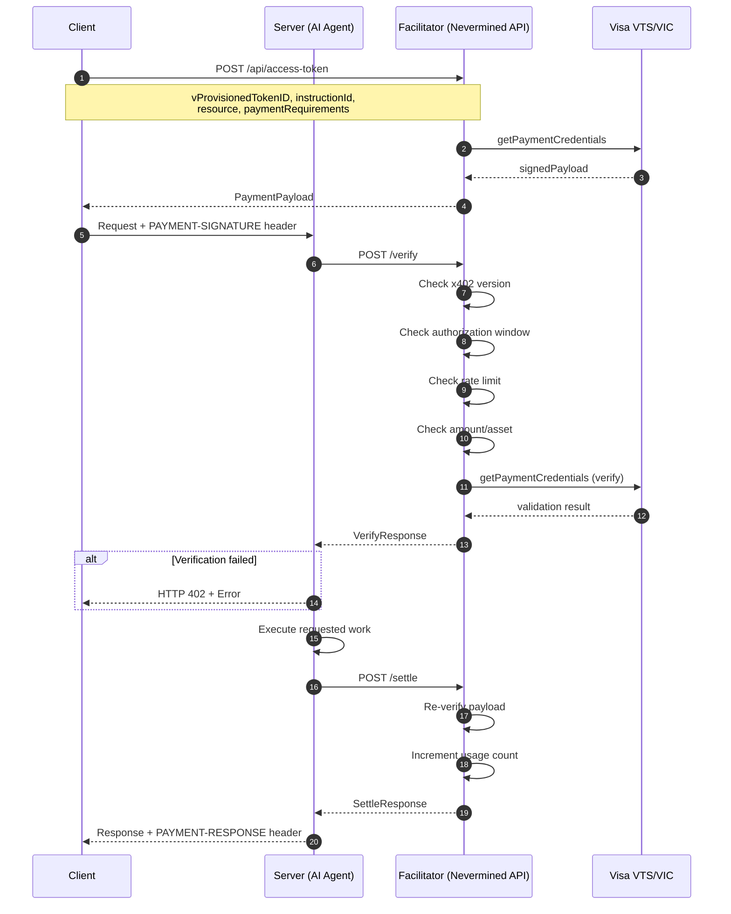

## Abstract

This specification defines the **nvm:vic extension** to the x402 protocol that enables fiat payment settlement using Visa Intelligence Commerce (VIC) and Visa Token Service (VTS). While the [x402 Smart Accounts extension](/docs/specs/x402-smart-accounts) settles payments via blockchain smart contracts, this extension allows settlement through Visa's payment infrastructure—enabling traditional card-based payments within the x402 HTTP payment flow.

This extension shares the same HTTP handshake pattern as other x402 schemes but replaces blockchain settlement with Visa payment credentials.

```
Version: 0.1
Status: Draft
Last Updated: January 2026
```

## 1. Introduction

### 1.1 Relationship to Base Specification

This specification extends the base x402 protocol and follows the same HTTP flow documented in the [x402 Smart Accounts Extension](/docs/specs/x402-smart-accounts). Readers SHOULD be familiar with that specification before reading this document.

**Key differences from the `nvm:erc4337` extension:**

| Aspect | `nvm:erc4337` | `nvm:vic` |
|--------|---------------|-----------|
| Scheme | `contract` | `visa` |
| Network | CAIP-2 blockchain (e.g., `eip155:84532`) | `visa:cert` or `visa:prod` |
| Authorization | ERC-4337 Session Keys | Visa Token Service credentials |
| Settlement | Smart contract execution | Visa payment network |
| Currency | ERC-20 tokens | Fiat (USD, EUR, etc.) |
| Rate limiting | Balance-based | Usage count-based |

### 1.2 Use Cases

The `nvm:vic` extension enables:

- **Fiat payments for AI agents** — Clients without crypto wallets can pay using Visa credentials
- **Enterprise integrations** — Organizations using traditional payment infrastructure
- **Hybrid payment options** — Merchants accepting both crypto and fiat via x402

## 2. Terminology

The key words "MUST", "MUST NOT", "REQUIRED", "SHALL", "SHALL NOT", "SHOULD", "SHOULD NOT", "RECOMMENDED", "NOT RECOMMENDED", "MAY", and "OPTIONAL" in this document are to be interpreted as described in [RFC 2119](https://www.rfc-editor.org/rfc/rfc2119).

### 2.1 Visa-Specific Terms

| Term | Definition |
|------|------------|
| **VTS** | Visa Token Service — Visa's tokenization platform that replaces card numbers with tokens |
| **VIC** | Visa Intelligence Commerce — Visa's API platform for commerce applications |
| **vProvisionedTokenID** | A Visa-provisioned token identifier representing a payment credential |
| **instructionId** | A VIC instruction identifier for the payment mandate |
| **Mandate** | A pre-authorized payment agreement with defined limits |

## 3. Extension Structure

### 3.1 Extension Identifier

This extension is identified by the scheme `visa` and certification and production networks `visa:cert` and `visa:prod`.

### 3.2 Payload Schema

The complete x402 payment payload with the Visa VIC extension:

```json
{
  "x402Version": 2,
  "resource": {
    "url": "https://api.example.com/resource",
    "description": "Premium API access",
    "mimeType": "application/json"
  },
  "accepted": {
    "scheme": "visa",
    "network": "visa:cert",
    "amount": "100.00",
    "asset": "USD",
    "payTo": "merchant_123",
    "maxTimeoutSeconds": 3600,
    "extra": {
      "vProvisionedTokenID": "tok_abc123",
      "instructionId": "instr_xyz789",
      "maxUsage": 10,
      "merchantName": "AI Agent Service",
      "merchantUrl": "https://merchant.com",
      "merchantCountryCode": "US"
    }
  },
  "payload": {
    "vProvisionedTokenID": "tok_abc123",
    "instructionId": "instr_xyz789",
    "signedPayload": "<visa-signed-payload>",
    "authorization": "<visa-authorization>",
    "validAfter": 1735603200,
    "validBefore": 1735606800,
    "nonce": "unique-nonce-value"
  }
}
```

### 3.3 Field Definitions

#### Root Fields

| Field | Type | Required | Description |
|-------|------|----------|-------------|
| `x402Version` | `number` | Yes | Protocol version. MUST be `2`. |
| `resource` | `object` | Yes | Description of the protected resource. |
| `accepted` | `object` | Yes | Payment requirements accepted by the merchant. |
| `payload` | `object` | Yes | Visa authorization data. |

#### Resource Fields

| Field | Type | Required | Description |
|-------|------|----------|-------------|
| `url` | `string` | Yes | URL of the protected resource. |
| `description` | `string` | No | Human-readable description. |
| `mimeType` | `string` | No | MIME type of the resource. |

#### Accepted Fields

| Field | Type | Required | Description |
|-------|------|----------|-------------|
| `scheme` | `string` | Yes | Payment scheme. MUST be `"visa"`. |
| `network` | `string` | Yes | Payment network. MUST be `"visa:cert"` or `"visa:prod"`. |
| `amount` | `string` | Yes | Maximum payment amount (decimal string, e.g., `"100.00"`). |
| `asset` | `string` | Yes | Currency code (e.g., `"USD"`, `"EUR"`). |
| `payTo` | `string` | Yes | Merchant identifier. |
| `maxTimeoutSeconds` | `number` | Yes | Authorization validity window in seconds. |
| `extra` | `object` | Yes | Visa-specific parameters. |

#### Extra Fields

| Field | Type | Required | Description |
|-------|------|----------|-------------|
| `vProvisionedTokenID` | `string` | Yes | Visa provisioned token identifier. |
| `instructionId` | `string` | Yes | VIC instruction identifier for the mandate. |
| `maxUsage` | `number` | Yes | Maximum number of times this authorization can be used. |
| `merchantName` | `string` | No | Merchant display name. |
| `merchantUrl` | `string` | No | Merchant website URL. |
| `merchantCountryCode` | `string` | No | ISO 3166-1 alpha-2 country code (e.g., `"US"`). |

#### Payload Fields (Visa Authorization)

| Field | Type | Required | Description |
|-------|------|----------|-------------|
| `vProvisionedTokenID` | `string` | Yes | Visa provisioned token identifier. |
| `instructionId` | `string` | Yes | VIC instruction identifier. |
| `signedPayload` | `string` | Yes | Visa-signed payment payload. |
| `authorization` | `string` | Yes | Visa authorization code. |
| `validAfter` | `number` | Yes | Unix timestamp when authorization becomes valid. |
| `validBefore` | `number` | Yes | Unix timestamp when authorization expires. |
| `nonce` | `string` | Yes | Unique nonce for replay protection. |

## 4. Protocol Flow

### 4.1 Overview

The protocol flow follows the standard x402 pattern with Visa-specific verification and settlement:



### 4.2 Key Differences from Blockchain Settlement

| Phase | `nvm:erc4337` | `nvm:vic` |
|-------|---------------|-----------|
| **Token Generation** | Client signs UserOperations locally | Client requests signed payload from Facilitator via Visa |
| **Verification** | Simulate UserOperations on-chain | Validate with Visa API + check rate limits |
| **Settlement** | Execute UserOperations on blockchain | Increment usage count + future Visa settlement |

## 5. Verification Requirements

### 5.1 Payload Validation

The facilitator MUST verify:

| Check | Requirement |
|-------|-------------|
| Version | `x402Version` MUST equal `2` |
| Scheme | `accepted.scheme` MUST equal `"visa"` |
| Network | `accepted.network` MUST equal `"visa:cert"` or `"visa:prod"` |
| Time Window | Current time MUST be within `validAfter` and `validBefore` |
| Amount | Requested amount MUST NOT exceed `accepted.amount` |
| Asset | Requested asset MUST match `accepted.asset` |

### 5.2 Rate Limit Validation

The facilitator MUST track usage per `instructionId`:

| Check | Requirement |
|-------|-------------|
| Mandate Exists | A mandate MUST exist for the `instructionId` |
| Usage Count | Current usage count MUST be less than `maxUsage` |

### 5.3 Visa Validation

The facilitator MUST verify credentials with Visa:

| Check | Requirement |
|-------|-------------|
| Token Valid | `vProvisionedTokenID` MUST be valid with Visa VTS |
| Instruction Valid | `instructionId` MUST match Visa response |
| Signature Valid | `signedPayload` MUST be verified by Visa |

## 6. Settlement Requirements

### 6.1 Settlement Process

When settling a payment, the facilitator MUST:

1. Re-verify the payment payload
2. Increment the usage count for the `instructionId`
3. Return a settlement receipt

<Note>
Current implementation tracks usage counts for rate limiting. Future versions MAY integrate with Visa's payment settlement for actual fund transfers.
</Note>

### 6.2 Receipt Format

The facilitator MUST return a receipt containing:

| Field | Type | Description |
|-------|------|-------------|
| `success` | `boolean` | Whether settlement succeeded. |
| `transaction` | `string` | Transaction identifier (format: `visa_tx_{timestamp}_{id}`). |
| `network` | `string` | Network identifier (`"visa:cert"`). |
| `payer` | `string` | The `vProvisionedTokenID` of the payer. |
| `remainingUsage` | `number` | Remaining uses before rate limit is reached. |

## 7. Error Handling

### 7.1 Error Codes

| Code | Name | Description |
|------|------|-------------|
| `invalid_x402_version` | Invalid Version | `x402Version` is not `2` |
| `authorization_expired` | Authorization Expired | Current time is after `validBefore` |
| `mandate_not_found` | Mandate Not Found | No mandate exists for `instructionId` |
| `rate_limit_exceeded` | Rate Limit Exceeded | Usage count has reached `maxUsage` |
| `amount_exceeds_limit` | Amount Exceeds Limit | Requested amount exceeds `accepted.amount` |
| `asset_mismatch` | Asset Mismatch | Requested asset doesn't match `accepted.asset` |
| `instruction_id_mismatch` | Instruction Mismatch | Visa response doesn't match `instructionId` |
| `visa_verification_failed` | Visa Verification Failed | Error calling Visa API |

### 7.2 Verify Response Format

**Success:**
```json
{
  "isValid": true,
  "payer": "tok_abc123",
  "remainingUsage": 9
}
```

**Failure:**
```json
{
  "isValid": false,
  "invalidReason": "rate_limit_exceeded",
  "payer": "tok_abc123",
  "remainingUsage": 0
}
```

### 7.3 Settle Response Format

**Success:**
```json
{
  "success": true,
  "transaction": "visa_tx_1734355200_abc123",
  "network": "visa:cert",
  "payer": "tok_abc123",
  "remainingUsage": 8
}
```

**Failure:**
```json
{
  "success": false,
  "transaction": "",
  "network": "visa:cert",
  "payer": "tok_abc123",
  "errorReason": "amount_exceeds_limit"
}
```

## 8. HTTP Transport

This extension uses the standard x402 HTTP transport headers:

| Header | Direction | Description |
|--------|-----------|-------------|
| `PAYMENT-REQUIRED` | Server → Client | Base64-encoded payment requirements (402 response) |
| `PAYMENT-SIGNATURE` | Client → Server | Base64-encoded `PaymentPayload` |
| `PAYMENT-RESPONSE` | Server → Client | Base64-encoded settlement response |

Payloads MUST be encoded using standard Base64:

```typescript
// Encode
const encoded = Buffer.from(JSON.stringify(payload), 'utf-8').toString('base64')

// Decode
const decoded = JSON.parse(Buffer.from(encoded, 'base64').toString('utf-8'))
```

## 9. Security Considerations

### 9.1 Token Security

- `vProvisionedTokenID` values MUST be treated as sensitive credentials
- Tokens SHOULD be transmitted only over HTTPS
- Tokens MUST NOT be logged in plain text

### 9.2 Authorization Window

- `validBefore` SHOULD be set to a reasonable window (default: 1 hour)
- Facilitators MUST reject authorizations outside their validity window
- Nonces MUST be unique to prevent replay attacks

### 9.3 Rate Limiting

- `maxUsage` provides client-side rate limiting
- Facilitators SHOULD implement additional server-side rate limiting
- Usage counts MUST be persisted reliably to prevent abuse

## 10. References

- [x402 Protocol](https://x402.org/)
- [x402 Smart Accounts Extension](/docs/specs/x402-smart-accounts)
- [x402 HTTP Transport v2 Specification](https://github.com/coinbase/x402/blob/main/specs/transports-v2/http.md)
- [Visa Token Service](https://developer.visa.com/capabilities/visa-token-service)
- [Visa Intelligence Commerce](https://developer.visa.com/)
