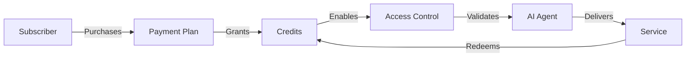

## Overview

Nevermined Payments is built on five core concepts that work together to enable AI monetization. Understanding these concepts will help you design and implement your AI services effectively.

<CardGroup cols={2}>
  <Card title="Payments Client" icon="code" href="#payments-client">
    Central SDK interface for all operations
  </Card>
  <Card title="AI Agents" icon="robot" href="#ai-agents">
    Your monetizable AI services
  </Card>
  <Card title="Payment Plans" icon="money-bill" href="#payment-plans">
    Flexible pricing structures
  </Card>
  <Card title="Credits System" icon="coins" href="#credits-system">
    Usage-based billing units
  </Card>
  <Card title="Access Control" icon="shield" href="#access-control">
    Secure service authentication
  </Card>
</CardGroup>

## Payments Client

The Payments Client is your primary interface for interacting with the Nevermined protocol. It handles all the complex blockchain interactions and provides a simple API.

### Initialization

```typescript
import { Payments } from '@nevermined-io/payments'

const payments = Payments.getInstance({
  nvmApiKey: process.env.NVM_API_KEY,
  environment: 'production'
})
```

### Key Responsibilities

- **Agent Management**: Register and update AI agents
- **Plan Creation**: Define pricing and credit structures
- **Access Validation**: Verify subscriber permissions
- **Credit Redemption**: Track and bill usage
- **Query Routing**: Direct requests to appropriate agents

## AI Agents

An AI Agent represents your monetizable service in the Nevermined ecosystem. Each agent has metadata, endpoints, and associated payment plans.

### Agent Structure

```typescript
interface Agent {
  agentId: string
  metadata: {
    name: string
    description?: string
    tags: string[]
    dateCreated: Date
    image?: string
  }
  api: {
    endpoints: Array<{ [method: string]: string }>
    openEndpoints?: string[] // Public endpoints
  }
  plans: PaymentPlan[]
}
```

### Agent Registration

```typescript
const agentMetadata = {
  name: 'Advanced AI Assistant',
  tags: ['ai', 'nlp', 'assistant'],
  dateCreated: new Date(),
  description: 'State-of-the-art AI for various tasks',
  image: 'https://example.com/logo.png'
}

const agentApi = {
  endpoints: [
    { POST: 'https://api.myai.com/query' },
    { GET: 'https://api.myai.com/status' }
  ],
  openEndpoints: ['https://api.myai.com/health']
}

const { agentId } = await payments.registerAgent(
  agentMetadata, 
  agentApi, 
  [planId]
)
```

### Agent Discovery

Subscribers can discover agents through:
- Direct agent ID lookup
- Tag-based search
- Metadata filtering
- Plan compatibility

## Payment Plans

Payment Plans define the commercial terms for accessing your AI agent. They specify pricing, payment methods, and what subscribers receive.

### Plan Components

<Tabs>
  <Tab title="Price Configuration">
    Defines cost and payment distribution:
    
    ```typescript
    interface PriceConfig {
      priceType: 'FIXED_PRICE' | 'DYNAMIC_PRICE'
      tokenAddress: string // ERC-20 or '0x0' for native
      amounts: bigint[]
      receivers: string[]
    }
    ```
    
    - **Fixed Price**: Set amount per subscription
    - **Dynamic Price**: Variable based on usage
    - **Multi-receiver**: Split payments between parties
  </Tab>
  
  <Tab title="Credits Configuration">
    Defines usage allowance:
    
    ```typescript
    interface CreditsConfig {
      creditsType: 'FIXED' | 'EXPIRABLE' | 'DYNAMIC'
      amount: bigint
      creditsPerRequest?: bigint
      durationOfThePlan?: bigint
    }
    ```
    
    - **Fixed Credits**: Set number of uses
    - **Expirable Credits**: Time-limited access
    - **Dynamic Credits**: Variable consumption
  </Tab>
</Tabs>

### Common Plan Types

#### Usage-Based Plan
```typescript
const price = getERC20PriceConfig(10_000_000n, USDC_ADDRESS, builderAddress)
const credits = getFixedCreditsConfig(100n, 1n) // 100 uses, 1 per request
const { planId } = await payments.registerCreditsPlan(price, credits)
```

#### Subscription Plan
```typescript
const price = getFiatPriceConfig(50_000_000n, builderAddress) // $50
const credits = getExpirablePlanCreditsConfig(86400n * 30n) // 30 days
const { planId } = await payments.registerTimePlan(price, credits)
```

## Credits System

Credits are the fundamental unit of consumption in Nevermined. They provide flexible billing for AI services.

### Credit Types

<AccordionGroup>
  <Accordion icon="coins" title="Fixed Credits">
    **Best for**: Predictable usage patterns
    
    ```typescript
    const credits = getFixedCreditsConfig(
      100n, // Total credits
      5n    // Credits per request
    )
    ```
    
    - Each request consumes a fixed amount
    - Simple to understand and implement
    - Ideal for uniform operations
  </Accordion>
  
  <Accordion icon="clock" title="Time-Based Credits">
    **Best for**: Subscription models
    
    ```typescript
    const credits = getExpirablePlanCreditsConfig(
      86400n * 30n // 30 days
    )
    ```
    
    - Unlimited usage within time period
    - Automatic expiration
    - Perfect for "all you can eat" pricing
  </Accordion>
  
  <Accordion icon="chart-line" title="Dynamic Credits">
    **Best for**: Variable complexity operations
    
    ```typescript
    const credits = {
      creditsType: 'DYNAMIC',
      minCreditsPerRequest: 1n,
      maxCreditsPerRequest: 50n,
      amount: 1000n
    }
    ```
    
    - Charge based on actual usage
    - Flexible pricing for complex services
    - Requires usage calculation logic
  </Accordion>
</AccordionGroup>

### Credit Lifecycle

1. **Purchase**: Subscriber buys a plan and receives credits
2. **Validation**: Each request checks available credits
3. **Consumption**: Credits redeemed based on usage
4. **Tracking**: Balance updated in real-time
5. **Expiration**: Time-based credits expire automatically

### Credit Redemption

```typescript
// After processing a request
await payments.redeemCredits(
  planId,
  creditsUsed, // Amount to redeem
  proof        // Usage evidence
)
```

## Access Control

Nevermined implements cryptographic access control to ensure only paying subscribers can access your services.

### How It Works

<Steps>
  <Step title="Plan Purchase">
    Subscriber purchases a plan and receives access credentials
  </Step>
  
  <Step title="Request Signing">
    Subscriber signs requests with their private key
  </Step>
  
  <Step title="Signature Validation">
    Your service validates the signature and checks credit balance
  </Step>
  
  <Step title="Service Delivery">
    If valid, process request and redeem credits
  </Step>
</Steps>

### Implementation

```typescript
// In your API endpoint
const isValid = await payments.isValidRequest(
  planId,
  agentId,
  subscriberAddress,
  signature // from 'x-nvm-query-signature' header
)

if (!isValid) {
  // Return 402 Payment Required
  const paymentCard = await payments.getAgentPaymentCard(agentId)
  return res.status(402).json(paymentCard)
}

// Process request...
```

### Security Features

- **Cryptographic Signatures**: Unforgeable request authentication
- **Replay Protection**: Nonces prevent request replay
- **Time-based Validation**: Signatures expire
- **Balance Checking**: Real-time credit verification
- **Automatic Revocation**: Access ends when credits depleted

## Working Together

These concepts combine to create a complete monetization system:



### Example Flow

1. **Setup**: You create an AI agent with a payment plan
2. **Discovery**: Subscribers find your agent
3. **Purchase**: They buy a plan and receive credits
4. **Access**: Signed requests validate against the plan
5. **Usage**: Credits are redeemed as services are consumed
6. **Renewal**: Subscribers purchase more credits when depleted

## Best Practices

<CardGroup cols={2}>
  <Card title="Plan Design" icon="pencil">
    - Offer multiple tiers
    - Clear credit allocation
    - Competitive pricing
    - Usage transparency
  </Card>
  <Card title="Agent Setup" icon="gear">
    - Descriptive metadata
    - Accurate endpoints
    - Proper tagging
    - Clear documentation
  </Card>
  <Card title="Credit Management" icon="calculator">
    - Fair consumption rates
    - Usage monitoring
    - Balance notifications
    - Graceful depletion handling
  </Card>
  <Card title="Security" icon="lock">
    - Always validate requests
    - Implement rate limiting
    - Monitor for abuse
    - Regular security audits
  </Card>
</CardGroup>

## Next Steps

Now that you understand the core concepts:

- [Create your first agent](/introduction/quickstart)
- [Design payment plans](/introduction/payment-plans)
- [Implement access control](/introduction/integration-guide)
- [Explore examples](/introduction/example-apps)