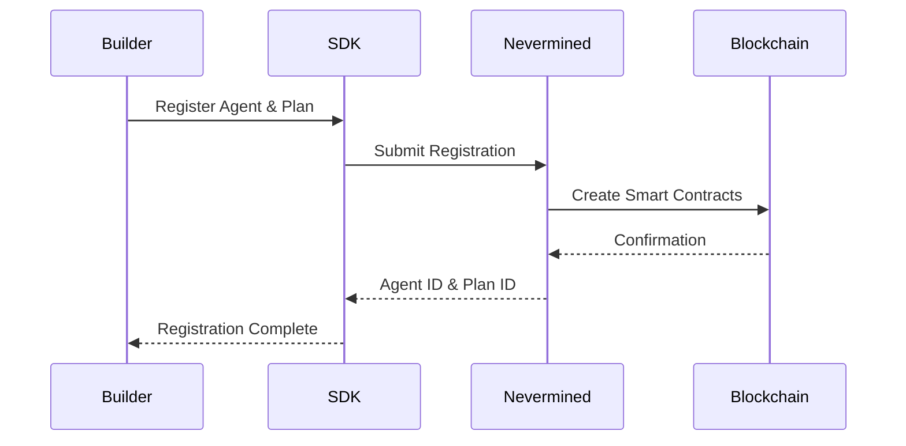
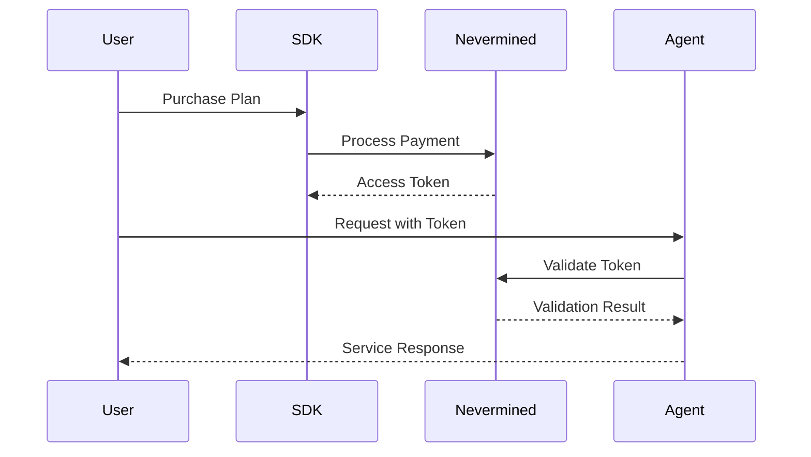

Welcome to the development guide section. Here you'll find practical, step-by-step tutorials for building different types of monetized AI services using Nevermined.

These guides are designed to take you from concept to a functional, monetized application, covering common use cases and integration patterns.

## Prerequisites

Before starting, ensure you have:

<Steps>
  <Step title="Nevermined API Key">
    Get your API key from the [Nevermined App](https://app.nevermined.io)
  </Step>
  <Step title="Development Environment">
    - Node.js 16+ and npm/yarn
    - Python 3.8+ (for Python examples)
    - A code editor (VS Code recommended)
  </Step>
  <Step title="Blockchain Wallet">
    - MetaMask or compatible wallet
    - Some test tokens for the testing environment
  </Step>
</Steps>

## SDK Installation

<Tabs>
  <Tab title="TypeScript/JavaScript">
    ```bash
    npm install @nevermined-io/payments
    # or
    yarn add @nevermined-io/payments
    ```
  </Tab>
  <Tab title="Python">
    ```bash
    pip install payments-py
    ```
  </Tab>
</Tabs>

## Initialize the SDK

<Tabs>
  <Tab title="TypeScript">
    ```typescript
    import { Payments } from '@nevermined-io/payments'
    
    const payments = Payments.getInstance({
      nvmApiKey: process.env.NVM_API_KEY,
      environment: 'testing' // or 'production'
    })
    ```
  </Tab>
  <Tab title="Python">
    ```python
    from payments_py import Payments
    import os
    
    payments = Payments(
        api_key=os.environ.get('NVM_API_KEY'),
        environment='testing'  # or 'production'
    )
    ```
  </Tab>
</Tabs>

## Development Guides

<CardGroup>
  <Card title="Simple AI Agent Guide" icon="robot" href="/introduction/development/simple-ai-agent">
    Learn how to build and monetize a straightforward AI agent, like a chatbot or a simple API, from scratch.
  </Card>
  <Card title="Multi-Agent System Guide" icon="diagram-project" href="/introduction/development/multi-agent-system">
    Discover how to orchestrate a system where multiple AI agents collaborate and pay each other for services.
  </Card>
</CardGroup>

## Key Concepts for Development

### Agent Registration Flow



### Subscriber Access Flow



## Common Development Patterns

### 1. Direct Integration
Best for new services where you have full control:
- Integrate SDK directly into your application
- Handle validation in your code
- Maximum flexibility and control

### 2. Proxy Integration
Best for existing services:
- No code changes required
- Nevermined Proxy handles payments
- Quick to implement

### 3. Hybrid Approach
Combine both patterns:
- Use proxy for standard endpoints
- Direct integration for custom logic
- Balance between control and convenience

## Best Practices

<AccordionGroup>
  <Accordion icon="shield" title="Security">
    - Never expose your API key in client-side code
    - Use environment variables for sensitive data
    - Implement rate limiting
    - Validate all inputs
  </Accordion>
  
  <Accordion icon="gauge" title="Performance">
    - Cache access tokens
    - Batch API calls when possible
    - Monitor credit usage
    - Implement graceful error handling
  </Accordion>
  
  <Accordion icon="code" title="Code Organization">
    - Separate payment logic from business logic
    - Use middleware for authentication
    - Implement proper logging
    - Write tests for payment flows
  </Accordion>
</AccordionGroup>

## Choose Your Path

-   If you are new to Nevermined or want to monetize a single AI service, start with the **Simple AI Agent Guide**.
-   If you are building complex, autonomous systems where agents interact, head to the **Multi-Agent System Guide**.

Each guide provides code examples, architectural patterns, and best practices tailored to the specific use case.