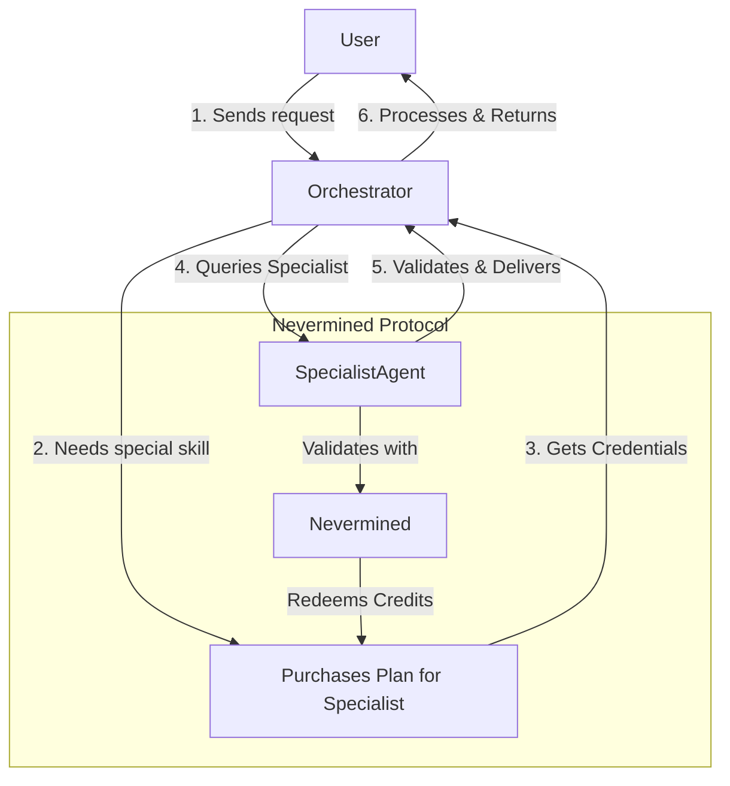

This guide explores an advanced use case: building a multi-agent system where different AI agents act as both service providers and consumers, paying each other for specialized tasks. This forms the basis of an autonomous AI economy.

We'll design a system with two agents:
1.  **Orchestrator Agent**: A primary agent that receives user requests.
2.  **Specialist Agent**: An agent with a specific skill (e.g., image analysis) that the Orchestrator Agent can query.

## 1. The Architectural Pattern

The core idea is that the `Orchestrator Agent` is also a Nevermined subscriber. It will purchase a payment plan for the `Specialist Agent` and use its credits to pay for services on behalf of the end-user.



## 2. Setting Up the Specialist Agent

First, create and register the `Specialist Agent`. This process is identical to the [Simple AI Agent Guide](/introduction/development/simple-ai-agent). The key is that this agent has a service that another agent will consume.

**Specialist Agent (`specialist-agent/src/index.ts`):**

```typescript
// ... (Standard Express server and middleware setup)

// The specialist's unique skill endpoint
app.post('/analyze-image', authMiddleware, async (req, res) => {
  const { imageUrl } = req.body;
  const { planId } = (req as any).nevermined;

  // Perform a complex, monetizable task
  const analysisResult = await performImageAnalysis(imageUrl);

  // Redeem credits for this specific task
  await payments.redeemCredits(planId, 10n, { request: req.body }); // Charge 10 credits

  res.json(analysisResult);
});
```

Register this agent on Nevermined. Take note of its `AGENT_ID` and `PLAN_ID`.

## 3. Building the Orchestrator Agent

The `Orchestrator Agent` will have its own public-facing endpoint, but internally it will act as a client to the `Specialist Agent`.

### Step 3.1: Orchestrator's Environment

The orchestrator needs the Specialist Agent's details in its `.env` file.

```bash title="orchestrator-agent/.env"
# Orchestrator's own config
NVM_API_KEY="orchestrator-api-key"
BUILDER_ADDRESS="orchestrator-wallet-address"
ENVIRONMENT="testing"
PORT=5000

# Details of the Specialist Agent it will consume
SPECIALIST_AGENT_ID="specialist-agent-id-from-step-2"
SPECIALIST_PLAN_ID="specialist-plan-id-from-step-2"
```

### Step 3.2: Purchasing a Plan for the Specialist

The Orchestrator must purchase a plan to access the Specialist. This can be done in an initialization script.

```typescript title="orchestrator-agent/src/initialize.ts"
import { payments } from './index'; // Assuming SDK is initialized in index

async function provisionAccess() {
  const specialistPlanId = process.env.SPECIALIST_PLAN_ID!;

  try {
    console.log(`Purchasing plan ${specialistPlanId} for specialist agent...`);
    await payments.orderPlan(specialistPlanId);
    console.log('Successfully purchased plan.');
  } catch (error) {
    console.warn(`Could not purchase plan (may already be owned): ${(error as Error).message}`);
  }
}

provisionAccess();
```

### Step 3.3: The Orchestrator's Logic

The orchestrator's main endpoint receives a request, queries the specialist, combines the results, and returns a final response.

```typescript title="orchestrator-agent/src/index.ts"
// ... (Standard Express server and middleware setup)

app.post('/complex-query', authMiddleware, async (req, res) => {
  const { prompt, imageUrl } = req.body;
  const userPlanId = (req as any).nevermined.planId;

  // --- Start of Agent-to-Agent Interaction ---
  
  // Get credentials to access the specialist agent
  const specialistCredentials = await payments.getAgentHTTPOptions(
    process.env.SPECIALIST_PLAN_ID!,
    process.env.SPECIALIST_AGENT_ID!
  );

  // Query the specialist agent
  const specialistResult = await payments.query(
    process.env.SPECIALIST_AGENT_ID!,
    specialistCredentials,
    { imageUrl } // Payload for the specialist
  );
  
  // --- End of Agent-to-Agent Interaction ---

  // Combine results from its own logic and the specialist's
  const finalResponse = await combineResults(prompt, specialistResult);
  
  // Redeem credits from the end-user's plan
  await payments.redeemCredits(userPlanId, 25n, { request: req.body }); // Charge user 25 credits

  res.json(finalResponse);
});
```

## 4. Economic Flow and Considerations

-   **Pricing Strategy**: The `Orchestrator Agent`'s payment plan must be priced to cover the costs of querying the `Specialist Agent`, plus a margin. If the specialist costs 10 credits per query, the orchestrator might charge the end-user 25 credits.
-   **Credit Management**: The orchestrator must monitor its own credit balance for the specialist's plan and re-purchase or upgrade as needed. This logic can be automated.
-   **Error Handling**: What happens if the specialist agent is down or the orchestrator runs out of credits? Your orchestrator should have robust error handling to manage these scenarios, perhaps by falling back to a default (less accurate) model.
-   **Discovery**: In a more advanced system, the orchestrator could dynamically discover specialist agents from the Nevermined registry based on their skills (metadata tags) and choose the most cost-effective one.

## Conclusion

You have now designed a multi-agent system where agents can autonomously transact. This pattern is the foundation for creating sophisticated AI economies.

By using Nevermined, you offloaded the complexity of secure, on-chain settlement, allowing you to focus on the agents' core logic and their interaction patterns. This opens the door to building decentralized AI applications, collaborative agent swarms, and much more. 