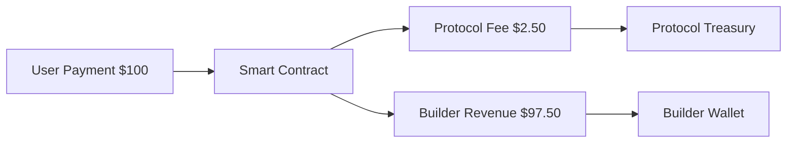

## Overview

NVM Pay provides transparent and efficient revenue management with instant settlements, flexible fee structures, and built-in support for revenue sharing between multiple parties.

## Fee Structure

### Protocol Fees

Nevermined charges a small protocol fee to maintain the infrastructure:

<Note>
Current protocol fee: **2.5%** of transaction value
- Covers infrastructure costs
- Funds ongoing development
- Ensures network security
</Note>

### Fee Calculation

```typescript
// Example: $100 payment
const totalPayment = 100_000_000n // $100 (8 decimals)
const protocolFee = 2_500_000n   // $2.50 (2.5%)
const builderReceives = 97_500_000n // $97.50

// This is handled automatically by the protocol
```

### Fee Distribution



## Instant Settlement

### How It Works

<Steps>
  <Step title="Payment Received">
    User pays for plan via crypto or fiat
  </Step>
  <Step title="Smart Contract Processing">
    Payment processed on-chain
  </Step>
  <Step title="Automatic Distribution">
    Funds split according to configuration
  </Step>
  <Step title="Instant Transfer">
    Builders receive funds immediately
  </Step>
</Steps>

### No Intermediaries

- Direct wallet-to-wallet transfers
- No waiting periods
- No manual withdrawal needed
- Full transparency on-chain

## Revenue Sharing

### Simple Split

Split revenue between team members:

```typescript
const teamSplit = {
  priceType: 'FIXED_PRICE',
  tokenAddress: USDC_ADDRESS,
  amounts: [
    40_000_000n,  // 40% to developer
    30_000_000n,  // 30% to designer
    30_000_000n   // 30% to marketer
  ],
  receivers: [
    '0xDeveloper...',
    '0xDesigner...',
    '0xMarketer...'
  ]
}
```

### Complex Distribution

Multi-party revenue sharing with different tiers:

```typescript
// $100 plan with complex distribution
const complexDistribution = {
  priceType: 'FIXED_PRICE',
  tokenAddress: USDC_ADDRESS,
  amounts: [
    50_000_000n,  // 50% to main developer
    20_000_000n,  // 20% to data provider
    15_000_000n,  // 15% to infrastructure
    10_000_000n,  // 10% to marketing
    5_000_000n    // 5% to community fund
  ],
  receivers: [
    developerAddress,
    dataProviderAddress,
    infrastructureAddress,
    marketingAddress,
    communityAddress
  ]
}
```

### Dynamic Revenue Sharing

Adjust splits based on contribution:

```typescript
function calculateRevenueSplit(
  totalAmount: bigint,
  contributions: Record<string, number>
): RevenueSplit {
  const addresses = Object.keys(contributions)
  const totalContribution = Object.values(contributions)
    .reduce((sum, val) => sum + val, 0)
  
  const amounts = addresses.map(addr => {
    const percentage = contributions[addr] / totalContribution
    return (totalAmount * BigInt(Math.floor(percentage * 100))) / 100n
  })
  
  return { addresses, amounts }
}
```

## Revenue Tracking

### On-Chain Analytics

All revenue data is available on-chain:

```typescript
// Get payment events for a plan
const payments = await payments.plans.getPaymentHistory(planId)

const totalRevenue = payments.reduce((sum, payment) => 
  sum + payment.amount, 0n
)

console.log({
  totalPayments: payments.length,
  totalRevenue: totalRevenue.toString(),
  averagePayment: (totalRevenue / BigInt(payments.length)).toString()
})
```

### Revenue Metrics

Track key performance indicators:

```typescript
interface RevenueMetrics {
  totalRevenue: bigint          // All-time revenue
  monthlyRevenue: bigint        // Current month
  averageOrderValue: bigint     // Average payment
  totalCustomers: number        // Unique buyers
  conversionRate: number        // Views to purchases
  churnRate: number            // Subscription cancellations
}
```

### Revenue Reports

Generate detailed reports:

```typescript
async function generateRevenueReport(
  agentId: string,
  startDate: Date,
  endDate: Date
): Promise<RevenueReport> {
  const agent = await payments.agents.getAgent(agentId)
  const revenues: Record<string, bigint> = {}
  
  for (const plan of agent.plans) {
    const history = await payments.plans.getPaymentHistory(
      plan.planId,
      startDate,
      endDate
    )
    
    revenues[plan.planId] = history.reduce(
      (sum, payment) => sum + payment.amount, 0n
    )
  }
  
  return {
    agentId,
    period: { startDate, endDate },
    planRevenues: revenues,
    totalRevenue: Object.values(revenues)
      .reduce((sum, val) => sum + val, 0n)
  }
}
```

## Tax Considerations

### Transaction Records

All transactions are recorded on-chain:
- Timestamp of payment
- Amount and currency
- Payer and receiver addresses
- Transaction hash for proof

### Export Options

<Note>
Tax reporting features coming soon:
- CSV export of transactions
- Integration with accounting software
- Customizable report formats
</Note>

## Best Practices

<AccordionGroup>
  <Accordion title="Revenue Optimization">
    - Monitor conversion rates
    - A/B test pricing
    - Analyze usage patterns
    - Optimize plan offerings
  </Accordion>
  
  <Accordion title="Financial Planning">
    - Account for protocol fees
    - Plan for tax obligations
    - Consider currency volatility
    - Maintain reserves
  </Accordion>
  
  <Accordion title="Transparency">
    - Clearly display fees
    - Explain revenue sharing
    - Provide payment receipts
    - Show transaction history
  </Accordion>
</AccordionGroup>

## Future Features

### Analytics Dashboard
Coming soon:
- Real-time revenue charts
- Customer lifetime value
- Cohort analysis
- Predictive analytics

### Advanced Reporting
Planned features:
- Custom report builder
- Automated insights
- Revenue forecasting
- Anomaly detection

### Integration Options
In development:
- QuickBooks integration
- Stripe reporting sync
- Custom webhooks
- API for analytics