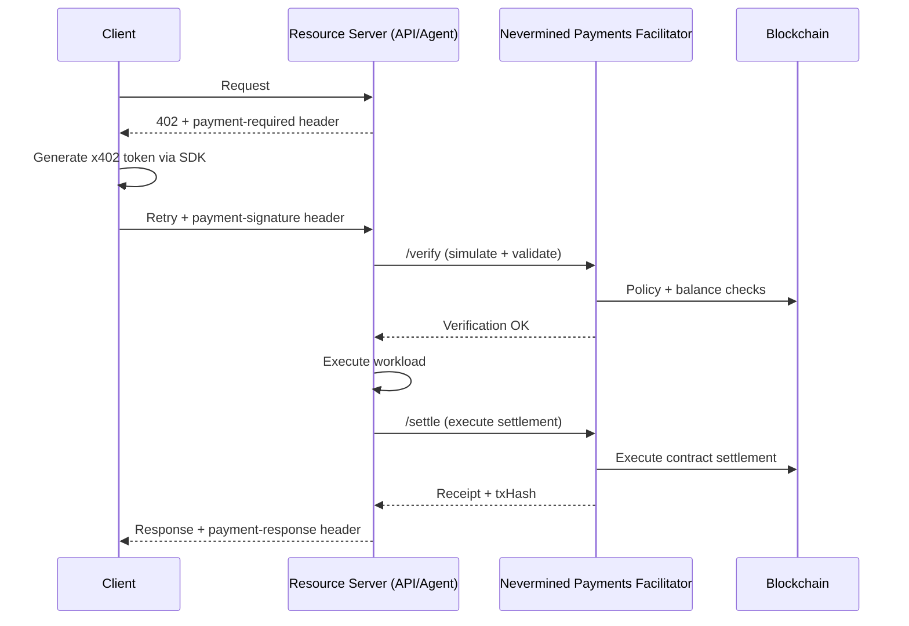

{/* The docs path stays /products/x402-facilitator/* for link stability — it is historical, from when the product was x402-only, and not a sign the facilitator is x402-only today. Do not "fix" it by renaming the route without adding redirects from every old path. */}

The Nevermined Payments Facilitator is an **enforcement and settlement engine** for HTTP-native agent payments. It lets any API, agent, MCP tool, or protected resource get paid without running on-chain infrastructure — and it speaks **two sibling payment protocols that settle against the same Nevermined Payment Plans**:

- **[x402](/development-guide/nevermined-x402)** — payment terms travel in a `payment-required` header and the payment is presented in `payment-signature`. Covers standard "pay-per-request" x402 and Nevermined's programmable extension (`nvm:erc4337` and `nvm:card-delegation` schemes, with smart accounts, session keys, and contract settlement).
- **[MPP (Merchant Payment Protocol)](/products/x402-facilitator/mpp-seller)** — the same plan, credits, and delegation, negotiated with an RFC 7235 `WWW-Authenticate: Payment …` challenge and an `Authorization: Payment …` credential instead.

A request that costs 2 credits burns 2 whether it was paid over x402 or MPP: **one meter, one delegation budget, two wire protocols.**

<Note>
For the complete technical specification of the x402 extension, see the [x402 Smart Accounts Extension Spec](/specs/x402-smart-accounts). For the MPP seller integration, see [Accepting MPP payments](/products/x402-facilitator/mpp-seller).
</Note>

The Facilitator sits in the payment flow — when a server receives a payment token, it delegates verification and settlement to the Facilitator rather than handling it directly. See [how the x402 flow works end to end](/development-guide/nevermined-x402).

## Why use a Facilitator?

A facilitator is the third party that:

- verifies payment proofs
- simulates/enforces what is allowed (amount, plan, merchant/agent binding)
- executes settlement on-chain
- returns a canonical receipt (e.g., transaction hash)

This is particularly important for **programmable x402**, where settlement may be more than a single ERC-20 transfer (credits, subscriptions, policy-based settlement).

## Facilitator API

### Environments

| Environment | URL | Purpose |
|------------|-----|---------|
| **Sandbox** | `https://facilitator.sandbox.nevermined.app` | Testing and development with testnets |
| **Production** | `https://facilitator.live.nevermined.app` | Live mainnet transactions |

<Note>
Use the sandbox environment for development and testing. Switch to production only when you're ready to process real payments.
</Note>

### Core Endpoints

Each protocol has its own verify/settle route pair. The plan, the credits, and the delegation underneath are identical — only the wire shape differs.

**x402** — verify then settle around your workload:

<CardGroup cols={2}>
  <Card title="Verify Endpoint" icon="shield-check">
    **POST** `/api/v1/x402/verify`

    Validates payment authorization, checks permissions, and simulates on-chain settlement before workload execution.
  </Card>

  <Card title="Settle Endpoint" icon="credit-card">
    **POST** `/api/v1/x402/settle`

    Executes on-chain settlement after workload completion and returns transaction receipt.
  </Card>
</CardGroup>

**MPP** — a seller mints a challenge, then verifies and settles the credential the buyer returns:

<CardGroup cols={3}>
  <Card title="Challenge Endpoint" icon="flag">
    **POST** `/api/v1/mpp/challenge`

    Mints the HMAC-bound `WWW-Authenticate: Payment` challenge to return with your `402`.
  </Card>

  <Card title="Verify Endpoint" icon="shield-check">
    **POST** `/api/v1/mpp/verify`

    Checks a returned credential without burning credits.
  </Card>

  <Card title="Settle Endpoint" icon="credit-card">
    **POST** `/api/v1/mpp/settle`

    Verifies **and** burns the credits, returning the `Payment-Receipt`.
  </Card>
</CardGroup>

Buyers mint their access token at `POST /api/v1/x402/permissions` (x402) or `POST /api/v1/mpp/permissions` (MPP). A token minted for one protocol is refused on the other's routes — see [protocol isolation](/products/x402-facilitator/mpp-seller#protocol-isolation). Full MPP seller reference: [Accepting MPP payments](/products/x402-facilitator/mpp-seller).

## How it works

## Nevermined's programmable x402 extension

Standard x402 is often implemented as an "exact transfer" authorization (e.g., EIP-3009). Nevermined extends x402 to support:

- **Smart Accounts (ERC-4337)** and delegated **session keys**
- **Smart-contract settlement** (credits, subscriptions, PAYG, dynamic charging)
- **Policy enforcement** (merchant allowlists, spend caps, validity windows)

This keeps the HTTP handshake the same, but upgrades settlement from "transfer" to **programmable execution**.

## Facilitator responsibilities

### Verification

- x402 envelope structure/version
- signature authenticity
- session key validity + scoped permissions
- plan state + subscriber balance
- simulation of allowed on-chain actions (UserOps)

### Settlement

After the server completes its work, the facilitator can execute the settlement action permitted by the payment payload, such as:

- `order` (purchase/top-up)
- `redeem` / `burn` (consume credits)
- "exact" transfers (when using standard x402)

## Getting started

<CardGroup cols={2}>
  <Card title="Express.js Integration" icon="node-js" href="/integrate/add-to-your-agent/express">
    One-line payment protection with Express middleware
  </Card>

  <Card title="How It Works" icon="gears" href="/products/x402-facilitator/how-it-works">
    End-to-end flow (client + server) with x402 headers and facilitator calls
  </Card>

  <Card title="Accepting MPP payments" icon="handshake" href="/products/x402-facilitator/mpp-seller">
    Advertise your plan-protected endpoint as MPP-payable, metered exactly like x402
  </Card>

  <Card title="Payment Models" icon="calculator" href="/integrate/patterns/payment-models">
    Credits, subscriptions, and dynamic pricing using programmable settlement
  </Card>

  <Card title="x402 Protocol" icon="plug" href="/development-guide/nevermined-x402">
    Integrate x402 into your API/agent
  </Card>

  <Card title="Google A2A" icon="sparkles" href="/integrations/google-a2a">
    Use x402 with A2A + AP2-style payment intent messaging
  </Card>
</CardGroup>
